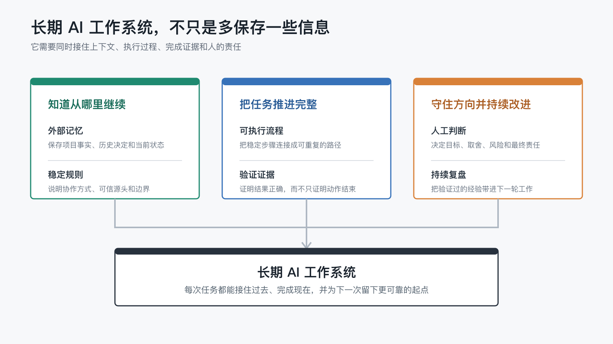

# 我不是在使用 AI 工具，而是在搭建长期工作系统

如果你每天都在用 AI，却仍然要一遍遍解释“我是谁、我在做什么、这次任务的背景是什么”，那你可能遇到的不是提示词（prompt）问题，而是工作系统问题。

最近我越来越强烈地感觉到，自己真正想要的不是一个更会聊天的 AI，而是一套能长期运行、持续沉淀、逐渐理解我工作方式的个人 AI 工作系统。

我想回答的问题是：

> 当 AI 不再只是一次性聊天工具，而是逐渐理解我的项目、偏好、流程和历史经验时，它会变成什么？

这篇文章是这个系列的第一篇，先不讲复杂技术实现，只讲一个最基础的变化：为什么我开始把 AI 从“聊天窗口”里拿出来，放进一个有记忆、有流程、有证据、有复盘的工作系统里。

## 1. 我过去怎么使用 AI

我最早使用 AI 的方式，和很多人差不多：遇到一个问题，就打开一个聊天窗口，把问题丢进去。

它很像一个随叫随到的问答工具。需要改一段文案，就让它帮我润色；需要理解一个概念，就让它解释；需要写一段代码，就让它给一个示例。很多时候它确实有效，尤其适合解决一个边界清楚、上下文不太复杂的小任务。

但这种使用方式有一个明显的问题：每一次对话几乎都是重新开始。

我要重新解释我是谁、我正在做什么、这个项目处于什么阶段、我偏好什么表达方式、哪些事情已经决定过、哪些路径不要再走。对 AI 来说，它看到的是当前窗口里的文字；对我来说，我真正需要的是一个能接住长期背景的工作伙伴。

于是，一个很奇怪的反差出现了：AI 单次回答越来越强，但我和它协作时，仍然经常停留在“重新说明背景”的阶段。

这不是因为 AI 不聪明，而是因为我还没有给它一个稳定的工作系统。项目背景、历史决策、个人偏好、工具路径和复盘经验，散落在聊天记录、脑子里、文档里和各种临时文件里。AI 可以在某一次对话里表现很好，却很难自然继承之前几十次协作积累下来的经验。

后来我慢慢意识到，问题的关键可能不是再写一个更长、更完美的 prompt。

真正的问题是：我需要让 AI 进入一个可以长期积累上下文的系统里。

如果每次协作都只停留在聊天窗口里，那它就是一次性使用；如果每次协作都能沉淀成文档、规则、模板、脚本或项目状态，那它才开始变成一个长期工作系统。

## 2. 为什么“一次性聊天”会遇到天花板

一次性聊天的问题，通常不是第一天就出现。

刚开始用 AI 的时候，新鲜感很强。一个问题、一个回答，一段代码、一份总结，一个卡住的点很快被推开。它像一个效率外挂，让很多原本要花半小时、一小时的事情变成几分钟。

但当任务开始变复杂，天花板就会出现。

复杂任务不是只缺一个答案。它需要知道前因后果，需要理解项目结构，需要记住哪些方案试过、哪些方案被否掉，需要知道我的偏好、我的约束、我的风险边界。比如我在一个仓库里做长期沉淀时，真正重要的往往不是“帮我写一段 Markdown”，而是“这份文档应该放在哪里”“它和之前的规则是否一致”“是否要同步更新索引”“是否应该提交”“是否会污染其他未提交改动”。

这些信息很难靠一次 prompt 全部讲清楚。

更麻烦的是，对话上下文会过期、会丢失、会被压缩。哪怕某一次对话里 AI 已经完全理解了我，下一个窗口又可能重新开始。项目背景、个人偏好、工具路径、历史决策散落在不同地方，我就不得不反复把它们重新拼给 AI。

于是 AI 看起来很强，但协作关系很浅。

它可以帮我解决一个问题，却不一定知道我正在构建一个怎样的长期系统。它可以在某个瞬间表现得像专家，却未必能在下一个任务里延续上一次的判断。久而久之，我发现自己不是在和一个越来越熟悉我的助手合作，而是在不断让一个临时协作者从零开始。

这就是一次性聊天的天花板：它能提高单次任务效率，但很难自然形成长期复利。

要跨过这个天花板，我需要的不是更长的聊天记录，而是一个能让上下文稳定存在的外部工作系统。

## 3. 我开始把 AI 放进长期工作系统

后来我开始改变使用方式：不再把 AI 只放在聊天窗口里，而是把它放进一个由文档、仓库、规则、工具和历史记录组成的工作系统里。

这个变化并不神秘。它的核心是把那些原本只存在于脑子里、聊天里、临时文件里的东西，变成 AI 和我都能反复读取的材料。

比如长期事实和稳定偏好，需要有一个地方记录；当前项目状态，需要有一个地方承接；阶段性分析，不应该只留在对话里，而应该变成可回看的文档；高频流程，不应该每次重新口头说明，而应该逐渐沉淀成操作指南、模板或脚本。

最近我创建了一个公开仓库 `ai-work-system`，这个过程本身就是一个小例子。

它一开始只是一个想法：我能不能把“长期 AI 助手”的实践，整理成可以公开分享的文章和方法论？然后这个想法被拆成几个具体动作：先确定仓库名，再选择协议，再写中文默认 README 和英文 README-EN，再加一个适合公开仓库的 `AGENTS.md`，约定后续文章更新时要同步 README 和多语言入口。

接着，第一篇文章从一句选题变成文章元信息（frontmatter）、目录、草稿、编辑稿。这里的文章元信息，指的是 Markdown 正文开头用来记录标题、日期和发布状态等信息的结构化内容。每一步都有 Git 记录，每次讨论都尽量落到文件里。这样一来，AI 不只是“帮我想想”，而是在协助我把想法变成一个可以继续演化的公开项目。

这就是我说的工作系统：对话不是终点，文件、规则、历史和下一步动作才是承接点。

在这个系统里，Markdown 是很重要的载体。它足够简单，人能读，AI 也容易读；它能被 Git 管理，也能被静态站、公众号排版工具或其他发布流水线继续使用。

Git 也很重要。它让每一次沉淀都有历史，让一个想法如何演进、一个规则如何被加入、一个草稿如何从占位变成正文，都变得可追踪。对长期协作来说，这种可追踪性本身就是记忆的一部分。

还有一些文件会逐渐承担固定角色。`README` 是对外入口，告诉人和 AI 这个项目是什么；`AGENTS.md` 是协作约定，告诉后续进入仓库的 AI 应该遵守什么规则；分析文档用来放阶段性思考；操作指南用来放可复用流程；模板用来减少重复劳动；脚本用来把高频动作变成可执行能力。

当这些东西开始出现，AI 的角色也变了。

它不再只是回答问题的人，而是可以参与整理、补全文档、检查规则、执行命令、提交版本、回顾差异、发现遗漏的人。它开始进入我的工作流，而不只是停留在一个聊天框里。

把这些部分放在一起看，一套长期 AI 工作系统需要同时接住上下文、执行、证据和人的判断：

## 4. 这种系统带来的第一个变化：少解释

最直接的变化，是我需要解释的东西变少了。

这不是说我什么都不用说，而是很多基础背景不需要每次从零开始说。

如果一个仓库有清晰的 `README`，AI 可以先知道项目定位。如果有 `AGENTS.md`，AI 可以知道协作规则。如果有文档落点约定，AI 就不需要每次问“这份东西要放哪里”。如果历史分析和索引维护得比较好，AI 可以顺着已有结构继续推进，而不是每次重新搭一个临时方案。

这种“少解释”对长期使用非常关键。

因为真正消耗人的，往往不是写一句 prompt，而是反复交代背景、纠正方向、提醒偏好、解释边界。一次两次还好，几十次之后，这种重复会让人觉得 AI 很聪明，但使用起来仍然很累。

当系统开始有记忆之后，我和 AI 的对话会变短，但推进会更快。

比如我只说“提交”，它知道要先检查工作区，不要把其他会话的改动带进去；我说“沉淀一下”，它知道优先写成文档，而不是只在聊天里总结；我说“继续”，它知道应该接着上一个明确步骤走，而不是突然展开一堆方向。

这种体验很像一个长期合作的人逐渐熟悉你的习惯。

它不是因为 AI 神奇地记住了一切，而是因为关键的上下文被外部化了，AI 可以读到，项目可以承接，人也可以复查。

## 5. 第二个变化：对话开始变成资产

另一个变化更重要：对话开始不只是对话。

过去我和 AI 聊完一个问题，最多得到一个答案。答案当下有用，但过几天很可能就被淹没在聊天记录里。下一次遇到类似问题，我可能还要再问一遍，再整理一遍，再判断一遍。

现在我更倾向于把重要对话变成资产。

一次网站分析，可以沉淀成一份分析文档；一个宣传想法，可以整理成文章选题；一次工作流讨论，可以变成操作指南；一个反复出现的约定，可以写进 `AGENTS.md`；一个可复用格式，可以变成模板；一个高频动作，可以逐渐变成脚本。

这样做之后，对话就不只是消耗品，而会进入项目结构。

它可以被搜索，可以被引用，可以被修改，可以被提交，可以在未来继续生长。更重要的是，它能减少下一次从零开始的成本。

我越来越觉得，AI 时代真正有价值的不是“我问出了一个好答案”，而是“这个答案是否进入了我的长期系统”。

如果没有进入系统，它只是一次灵感；如果进入了系统，它才可能变成复利。

## 6. 第三个变化：AI 和人的能力一起成长

这个过程里，成长的不只是 AI。

表面上看，是 AI 越来越了解我的项目、习惯和偏好。它知道我喜欢把面向自己阅读的沉淀写成中文，知道我希望一次只推进一件事，知道提交时要小心工作区里其他无关改动，知道公开仓库不能泄露私人路径、密钥和内部记忆。

但从另一个角度看，我也在被训练。

我会更清楚地描述目标，更习惯把大任务拆成小步骤，更愿意把模糊想法沉淀成文档，更重视边界、验证和提交历史。为了让 AI 更好地协作，我也必须把自己的工作方式显性化。

这件事很有意思。

以前很多工作习惯是隐性的。我知道自己想要什么，但不一定说得清楚；我知道某个结果“不对味”，但不一定能提前定义标准。和 AI 长期协作之后，这些隐性偏好会被不断逼出来，变成规则、模板、检查点和项目结构。

所以这不是单向的“AI 变强”。更准确地说，是人和 AI 共同塑造了一个工作系统。

AI 因为系统而更贴合我，我也因为系统而更清楚自己如何工作。

## 7. 这不是魔法，也不是人格化神话

我不想把这件事讲得太玄。

说“长期 AI 助手”“不会失忆”“越来越懂我”，听起来很容易滑向人格化叙事。但在我的理解里，这不是魔法，也不是 AI 拥有了真正的永久记忆或自我意识。

更朴素地说，它是一套工程化的做法。

所谓“不会失忆”，本质是把关键上下文外部化、结构化、版本化。把稳定事实写进文档，把当前状态写进状态文件，把流程写进操作指南，把规则写进 `AGENTS.md`，把变化交给 Git 记录。AI 每次进入项目时，不是凭空记得过去，而是可以读取这些材料。

这也意味着边界非常重要。

不是所有东西都适合沉淀，更不是所有东西都适合公开。私人记忆、客户信息、密钥、cookie、内部路径、未公开项目状态，都不应该随便进入公共仓库。越是想长期使用 AI，越要清楚哪些信息可以给 AI 读，哪些只能留在私有环境，哪些动作必须人工确认。

这也是我为什么更喜欢把它称为“工作系统”，而不是只用“AI 伙伴”来概括它。

伙伴这个词有温度，但系统这个词提醒我：它需要结构、权限、版本、边界和验证。

## 8. 这 15 篇文章如何继续展开

现在回头看，这篇文章里提出的想法已经不再只是启动计划。这个系列最终形成了 15 篇文章，也在写作过程中逐步建立了公开仓库、结构化文章状态、三平台发布、自动导航和发布前后检查。

本系列其余文章可以按五个阶段连续阅读：

1. **先解决记忆问题**：第 2 至 4 篇解释 AI 为什么会“失忆”、外部记忆为什么有效，以及最小项目记忆需要哪些核心信息。
2. **再让经验进入流程**：第 5、6 篇讨论经验如何成为规则，稳定规则又如何逐渐变成可执行工作流。
3. **用 Review 建立可信边界**：第 7 至 9 篇区分生成、验证和接受，并重新划分脚本、AI 与人的职责。
4. **持续评估和维护系统**：第 10 至 12 篇讨论如何判断系统是否真正减负、如何清理过期内容，以及任务中断后怎样继续。
5. **守住使用边界**：第 13 至 15 篇讨论提示词、任务系统化和信息权限边界，避免把“长期协作”误解成“什么都放进去”。

这条路径也记录了项目本身如何长出来：先有真实问题，再有规则和脚本；先经过人工验证，再把稳定部分交给自动化。公开仓库承载可分享的方法和脱敏案例，私有系统则继续保留真实项目与个人上下文。

整个系列想展示的，不只是“我用了 AI”，而是一种更长期的工作方式：

> 把 AI 从一次性问答工具，逐步放进一个有记忆、有流程、有证据、有复盘的个人工作系统里。

这件事仍然会继续变化，但第一阶段已经留下了一条可以复查、复用和继续改进的实践路径。

如果你也在高频使用 ChatGPT、Claude、Codex、Cursor 或其他 AI 工具，并且已经开始厌倦每次都重新解释背景，也许可以试着问自己一个问题：

> 我是在使用 AI，还是在搭建一个能长期和 AI 协作的工作系统？

这两个答案，最后会走向很不一样的工作方式。

如果只能从这篇文章带走一个动作，我建议从很小的地方开始：

建一个私有或公开仓库，写下第一版 `README`，再写一份给 AI 看的 `AGENTS.md`。不用复杂，先说明三件事：这个项目是什么、哪些信息不能公开、文章或文档更新时要同步哪些入口。

当这些约定被写下来，AI 才真正有机会从一次性聊天，进入你的长期工作系统。

下一篇，我们先从最直接的摩擦开始：为什么 AI 聊了很多次，下一次仍然像第一次认识你？
