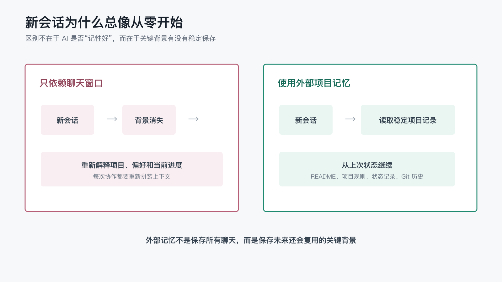

# 为什么 AI 总是失忆？

上一篇文章讲的是：我不是只在使用 AI 工具，而是在搭建一套长期工作系统。

这一篇准备回答一个更具体、也更常见的问题：为什么我们明明每天都在用 AI，却仍然经常觉得它像什么都不记得？

我以前也很容易把这个问题理解成“模型记性不好”。

比如前几天我刚和 AI 讨论过一篇文章的结构：开头要轻一点，不要太技术化，例子要贴近日常协作。今天再打开一个新窗口，它可能又会给我一篇很像产品说明书的稿子。它不是故意忘记，也不是写作能力突然变差，而是当前对话里没有把这些偏好重新交给它。

这就是很多人使用 AI 时最熟悉的挫败感：你明明已经说过了，但它好像没有带着那段历史继续工作。

后来我慢慢意识到，AI 的“失忆”不只是模型问题，更是工作系统问题。

## 1. AI 不是在读你的全部人生

很多时候，AI 不是完全没有能力理解上下文，而是它只看到了当前被交给它的上下文。

我们和人协作时，会默认对方记得很多东西：上次开会说过什么，这个项目为什么这么设计，某个名字为什么不能改，某个流程之前踩过什么坑。长期同事之间甚至不需要把这些背景完整说出来，一个眼神、一个缩写、一个文件名就够了。

但 AI 不会自然拥有这些默认背景。

在一次普通聊天里，它看到的是当前窗口里的文字、附带的文件、系统给它的规则，以及可能被工具读取到的项目内容。它不会自动知道你昨天在另一个窗口里做过什么，也不会自动知道你脑子里那些没有写下来的偏好。

所以很多“失忆”其实不是它忘了，而是它从来没有被稳定地告知。

这也是为什么同一个 AI，在一个上下文完整的任务里看起来很懂你，在另一个空白窗口里又像第一次见面。能力没有突然消失，只是它拿到的工作材料不一样。

## 2. 聊天窗口不是长期记忆系统

聊天窗口适合解决单次问题，但不适合承载长期工作状态。

单次问题很简单：帮我解释一个概念，润色一段话，写一个函数，翻译一段英文。只要当前窗口里的信息足够，AI 就能完成。

长期任务就不一样了。

长期任务需要知道一串连续的东西：这个项目的目标是什么，哪些方案已经试过，哪些决策已经确定，哪些内容需要同步更新，哪些偏好要一直保留，哪些内容暂时不能公开。

这些信息如果只存在于聊天窗口里，就会天然不稳定。

对话会越来越长，重要信息会被淹没；新会话会从空白开始，旧背景无法自然继承；上下文被压缩后，细节可能变模糊；多个会话同时推进时，不同窗口甚至会对项目状态形成不同理解。

我在写这个系列文章时就遇到过这种情况。

最开始只是写第一篇文章。后来又要维护 README、发布阅读页、同步中英文入口、区分草稿和已发布文章。每一步都不复杂，但组合起来以后，下一次再让 AI 继续推进时，它必须知道：哪里是源稿，哪里只是阅读页，哪些文章能公开，哪些还只是草稿。

如果这些只靠我在聊天里提醒，那每次继续都会变成一次小型复述。

这不是长期协作，这是反复开场。

## 3. 真正需要保存的是可复用上下文

解决 AI 失忆，不是把所有聊天记录都保存下来。

所有都保存，听起来很安心，但实际会制造另一个问题：噪音太多。

一次协作里会有很多临时内容：随口讨论的方向、被放弃的方案、尚未验证的猜测、执行命令时的中间输出、已经过期的判断。如果这些东西不分层地全部塞给 AI，它不但不会更清醒，反而可能更容易被旧信息误导。

真正值得保存的是可复用上下文。

比如：

- 项目定位：这个仓库到底是做什么的。
- 内容源头：哪些文件是正式源文，哪些只是展示或生成物。
- 工作规则：新增文章时应该同步哪些入口。
- 状态语义：`draft`、`review`、`ready` 这些发布状态标签分别代表什么。
- 验证命令：本地应该跑哪些命令确认没有破坏链路。
- 风险边界：哪些 token、cookie、内部路径不能暴露。
- 历史结论：某个 CI 失败的真正原因是什么，后来怎么修好的。
- 表达偏好：文章面向什么读者，技术细节应该讲到多深。

这些信息的共同点是：它们会反复影响后续判断。

所以与其期待 AI 记住所有聊天，不如把这类信息沉淀到稳定的位置。让 AI 下次工作时可以重新读取，让人自己也可以复查。

## 4. 外部记忆让 AI 不必每次从零开始

我现在更倾向于把 AI 需要长期继承的背景放到外部系统里，而不是只放在对话里。

这里的“外部记忆”不一定是什么复杂数据库。很多时候，最朴素的 Markdown 文件就足够了。

`README` 告诉人和 AI：这个项目是什么，当前有哪些文章，应该从哪里开始读。

项目规则文件告诉后续进入仓库的 AI：这个项目的协作规则是什么，哪些动作是默认要做的，哪些文件不能随便提交。

这里有一个容易忽略的细节：不同 agent 工具默认读取的规则文件并不完全一样。

比如在 Codex App 或 Codex CLI 里，常见入口是 `AGENTS.md`。它可以放在仓库根目录，也可以按子目录继续分层，让 Codex 进入项目时先知道本仓库的工作约定。

但如果换成 Claude Code，默认使用的项目规则入口通常是 `CLAUDE.md`，而不是 `AGENTS.md`。Claude Code 还会读取 `.claude/` 目录下的设置、规则、技能、子代理等配置或能力文件，也就是英文里常见的 settings、rules、skills、subagents。也就是说，同样是“给 AI 助手看的项目说明”，在不同工具里可能需要放在不同文件名和目录结构下。

所以更准确地说，我们需要的不是某一个固定文件名，而是一层“agent rules”：把项目背景、协作约定、常用命令、风险边界和文档入口写到当前工具会自动加载的位置。用 Codex 时，它可能是 `AGENTS.md`；用 Claude Code 时，它可能是 `CLAUDE.md`；换成其他 agent 工具时，也应该先确认它默认加载什么规则文件。

发布工作流文档告诉我们：文章状态怎么流转，阅读页怎么同步，失败时应该查哪一段。

文章元信息告诉脚本：这篇文章是否可以发布，属于哪个系列，标题和摘要是什么。很多 Markdown 写作系统会把这类信息放在正文最前面，用一段 `---` 包起来，英文里常叫 `frontmatter`。

Git 历史告诉我们：某个规则是什么时候加入的，某个问题是如何修复的。

这些东西放在一起，AI 就不需要每次都靠我口头补背景。它可以先读项目文件，再继续工作。

这不是让 AI 神奇地拥有永久记忆，而是让记忆从聊天窗口里移出来，变成项目的一部分。

只依赖聊天窗口和使用外部项目记忆，差别可以简单地画成这样：

外部记忆不是保存所有聊天，而是保存未来还会反复使用的关键背景。

## 5. 一个具体例子：从“记得我偏好吗”到“按记录继续”

这个问题不只出现在代码或仓库里。

假设我长期让 AI 帮我准备一组公开文章。第一篇已经确定了风格：不要像教程手册，也不要像营销稿；要从真实协作里的困惑写起，语言要轻一点，读者不需要先懂技术。

如果这些偏好只存在于某一次聊天里，下一篇文章就很容易跑偏。AI 可能重新给我一套很正式的结构：定义、背景、挑战、解决方案、总结。它没有错，但那不是我想要的味道。

这时候我可以每次重新解释一遍：

- 这是一组长期系列文章。
- 读者是深度使用 AI 的普通人，不只是开发者。
- 开头要从真实感受进入。
- 技术细节要为观点服务，不要喧宾夺主。
- 每篇最好能接住上一篇留下的问题。

但如果每次都靠我口头补充，这个协作就会很累。

更好的做法，是把这些偏好沉淀下来。可以放在项目说明里，也可以放在写作约定里，甚至先放在一个很朴素的笔记里。下一次 AI 写文章前先读这些材料，它就不需要凭空猜测我的偏好。

这就是“记忆”真正发挥作用的地方：不是替我保存所有聊天，而是减少那些本来就不该反复解释的背景。

## 6. 再看一个项目例子：从“记得发布了吗”到“按规则检查”

举一个很小的例子。

第一篇文章发布以后，我发现 README 里仍然写着“当前草稿”和“可发布稿阶段”。从人的角度看，这就是一个状态不同步的问题：文章已经发布到 Wiki 了，README 还停留在发布前。

如果没有系统，下一次我还要告诉 AI：

- 第一篇文章已经发布了。
- README 应该改成已发布文章。
- 英文 README 也要同步。
- 文章源文件里的 `status: ready` 不要改，因为它是发布状态标签，控制发布脚本是否同步这篇文章。
- GitHub Wiki 和 Gitee Wiki 都要作为阅读入口。

这些都靠人记，迟早会漏。

后来我们把规则固化下来：

- `content/articles/*.md` 是唯一内容源头。
- README 的已发布文章区块由脚本生成。
- `status: ready` 表示源稿可进入发布链路。
- Wiki 是阅读展示层，不反向修改源文。
- 新增或修改文章后默认运行 `python3 scripts/update_readme_index.py`。

这样下一次再处理类似问题时，AI 不需要“记得我之前怎么说”，它只需要按仓库里的规则检查。

这就是长期工作系统带来的变化：把“你应该记得”变成“你可以读取”。

## 7. 记忆的目标不是存更多，而是少重复解释

一个好的 AI 工作系统，不是把所有对话都塞进记忆里，而是让关键上下文在正确的位置稳定存在。

存更多不一定更好。真正有价值的是让信息处在合适的位置。

稳定规则放进项目约定或工作流（workflow）文档；当前入口放进 `README`；可发布状态放进文章元信息；临时推进过程可以放进本地工作日志；已经完成的变化交给 Git 历史。

这样一来，人和 AI 都不需要在一团聊天记录里翻找真相。

最终效果应该是：人说更少背景，AI 仍然能沿着已有规则继续做对的事。

这时 AI 看起来就像“记性变好了”。但本质上，不是它终于学会了永远记住你，而是你给它搭了一个可以反复读取、持续更新、不会只存在于聊天窗口里的工作系统。

这也是我为什么说，长期 AI 协作的关键不只是提示词（prompt），而是系统。

沿着这条线，后面当然可以继续拆一个更具体的问题：如果要给 AI 建一个最小可用的项目记忆系统，哪些文件应该先出现，哪些规则应该先写下来，哪些东西反而不应该急着记。

不过在进入这个偏工程化的问题之前，还有一个更直接的观察也值得先写下来：当 AI 真的站在一个长期工作系统里写作时，为什么它写出来的东西反而不那么像常见的“AI 文”？
