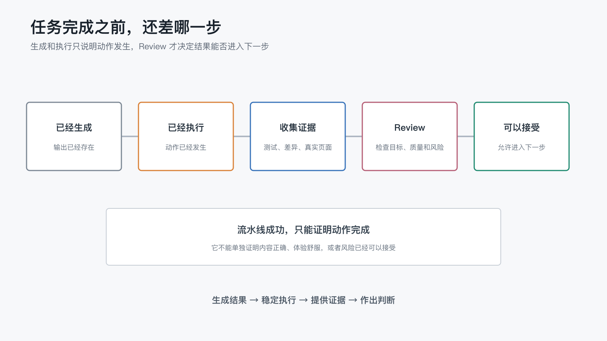

# 为什么 AI 工作系统需要 Review，而不只是生成？

上一篇文章最后，我留下了一个问题：

> AI 已经按工作流完成了任务，但我们凭什么确认这个结果真的可以接受？

这个问题看上去像是在问“要不要再检查一次”，但它其实关系到整套 AI 工作系统能不能继续扩大自动化范围。

AI 可以生成文章、修改代码、运行脚本，也可以在推送后自动触发持续集成（CI）。当屏幕上出现“任务完成”或流水线变成绿色时，我们很容易把执行结束当成工作结束。

但在这个项目里，我已经多次遇到另一种情况：脚本确实执行成功了，最终结果却不一定适合直接交给读者。

GitHub Wiki 和 Gitee Wiki 都能同步成功，但页面顺序和导航体验可能不同；文章可以被成功发布到墨问，但标题编号、封面和目录嵌套仍然需要确认；一篇文章也可以语句通顺、结构完整，却没有承接上一篇末尾留下的问题。

这些都不是“生成失败”。

它们暴露的是另一层问题：**系统完成了动作，却还没有证明结果可以接受。**

这就是 Review 存在的理由。

## 1. 生成、执行和可以接受，是三个不同状态

在一次 AI 任务里，至少有三个容易被混在一起的状态。

### 已经生成

AI 给出了文章、代码、方案或配置文件。

这只能说明输出存在，不代表内容准确，也不代表它符合项目当前的规则。

### 已经执行

脚本运行结束，文件被修改，流水线完成，内容成功推送到平台。

这说明动作已经发生，但执行成功仍然可能把错误内容更快地送到更多地方。

### 可以接受

结果符合目标、规则和质量要求，关键风险已经被识别，相关证据足以支持“可以继续”这个判断。

只有走到这里，一次任务才真正完成。

如果工作流只定义“怎么生成”和“怎么执行”，却没有定义“什么结果可以接受”，系统就会在最重要的地方留下空白。

从生成结果到真正可以接受，中间还需要证据和 Review：

流水线成功只能证明动作已经完成，不能单独证明结果正确。

## 2. Review 不是重新做一遍

一提到 Review，很多人会想到人工从头到尾再检查一遍。

如果 AI 写完文章，人还要逐字重写；AI 改完代码，人还要重新实现一次，那么这套协作确实没有节省多少精力。

但有效的 Review 不是重复执行，而是针对结果回答几个不同的问题：

1. **正确性**：事实、链接、代码和配置是否正确？
2. **一致性**：结果是否遵守项目规则，是否与前后文和现有系统保持一致？
3. **完整性**：要求中的关键部分是否遗漏，异常路径是否被考虑？
4. **可用性**：真实读者或使用者能否顺利理解、操作和连续阅读？
5. **风险**：这次改动会不会泄露信息、破坏已有内容，或者触发不可逆操作？

这些问题不应该全部交给同一个人，也不应该全部留到最后才看。

成熟的 Review 会把不同问题放到最适合处理它们的位置，让脚本、AI 和人分别承担自己擅长的部分。

## 3. Review 需要分层，但这一篇先不急着划边界

Review 并不意味着所有问题都交给人从头检查。能够明确判断的格式、链接和测试结果，可以由脚本稳定验证；需要理解前后文的问题，可以先由 AI 帮助发现疑点；涉及目标、体验、风险和价值取舍时，才需要人作出决定。

这里最重要的不是记住三种角色的清单，而是先确认一件事：**不同问题需要不同证据，也应该放到不同位置处理。** 如果所有检查都堆到最后交给人，Review 会变成新的重复劳动；如果所有判断都交给自动化，系统又可能在目标已经偏离时继续运行。

至于哪些检查可以直接自动化、哪些适合 AI 审阅、哪些判断必须留给人，下一篇会专门展开。本文先继续回答更基础的问题：Review 需要什么证据，又怎样形成一个完整闭环。

## 4. Review 需要证据，而不是一句“已经完成”

“已经修改”“测试通过”“发布成功”，这些描述都太容易说出口。

真正有用的 Review，需要看到能够支持判断的证据。

不同任务的证据可能不同：

- 修改文章时，看正文差异、元信息解析结果和 README 索引变化。
- 修改代码时，看代码差异、测试输出和失败路径。
- 执行发布时，看试运行清单、流水线日志和实际页面。
- 调整界面时，看真实尺寸下的截图和交互结果。
- 引用外部事实时，看原始来源，而不是只看生成文本里的结论。

证据也需要说明边界。

单元测试通过，只能证明被测试的部分符合预期；Wiki 同步脚本成功，只能证明推送动作完成；一个平台显示正常，也不能自动证明另一个平台的导航、链接和排版都正常。

所以，好的完成说明不只是“我做完了”，还应该包括：

1. 做了哪些改动。
2. 用什么方式验证。
3. 哪些范围还没有验证。
4. 仍然存在哪些需要人判断的风险。

当这些信息足够清楚时，Review 才不需要重新猜测整个过程。

## 5. 这个项目里，哪些问题只有 Review 才能发现

这个系列本身就是一条不断补充 Review 的实践链路。

### 流水线成功，不代表阅读体验正确

GitHub Wiki 和 Gitee Wiki 都已经能够自动发布，但两个平台的导航机制并不相同。

脚本可以确认页面已经推送，却无法仅凭退出状态判断左侧导航是否顺序混乱、链接是否方便点击、目录是否适合连续阅读。最后仍然要打开真实页面查看。

这属于体验 Review。

### 发布成功，不代表内容结构符合预期

墨问接口可以创建文章，也可以返回发布结果，但“成功创建一篇笔记”并不等于整个系列已经正确呈现。

文章标题需要统一编号，目录要按最新文章在前的顺序排列，新文章还要被嵌入总目录。这些要求有些可以继续脚本化，有些则需要先通过真实页面确认平台行为。

这属于结构和集成 Review。

### 单篇文章没问题，不代表系列没有冲突

之前审阅系列文章时，我们发现上一篇结尾预告的问题，与下一篇实际主题并不一致。

如果只看新文章本身，它可能完整、通顺，也符合选题；但读者连续阅读时，会感到承诺没有被兑现。后来我们才把“写新篇前回顾上一篇末尾钩子”写进项目规则。

这属于上下文一致性 Review。

### 文件看起来正常，不代表标准工具能够读取

文章开头的元信息看上去只是几行普通文本，但其中包含冒号等 YAML 特殊字符时，简化脚本可能可以读取，标准解析器却会报错。

肉眼检查和仓库脚本都没有暴露问题，换成标准 YAML 解析后才发现格式并不可靠。

这属于标准兼容性 Review。

这些例子说明，Review 不是发布前额外增加的一道形式流程。它会把真实运行中发现的问题，逐步变成下一次可以自动检查的规则。

## 6. 一个最小 Review 闭环

并不是每次任务都需要复杂的审查流程。

对大多数日常协作，一个最小 Review 闭环可以只有五步：

1. **先写清验收条件**：开始前说明什么结果才算完成。
2. **生成或执行任务**：让 AI、脚本或流水线完成具体动作。
3. **收集验证证据**：运行测试、查看差异、执行试运行或打开真实页面。
4. **按风险分配判断**：机械问题自动检查，上下文问题交给 AI 复核，关键取舍留给人。
5. **把新发现反馈给系统**：稳定复现的问题进入规则、测试或工作流。

最后一步尤其重要。

如果每次 Review 都发现同一个问题，却始终只靠人提醒，Review 就变成了重复劳动。只有把稳定发现转成项目规则或自动检查，系统才会真正进步。

反过来，也不能因为某个问题出现过一次，就立即增加大量规则。先确认它是否会重复、是否能够准确判断、自动化成本是否合理，再决定如何沉淀。

Review 不只是给当前结果打勾，它还在帮助下一次任务减少同类错误。

## 7. Review 不是自动化的刹车

从表面看，生成之后增加 Review，会让工作流多一个步骤。

但没有 Review 的自动化，很难被放心地扩大。

当我们不知道结果是否可靠时，只能缩小自动化范围，或者每次都从头人工检查。相反，当系统能够提供清晰证据，知道哪些问题可以自动拦截、哪些位置必须等待人确认，更多重复动作才敢交给它。

所以，Review 并不是为了降低 AI 的速度。

它真正解决的是信任问题：不是让人凭感觉相信 AI，而是让系统持续提供足够证据，使人可以在正确的位置作出判断。

生成让 AI 产出结果，工作流让结果稳定出现，Review 则决定这个结果能不能进入下一步。

当 Review 也开始稳定重复时，下一个问题自然会出现：

> 哪些审阅可以继续变成自动检查，哪些判断又必须始终留给人？

这可能是长期 AI 工作系统继续扩展时，最需要守住的一条边界。
