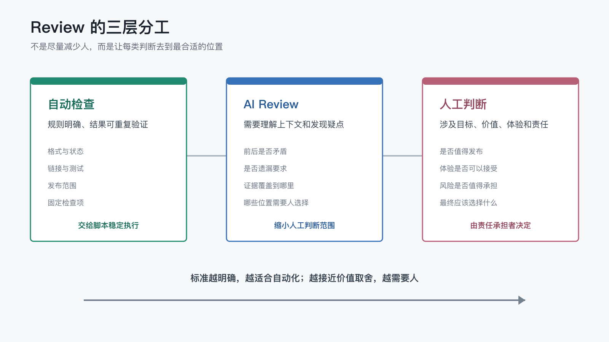

# 哪些 Review 可以自动化，哪些判断必须留给人？

上一篇文章最后，我留下了一个问题：

> 哪些审阅可以继续变成自动检查，哪些判断又必须始终留给人？

这个问题看似是在讨论工具分工，实际决定了一套 AI 工作系统能走多远。

如果所有结果都要人从头检查一遍，自动化只是把工作从“亲自执行”换成了“逐项验收”；但如果为了追求无人参与，把所有判断都交给脚本或 AI，系统又可能在目标已经偏离时继续高速运行。

所以，Review 的理想状态不是尽量减少人，也不是给每一步都增加人工审批。

更合理的目标是：

> 让系统自动处理能够明确判断的问题，让 AI 帮助发现需要理解上下文的问题，让人只出现在真正需要决策的位置。

## 1. 不是所有 Review 都值得人工完成

当一个工作流刚刚建立时，人工检查通常最多。

文章修改后，要看看元信息有没有写错；README 是否更新；Wiki 发布范围是否正确；多个平台上的标题、顺序和链接是否一致。发布完成后，还要打开真实页面确认阅读体验。

这些检查一开始混在一起，都由人完成并没有问题。因为只有真实运行过几次，我们才知道平台会在哪里出错，哪些结果值得关注。

但如果每次都重复检查同一批确定性问题，人工 Review 很快会变成新的机械劳动。

例如：

- `status` 是否已经变成 `ready`。
- 文章元信息能否被标准 YAML 解析器读取。
- README 是否包含所有可发布文章。
- Wiki 试运行是否列出了正确数量的页面。
- 测试和格式检查是否通过。

这些问题并不需要人的审美和价值判断。只要规则已经明确，脚本通常比人检查得更稳定。

所以，Review 自动化的起点不是“这件事能不能交给 AI”，而是先分清：眼前的问题究竟是规则判断，还是人的判断。

## 2. 第一类：可以直接自动化的检查

最适合自动化的 Review，通常有三个特征：

1. 判断标准可以明确写出来。
2. 输入和输出相对稳定。
3. 同一个结果可以被重复验证。

在这个项目里，文章是否可以进入发布链路，已经不需要每次靠人回忆。

脚本会读取文章元信息，只有 `status: ready` 的文章才会进入 GitHub Wiki、Gitee Wiki 和墨问的发布范围。README 索引也由脚本根据相同状态生成。这样，“这篇文章是不是准备发布”就从临时判断变成了结构化条件。

类似的自动检查还包括：

- 用标准解析器验证文章元信息。
- 检查生成后的 README 是否遗漏文章。
- 通过 Wiki 试运行（dry-run）确认页面名称和数量。
- 通过测试确认发布脚本的编号、排序和内容转换逻辑。
- 用 `git diff --check` 检查多余空格和格式问题。

这类检查的价值，不只是节省几分钟。

人会疲劳，也可能因为“前几次都没问题”而跳过某一步。脚本不会因为任务看起来熟悉就降低检查标准。只要规则没有变化，它每次都能给出相同的判断。

但自动检查也有边界。

它只能证明规则中写明的条件已经满足，不能证明规则之外的一切都正确。七篇文章都成功进入 Wiki，只能说明发布范围正确，不能说明每篇文章都值得阅读。

## 3. 第二类：适合 AI Review，但不能直接放行

有些问题无法用简单的“是或否”判断，却仍然可以通过上下文和检查清单发现。

例如：

- 新文章是否承接上一篇结尾留下的问题。
- 同一个概念在前后文章中是否出现矛盾。
- 内容是否重复，结构是否突然跳跃。
- 代码改动是否超出这次任务范围。
- 测试结果是否覆盖了真正发生变化的部分。
- 文档描述是否与脚本的实际行为一致。

这些问题很适合让 AI 先做一轮 Review。

AI 可以同时阅读前后文章，比较不同文件，整理代码差异，也可以把“已经验证”“根据上下文推断”和“仍然缺少证据”分开列出。它的优势是能够快速处理大量上下文，并按照固定视角反复检查。

但 AI Review 不能自动等同于最终放行。

首先，生成内容的 AI 可能会延续自己原来的假设。即使换一个会话或角色审阅，它仍然可能共享相似的盲区。

其次，AI 能判断内容是否前后一致，却未必知道这种一致是不是作者真正想表达的立场。它也可以确认测试已经运行，却不能仅凭测试名称证明真实用户路径一定没有问题。

所以，这一层更适合产出的是：

1. 发现的问题和疑点。
2. 已经获得的验证证据。
3. 证据尚未覆盖的范围。
4. 需要人作出选择的位置。

AI Review 的职责是缩小人工判断范围，而不是替人宣布“一切都没问题”。

## 4. 第三类：必须留给人的判断

有些问题即使能够收集很多信息，也没有唯一的标准答案。

例如：

- 这篇文章是否真的值得发布。
- 表达方式是否符合作者长期形成的立场和审美。
- 第一次看到项目的读者会不会迷路。
- 某个残余风险是否可以接受。
- 是否应该为了自动化方便而改变原来的内容结构。
- 涉及外部账号、敏感信息或不可逆操作时，是否允许继续。

这些判断依赖目标、价值、体验和责任归属。

脚本可以告诉我 Gitee Wiki 已经同步成功，但它不能决定左侧导航的展示方式是否舒服。AI 可以比较 GitHub 和 Gitee 的页面结构，却不能替我决定：读者体验差到什么程度时，应该调整发布策略。

墨问接口也可以返回文章创建成功，目录脚本可以确认新文章已经嵌入最上方。但封面是否合适、标题是否自然、整套目录看起来是否像我愿意公开分享的作品，仍然需要人确认。

这些人工节点不是因为自动化能力不够强。

即使未来模型更准确、工具更丰富，最终目标仍然来自人。系统可以帮助呈现选项、解释影响和暴露风险，却不应该默默替责任承担者决定什么值得做。

人的价值正在从“亲自执行每个动作”，转向“定义什么才算对，并为关键取舍负责”。

把这三类 Review 放在一起看，它们的分工边界会更直观：

标准越明确，越适合自动化；越接近价值取舍，越需要人。

## 5. 一个判断能不能自动化，先问四个问题

以后再遇到重复出现的 Review 项时，可以先问四个问题。

### 判断标准能否写清楚？

“文章元信息必须能被标准 YAML 解析”很清楚。

“文章读起来要舒服”则包含节奏、读者背景、表达偏好等多种因素，很难直接压缩成一个稳定规则。

### 错误结果能否被可靠识别？

链接返回 `404`，脚本可以明确发现。

但一篇文章虽然没有事实错误，却让读者误解了重点，这种失败很难只靠单一指标识别。

### 自动判断出错后，代价是否可控？

本地格式检查误报一次，通常只需要人工确认。

如果自动化判断错误后会公开敏感信息、覆盖远端内容或触发不可逆操作，就应该保留更严格的人工确认点。

### 这件事是否仍然涉及价值取舍？

工具可以判断两个方案分别需要多少成本，却不能替人决定应该优先追求速度、质量、覆盖范围还是长期维护性。

前三个问题都有明确答案，并且最后一个问题不涉及价值取舍时，这项 Review 才比较适合直接自动化。

如果标准仍然模糊，可以先把它交给 AI 辅助审阅；如果涉及目标、责任和风险接受，就应该明确保留人的决定权。

## 6. Review 的边界不是一次划定的

自动检查、AI Review 和人工 Review 之间，并不存在永远不变的分界线。

这个项目最初发布文章时，很多步骤都靠人工确认。随着真实问题不断出现，一部分检查逐渐进入系统：

1. 文章状态进入元信息，发布范围可以自动筛选。
2. README 索引交给脚本生成，不再手工维护两份列表。
3. Wiki 同步增加试运行，提交前就能看到目标页面。
4. 墨问文章编号、时间倒序目录和内容映射进入自动化。
5. 内容哈希没有变化时跳过远端编辑，避免浪费接口额度。

与此同时，另一些判断仍然留给人：

- 文章从 `review` 进入 `ready`，需要人确认内容质量。
- 跨平台页面是否舒服，需要查看真实展示效果。
- 新的自动化规则是否值得长期维护，需要结合使用频率和风险决定。
- 平台行为与预期不一致时，是否继续重试，需要判断外部限制和操作成本。

这条边界会随着证据变化。

某个问题第一次出现时，我们可能只能人工观察；当它稳定复现、判断标准逐渐清楚后，可以先交给 AI 检查，再进一步变成脚本或测试。

反过来，如果自动检查经常误报，或者真实情况已经超出原来的规则，就应该把判断重新交还给 AI 或人，而不是为了“自动化覆盖率”保留一条失真的规则。

## 7. 自动化也必须知道什么时候停

一套成熟的工作流，不只是能够自动继续，也必须能够自动停止。

至少遇到下面几类情况时，系统应该停下来：

- 关键验证证据缺失。
- 实际结果与预期不一致。
- 操作涉及敏感信息或不可逆影响。
- 外部平台的权限、额度或状态无法确认。
- 多条规则给出了互相冲突的结论。

以墨问发布为例，脚本逻辑和本地转换测试都可以通过，但远端平台仍然可能返回接口额度限制。

这时，系统已经完成了它能够完成的 Review：本地内容有效、发布范围正确、请求路径符合约定。外部额度是否需要充值、是否暂时改为人工发布，则是成本和运营选择，不应该被当成代码故障无限重试。

停止不是自动化失败。

恰恰相反，知道什么时候不应该继续，是自动化具备边界感的表现。

## 8. 人不是工作流外面的审批者

当越来越多 Review 被自动化后，人并不会从系统中消失。

人也不应该退到工作流末端，变成一个等自动化结束后统一盖章的审批者。更合理的做法，是让人出现在目标、信息或责任真正发生变化的节点，其余步骤则依据已经确认的规则和证据继续运行。

这意味着，Review 边界划清之后，问题并没有结束。它还会进一步改变人的工作：当重复执行、固定检查和部分上下文整理逐渐被系统接走，人究竟应该把注意力放在哪里？

于是，下一个问题自然出现：

> 当 AI 成为长期协作者，人真正需要做的工作还剩下什么？

这可能是下一篇值得继续讨论的问题。
