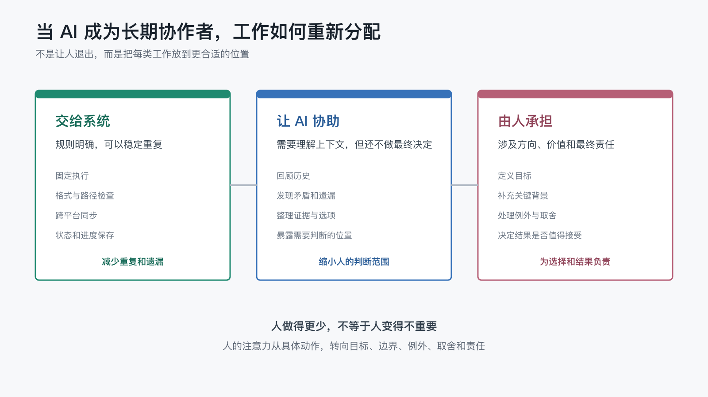

# 当 AI 成为长期协作者，人真正需要做的工作还剩下什么？

上一篇文章最后，我留下了一个问题：

> 当 AI 成为长期协作者，人真正需要做的工作还剩下什么？

这个问题很容易滑向两个极端。

一种想象是，AI 越来越能干，人迟早只需要说一句话，然后等待结果。

另一种担心是，AI 虽然完成了很多动作，人却要花更多时间写提示、检查结果、修正偏差，最后只是从“亲自做”变成“盯着 AI 做”。

真实情况通常不在这两个极端里。

当 AI 进入一个有记忆、有流程、有证据、有 Review 的长期工作系统后，人确实不必再亲自完成每一个动作。但这不等于人的工作消失了。

更准确地说，人的工作开始重新分配。

一部分重复动作交给系统，一部分需要理解上下文的工作交给 AI 协助，真正涉及目标、取舍和责任的部分则更集中地回到人手里。

## 1. 先被减少的，是那些反复从头开始的工作

在一次性聊天里，人经常要重复做同一类准备。

换一个新会话，要重新解释项目是什么；要提醒哪些文件不能改；要说明文章写给谁看；要告诉 AI 发布前需要更新 README；任务结束后，还要逐个打开页面确认链接和图片是否正常。

这些动作单独看都不复杂，但它们不断切断人的注意力。

长期工作系统首先减少的，往往不是最有创造力的工作，而是这些反复出现的“重新说明”和“重新确认”：

- 重复介绍项目背景。
- 反复提醒固定规则。
- 在多个文件之间机械搬运内容。
- 每次从头检查相同的格式和路径。
- 追问任务做到哪一步、还剩什么。

这个项目就是这样一点点变化的。

最初，文章是否可以发布、README 是否需要更新、Wiki 会同步哪些内容，都依赖对话里的临时说明。后来，文章状态进入结构化元信息，README 由脚本生成，三个平台从同一份 Markdown 发布，Wiki 在发布后还会自动检查远端页面和图片哈希。

这些工作并不是“不重要”。

恰恰因为它们重要，又有稳定的判断标准，才值得从人的记忆里移到系统里。

## 2. 交给系统的，不只是执行动作

很多人把自动化理解为“帮我点按钮”。

但一个长期工作系统真正接走的，通常包含三层工作。

第一层是固定执行。

例如更新文章索引、生成 Wiki 页面、同步到不同平台、给文章补连续阅读导航。这些动作一旦规则明确，就不需要人每次重新操作。

第二层是确定性检查。

例如文章元信息能否解析、配图文件是否存在、远端图片是否返回正确内容、生成后的页面是否与预期一致。这些问题有明确答案，脚本可以比人更稳定地重复验证。

第三层是进度记忆。

例如哪些文章已经发布、哪张图片已经上传、某个平台因为额度限制停在什么位置。系统把这些状态保存下来，下次可以继续，而不是要求人重新回忆整条过程。

这三层工作被接走后，人获得的并不只是一点操作时间。

更重要的是，人的注意力不再被大量“我是不是漏了什么”占用。

## 3. AI 更适合接住那些需要理解、但还不需要最终决定的工作

固定规则可以交给脚本，但现实中还有很多问题没有简单的“通过”或“失败”。

例如：

- 新文章是否承接了上一篇的结尾。
- 一段解释对普通读者是不是太技术化。
- 一张配图能否真的降低理解成本。
- 某次故障是代码问题、平台延迟，还是外部额度限制。
- 一个新发现值得写进长期规则，还是只适合留在本次记录里。

这些工作需要阅读上下文、比较前后变化、提出可能的解释。AI 在这里很有价值。

它可以先回顾历史，整理证据，指出矛盾，给出几个可选方向，也可以把确定的信息和仍需判断的部分分开。

但它不应该替人默默完成最后一步。

AI 可以说“这篇文章加入一张三类工作分工图，可能比继续增加文字更容易理解”；是否采用、图放在哪里、它是否符合整个系列的表达方式，仍然需要作者判断。

AI 的作用不是让人退出，而是把一个模糊问题整理到人可以更快作出决定的状态。

## 4. 人留下来的，是五类越来越集中的工作

当重复执行、固定检查和大部分上下文整理被接走后，人真正需要做的工作反而更清楚。

### 定义目标

AI 可以快速生成文章、代码或方案，但“这次真正想解决什么”不能只从历史模式里推出来。

同样是优化发布流程，可以追求速度，可以追求稳定，也可以优先改善第一次访问项目的读者体验。目标不同，合理方案也不同。

### 提供关键背景

长期记忆可以保存很多事实，却不可能自动拥有所有现实语境。

哪些变化来自临时活动，哪些读者是这次真正关心的人，某个看似小的问题为什么会影响长期方向，这些背景常常需要人补充。

### 设定边界和验收标准

“做完”并不是一个天然清楚的状态。

是脚本运行成功就算完成，还是 GitHub、Gitee 和墨问都需要验证？图片能够访问就够了，还是还要确认位置和阅读感受？哪些操作可以自动继续，哪些地方必须停下来？

这些边界决定了系统会把工作带到哪里。

### 处理例外和取舍

规则适合处理重复情况，真实工作却总会出现例外。

墨问每天的免费调用额度是否够用，要不要开通 PRO；Gitee 的页面顺序不完全可控时，是继续投入时间还是接受当前结果；一篇文章需要配图时，是增加一张简单图，还是保持纯文字。

这些问题没有脱离情境的标准答案。

### 承担最终责任

AI 可以提供建议，脚本可以给出证据，但公开什么、接受什么风险、把有限时间放在哪里，最终仍然需要有人负责。

这不是一句抽象的“人类监督”。

它意味着，当结果产生影响时，人不能把选择藏在“AI 建议如此”或“流程自动执行”后面。

把三类工作放在一起看，变化会更直观：

人的工作没有消失，而是从大量具体动作中收拢到更少、但更重要的位置。

## 5. 人不是从执行者升级成审批者

这里还有一个常见误区。

当系统承担越来越多动作后，人似乎只需要在每一步最后点“同意”。如果真是这样，人的工作并没有变得更有价值，只是多了一连串等待确认的按钮。

长期协作的目标，不应该是把人变成流水线末端的审批者。

人更像是工作系统的设计者和参与者：

- 在开始前说明方向。
- 在过程中补充系统不知道的现实变化。
- 在关键节点处理例外。
- 在结果出现后判断体验与价值。
- 在复盘时决定哪些经验值得进入下一轮系统。

有些流程可以连续运行到结束，有些流程必须在中间等人。区别不在于“人是否重要”，而在于眼前这个节点是否真的需要人的判断。

如果每一步都等待人，系统无法形成连续工作能力。

如果任何一步都不等待人，系统又可能带着错误目标稳定运行。

成熟的分工，是让人只在信息、责任或价值发生变化的位置出现。

## 6. 工作方式改变后，人的要求其实更高了

AI 接走一部分执行工作，并不会自动让人变得轻松。

当“怎么做”越来越容易时，“为什么做”和“什么才算做好”会变得更重要。

这要求人能够：

- 说清楚目标，而不只是抛出任务名称。
- 识别哪些问题值得长期解决，哪些只是一次例外。
- 接受系统给出的证据，也看见证据没有覆盖的地方。
- 在多个看起来都合理的方案之间作出取舍。
- 对最后进入现实世界的结果负责。

过去，一个人可以靠熟练操作掩盖目标不清。

现在，AI 可能很快把一个模糊目标执行得很完整。目标越模糊，自动化能力越强，偏离也可能越稳定。

所以，长期 AI 协作并不是降低了人的价值，而是把人的价值从“我能完成多少动作”，推向“我能否定义一个值得完成的结果”。

## 7. 一个简单练习：重新看一遍自己的工作

如果想知道 AI 应该在自己的工作里承担什么，可以先不研究更多工具，而是把最近一周反复做的事情分成三类。

### 第一类：重复执行

判断标准已经明确，只是需要稳定完成。

例如整理固定格式、同步内容、生成列表、重复发送相同提醒。

这类工作优先考虑交给脚本或工作流。

### 第二类：需要理解和检查

不能只靠固定条件判断，但可以通过上下文发现疑点、整理证据和缩小范围。

例如检查前后是否矛盾、比较多个方案、判断信息是否遗漏。

这类工作适合先让 AI 协助。

### 第三类：必须由人决定

涉及目标、价值、风险、体验和最终责任。

例如是否公开、是否投入更多成本、什么结果值得接受、下一阶段应该往哪里走。

这类工作不需要假装可以完全自动化。

完成这个分类后，再问自己一个问题：

> 我现在花最多时间的，真的是第三类工作吗？

如果答案是否定的，问题可能不是 AI 能力不够，而是前两类工作还没有进入系统。

## 8. 真正改变的，不只是效率

当 AI 只是一次性工具时，人最容易看到的是速度：写得更快、查得更快、改得更快。

当 AI 成为长期协作者后，更大的变化是工作分工。

系统开始记住状态、重复执行流程、检查确定性结果；AI 开始帮助理解上下文、整理证据和暴露疑点；人则把更多精力放在目标、边界、例外、取舍和责任上。

这种变化不一定让每一天看起来更轻松。

但它会逐渐减少那些没有必要由人反复承担的认知负担，让人的注意力回到真正影响方向的位置。

所以，当 AI 成为长期协作者，人剩下来的并不是一点零碎的“高级工作”。

人留下的是整套系统无法替自己定义的部分：什么值得做，什么结果可以接受，以及自己愿意为什么负责。

而当工作方式已经发生变化，下一个问题也会自然出现：

> 怎么判断一套长期 AI 工作系统，是真的帮助了自己，而不只是让流程变得更复杂？

这可能是下一篇值得继续讨论的问题。
