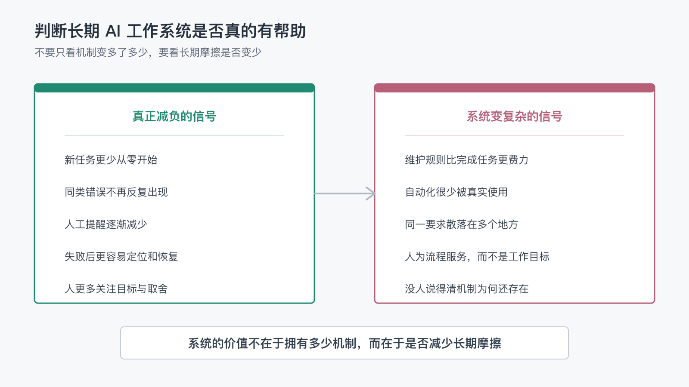

# 怎么判断一套长期 AI 工作系统，是真的有帮助，而不是让流程变得更复杂？

上一篇文章最后，我留下了一个问题：

> 怎么判断一套长期 AI 工作系统，是真的帮助了自己，而不只是让流程变得更复杂？

这个问题很重要，因为一套系统刚开始运行时，通常会变得比原来更复杂。

你需要增加项目规则、状态标记、检查脚本、发布流程，还要记住哪些内容应该写进 README，哪些内容应该留在文章里。单看新增的文件和步骤，很容易得出一个结论：我是不是只是给自己增加了更多维护工作？

答案不能只看系统有多少文件、多少脚本或多少自动化步骤。

真正应该观察的是：

> 这套系统有没有减少长期重复出现的摩擦？

## 1. 系统变复杂，不等于工作变简单

复杂度和价值不是一对简单的反义词。

一套系统可能暂时增加一些结构，但让之后的每次工作都少解释一点、少检查一点、少犯一次同样的错误。这样的复杂度是有回报的。

反过来，一套系统也可能看起来非常自动化，却要求人不断维护规则、填写状态、确认没有用的输出。这样的系统虽然“能力很多”，却没有真正减轻负担。

所以，不能只问：

- 现在多了多少个文件？
- 现在多了多少个步骤？
- 现在用了多少个工具？

还要继续问：

- 新任务是否更少从零开始？
- 同类错误是否真的减少？
- 人工提醒是否越来越少？
- 出错后是否更容易定位和恢复？
- 人是否更多关注目标和取舍，而不是流程本身？

这些问题比“自动化程度有多高”更接近系统的真实价值。

## 2. 用五个指标观察系统是否真的减负

“节省了多少时间”当然是一个有用指标，但它不是唯一指标。

有些工作流第一次搭建时，确实比手工完成更慢。比如为一篇文章补充 frontmatter（文章元信息），建立状态区分，写一个发布检查，或者把图片转换成多个平台都能显示的格式。这些动作可能不会立刻让当天的任务更快完成。

更适合长期观察的，是下面五种摩擦有没有持续减少。每个指标都同时回答三件事：它代表什么价值、从哪里看到变化、复盘时具体问什么。

### 指标一：新任务更少从零开始

它代表背景和稳定做法已经被系统接住，而不是继续依赖人的临时说明。

在这个项目里，新文章不需要重新发明文章状态、README 索引、Wiki 导航和图片发布方式。已有规则和脚本提供了可复用的起点，但不会强迫每篇文章采用相同的内容结构。

复盘时可以问：**这次开始任务时，哪些背景和基础动作不再需要重新解释？**

### 指标二：同类错误持续减少

它代表一次修复已经变成可重复的保护，而不只是当时把问题处理掉。

例如，Wiki 图片最初需要人工逐页检查，后来发布前后检查可以验证图片路径、HTTP 状态和内容哈希。它不会让文章写得更好，却能防止同类确定性错误反复出现。

复盘时可以问：**哪个真实发生过的错误，现在有证据表明不会再以同样方式出现？**

### 指标三：人工提醒越来越少

它代表稳定规则已经进入合适的承载位置，人不必反复说“记得更新 README”“记得检查上一篇钩子”或“记得更新旧文章导航”。

规则进入项目说明、脚本、测试或工作流后，人的提醒应该逐渐从重复指令变成少数真正的判断。不过，内容质量、公开范围和外部账号操作仍然需要保留人工节点。

复盘时可以问：**这次还有哪些提醒只是因为系统没有读到或执行已有规则？**

### 指标四：失败更容易定位和恢复

它代表系统能够保存进度和证据，而不是假设所有步骤永远成功。

一个好的发布流程应该能够说明哪个平台已经成功、哪一步失败、本地源文件是否更新、重试是否会产生重复内容，以及暂时无法继续时应该从哪里恢复。墨问额度不足时保存已完成映射、等待恢复后继续，就是这种能力的体现。

复盘时可以问：**如果现在中断，下一次能否根据现有记录继续，而不必重新猜测整个过程？**

### 指标五：人的注意力回到目标与取舍

它代表系统真正接走了机械负担，而不是增加了另一层管理工作。

如果人能够更多讨论文章应该写什么、读者是否能看懂、哪些经验值得公开、哪些风险可以接受，而不是手动搬运、重复检查和追踪状态，系统才真正产生了价值。

复盘时可以问：**人这次主要在作出判断，还是仍然在替系统记步骤、搬内容和追进度？**

这些价值不一定都能立刻换算成分钟，但可以通过具体变化反复观察。

## 3. 从当前项目可以看到哪些真实证据

这套判断不需要停留在抽象指标上。当前项目的几次改造，已经提供了几个具体例子。

文章的 `status` 把“正在修改”和“允许发布”区分开，减少了草稿误发布的风险。

README、GitHub Wiki 和 Gitee Wiki 使用同一份文章源文件，减少了多处手工复制带来的不一致。

Wiki 发布前后都有检查，图片格式、路径、页面内容和远端资源都可以被自动验证，减少了每次人工打开页面排查的范围。

文章底部的“上一篇、目录、下一篇”由脚本全量重建。新增文章时，旧文章的导航也会一起更新，不需要记住每一篇受影响的页面。

墨问发布则保留了文章和笔记 ID 的映射。遇到额度限制时，系统不会无限重试，而是保留尚未完成的任务，等额度恢复后继续。

这些机制并不是越多越好。它们之所以值得保留，是因为每一项都对应着真实出现过的重复劳动、错误或恢复成本。

## 4. 也要警惕系统正在变复杂

长期系统的另一个风险，是把所有经历都变成永久规则。

下面这些情况，通常说明系统复杂度已经开始失去控制：

- 维护规则比完成真实任务更费力。
- 自动化长期没有被真实使用，只是在等待一个想象中的场景。
- 为极少发生的问题引入了很多额外机制。
- 同一个要求同时写在多个地方，修改时经常忘记同步。
- 人开始服务流程，而不是让流程服务于工作目标。
- 没有人能解释某个脚本或状态字段为什么还需要存在。

这些信号负责暴露问题，不负责在这一篇给出完整的清理方案。下一篇会专门讨论内容和机制如何更新、合并、降级与删除。

## 5. 系统的价值在于少一些长期摩擦

一套长期 AI 工作系统真正成熟的标志，不是它拥有多少个脚本、多少个检查点或多少种集成。

更可靠的判断是：

- 它是否让下一次工作更容易开始？
- 它是否让已经解决的问题不再反复出现？
- 它是否让失败更容易理解和恢复？
- 它是否让人有更多精力处理目标、体验和责任？

如果答案大多是肯定的，那么系统增加的结构可能正在产生价值。

如果答案是否定的，就应该暂停继续扩建，先确认复杂度来自哪里。

长期工作系统不是一座只能不断加高的建筑。它更像一套需要持续调整的工作环境：有些东西应该沉淀，有些东西应该自动化，还有一些东西到了合适的时候就应该被清理掉。

所以，判断系统是否有帮助，最后不妨回到一个很朴素的问题：

> 最近一次工作中，这套系统具体替我减少了哪一种长期摩擦？

如果暂时答不上来，下一步不一定是增加更多能力，而可能是先观察和复盘。至于没有价值的机制具体如何处理，应该建立在下一步的治理判断上。

而当我们开始讨论“什么应该留下、什么应该删除”时，下一个问题也会自然出现：

> 为什么长期工作系统需要清理，而不是只需要积累？

这会是下一篇值得继续讨论的问题。
