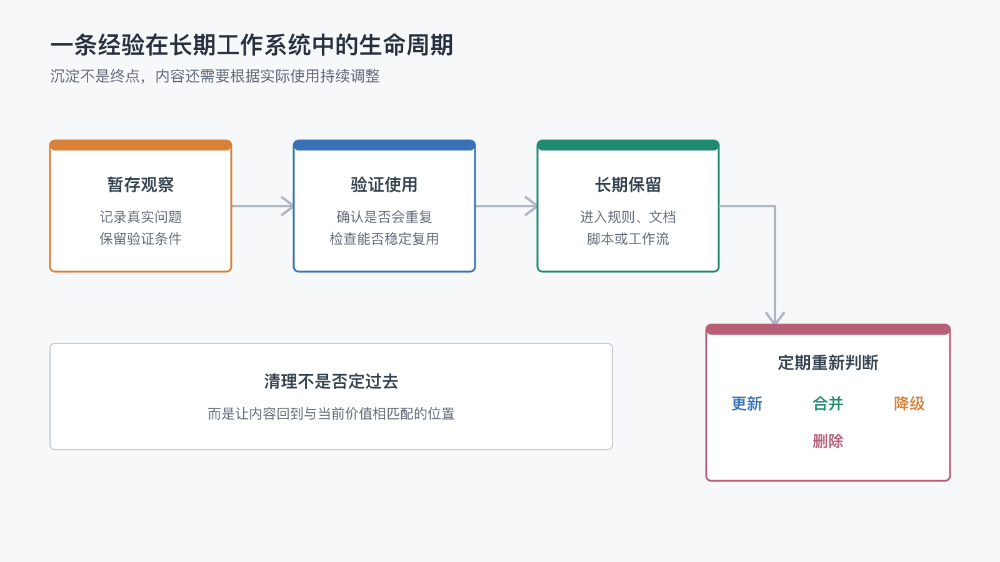

# 为什么长期工作系统需要清理，而不是只需要积累？

上一篇文章最后，我留下了一个问题：

> 为什么长期工作系统需要清理，而不是只需要积累？

这个问题听起来有些反直觉。

我们搭建长期 AI 工作系统，最初就是因为 AI 会忘记。于是，我们把项目目标写进 README，把协作规则写进 `AGENTS.md`，把当前进度写进状态文件，再把验证过的经验变成脚本、测试和工作流。

既然记忆来之不易，为什么还要主动删除？

因为长期系统真正需要的，不是“什么都记得”，而是“在需要的时候，能够读到仍然可信的内容”。

如果一条信息已经过期、重复或者与当前规则冲突，它被保留下来并不会增加记忆，反而会增加判断成本。

## 1. 记得越多，不代表理解得越好

对人来说，旧笔记太多时，需要花时间判断哪些仍然有效。

对 AI 来说也是一样。

假设一个项目同时留下了三段说明：

- 早期记录说文章发布后需要手工更新 Wiki。
- 后来的规则说 Wiki 已经由 GitHub Actions 自动同步。
- 一份没有日期的操作笔记又说 Gitee GO 负责发布。

如果这些内容同时存在，AI 不能只靠“读到了”就知道应该相信哪一条。它还要结合文件位置、更新时间、当前代码和项目规则，重新判断哪个才是现在的事实。

信息越多，这个判断不一定越准确。

未经维护的长期记忆，常见的问题有三种：

1. 过期状态伪装成当前事实。
2. 新旧规则给出互相冲突的指令。
3. 同一说明散落在多个位置，修改时只更新了其中一份。

这和完全没有记忆是两个相反的极端。

没有记忆时，每次都要从零解释；记忆失控时，每次都要从一堆历史内容中重新判断。

## 2. 最容易留下来的五类过期内容

长期系统中的“清理”，不是删除所有旧资料，而是识别哪些内容已经不应该继续影响未来工作。

下面五类内容最容易被忽略。

### 已完成任务留下的临时状态

排查一次流水线失败时，我们可能记录错误日志、猜测原因、尝试过的命令和下一步动作。

这些信息在处理中很有价值。但问题解决后，真正值得长期保留的通常只是最终原因、稳定修复和验证方式。

如果所有中间猜测都继续出现在当前状态文件里，下一次接手的人或 AI 很容易误以为问题仍未解决。

### 已经被替代的旧规则

工作方式发生变化后，旧操作说明可能不会自动消失。

例如，原来需要手工运行发布脚本，后来已经改成 push 后自动触发。如果旧说明仍然放在显眼位置，系统就会同时存在两套操作路径。

这类内容最危险的地方，不是它完全错误，而是它曾经正确，所以看起来仍然可信。

### 重复出现在多个位置的说明

同一条规则写在 README、`AGENTS.md`、工作流注释和发布手册里，看起来像是“多一份保障”。

但只要其中一个地方修改了，其他副本就可能变成旧版本。

真正稳定的做法不是到处复制，而是指定一个可信源头，其他位置只保留入口或引用。

### 只使用过一次的自动化

一次偶发问题很容易激发我们写一个新脚本、增加一个状态字段，或者建立一套检查流程。

如果它之后从未再次运行，它就可能从“解决问题的工具”变成“需要维护的机制”。

自动化也有成本：依赖会更新，平台接口会变化，后来的人还要理解它为什么存在。

### 已经失效的平台经验

外部平台的行为经常变化。

某个页面曾经可以手工拖动排序，某个接口曾经每天限制十次调用，某种图片地址曾经无法展示。这些经验都来自真实使用，但不能因此永久视为不变规则。

平台经验需要保留观察时间和验证条件。情况变化后，应当更新当前规则，并把旧结论降级为历史背景。

## 3. 清理不只是删除

谈到清理，很容易把它理解成“这个文件要不要删”。

实际上，一条内容退出当前位置时，至少有四种处理方式。

### 更新

内容仍然有价值，但描述已经过期。

例如发布流程仍然需要说明，只是执行方式从手工脚本变成了自动流水线。这时应该修改当前说明，而不是保留两套版本。

### 合并

多个位置表达的是同一个规则。

选择一个最合适的可信源头保留完整内容，其他地方改成简短入口。这样既能被找到，也不需要多处同步维护。

### 降级

某条经验不再适合作为当前规则，但仍然有追溯价值。

例如 Gitee Wiki 手工排序会在下一次同步后变化，这个结论不应该继续驱动发布流程，但可以留在历史记录中，帮助以后理解为什么采用编号文件名。

### 删除

内容已经没有当前价值，也没有值得保留的历史作用。

例如已经完成的临时待办、被证伪的猜测、重复生成的中间文件，可以直接删除。

把这四种动作放在一起，内容在长期系统中的生命周期会更清楚：

清理不是否定过去的工作，而是让内容回到与它当前价值相匹配的位置。

## 4. 怎么判断一条内容是否应该清理

不需要给每份文件建立复杂的保留期限。遇到可疑内容时，可以先问五个问题。

### 现在还有谁读取它？

如果一个文件没有被人查看，也没有被 AI、脚本或工作流读取，它可能已经失去入口。

没有读者的规则，即使写得很完整，也无法真正影响工作。

### 最近是否真实使用过？

一条规则可能听起来合理，但长期没有遇到对应场景。

这不代表必须立即删除，但应该重新判断它是否值得占据最核心的上下文入口。

### 它是否仍然代表当前事实？

检查实际代码、工作流和远端平台行为，而不是只看文字写得是否确定。

文档曾经正确，不代表现在仍然正确。

### 删除后，系统会失去什么？

这个问题可以避免为了整洁而误删重要背景。

如果删除后，下一次很可能重复犯错或无法理解关键决策，就应该保留结论，或者把它移动到更合适的位置。

### 它是否已有更可信的替代来源？

如果文章是否发布已经由元信息中的 `status` 决定，就不应该再在 README 中手工维护另一套状态。

旧内容已有稳定替代来源时，清理通常比继续同步更可靠。

## 5. 当前项目是怎么逐步清理边界的

这个项目并不是先设计出一套完整的清理制度，再开始写文章。

很多边界都来自真实使用。

### `AGENTS.md` 不保存所有操作细节

最初，为了避免忘记，发布流程中的一些具体重试逻辑和平台限制也可能被写进 `AGENTS.md`。

但这些细节变化较快，而且只与特定工作流有关。更合适的做法，是把它们放回脚本、工作流注释或发布手册中，让 `AGENTS.md` 只保留跨任务都需要的稳定规则和入口。

这样做不是少记录，而是避免最核心的规则文件快速膨胀。

### 工作日志不承担长期记忆

`WORKLOG.md` 适合记录最近做了什么、还剩什么和当前阻塞。

但任务结束后，旧过程不应该无限累积。仍然有价值的结论应进入规则、文档或脚本；已经失效的过程可以清理。

工作日志负责帮助继续当前工作，不负责保存项目的全部历史。

### 发布状态只有一个可信源头

文章能否发布，由文章元信息中的 `status` 决定。

README、GitHub Wiki、Gitee Wiki 和墨问都读取这个状态，而不是分别维护“已发布”标记。

这减少了重复信息，也让过期状态更容易被发现。

### 流程被替代后，旧路径不再并行保留

Gitee GO 曾经承担过 Wiki 发布，后来发布职责转移到 GitHub Actions。

如果两套流程同时运行，就可能重复发布或互相覆盖。关闭旧路径，本身就是一次系统清理：让当前责任边界只有一个答案。

## 6. 什么时候应该触发清理

清理不一定需要一个每周自动运行的复杂任务。

对小型项目来说，几个真实信号已经足够。

### 规则发生冲突时

AI 或人发现两个文件给出不同指令，不要只选择其中一个继续执行，还要追踪另一条为什么仍然存在。

### 流程被新方案替代时

新脚本、新平台或新工作流上线后，检查旧入口、旧说明和旧状态是否应该一起退出。

### 一个阶段结束时

故障处理完成、文章发布完成或一轮实验结束时，把临时记录中的结论提炼出来，再清理不再需要的过程。

### 核心入口开始膨胀时

当 README、`AGENTS.md` 或状态文件越来越难读，通常不是继续增加目录就能解决的问题。

应该检查其中是否混入了只属于某个局部流程的细节，或者重复保存了已经有可信源头的信息。

### 很久没人能解释某项机制时

如果一个脚本、字段或检查存在很久，却没人能说清它解决什么真实问题，就应该重新验证，而不是因为“可能有用”永远保留。

## 7. 给系统留一个最小清理循环

一套轻量的清理过程，可以只有四步。

1. 发现过期、重复或冲突的内容。
2. 找到当前可信事实和实际读取者。
3. 选择更新、合并、降级或删除。
4. 验证清理后，现有工作流仍然能够正常运行。

最后一步很重要。

清理不是只让文件数量变少。删除规则后，要确认脚本没有依赖它；合并说明后，要确认原来的入口还能找到新位置；关闭旧工作流后，要确认当前发布链路已经承担完整职责。

清理也需要证据，只是它验证的不是“新增能力能不能运行”，而是“移除旧内容后，系统是否仍然完整”。

## 8. 会遗忘的系统，反而更可靠

长期 AI 工作系统需要记忆，但记忆的价值从来不在数量。

真正有用的记忆应该满足三个条件：

- 它仍然代表当前事实。
- 它放在会被正确读取的位置。
- 它能够持续帮助未来的判断和行动。

不满足这些条件的内容，即使来自真实经历，也不应该永远占据当前上下文。

有些内容需要更新，有些需要合并，有些应该退回历史记录，还有一些可以直接删除。

所以，清理并不是长期系统的反面。

它和沉淀共同组成了一次完整的治理：让值得长期影响工作的经验留下，也让已经失效的内容停止影响未来。

一个什么都不肯忘记的系统，最终会让人和 AI 都困在历史里。

一个允许自己修正、合并和遗忘的系统，才有可能始终保持对当前工作的理解。

而当系统已经能够积累，也能够清理，下一步值得追问的是：

> 一套不会从零开始的 AI 助手，在真实工作中究竟能帮我们做什么？

这可能是下一篇值得继续展开的问题。
