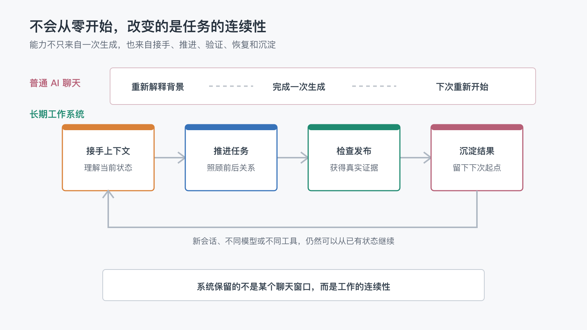

# 一个不会从零开始的 AI 助手，实际能帮我做什么？

上一篇文章最后，我留下了一个问题：

> 一套不会从零开始的 AI 助手，在真实工作中究竟能帮我们做什么？

这个问题看起来很好回答。

AI 可以写文章、改代码、查资料、生成图片、执行命令，也可以操作浏览器。只要打开一个模型的功能介绍，马上就能列出很长的清单。

但“能完成哪些动作”，并不是长期协作最重要的区别。

普通 AI 聊天也能写出一篇文章。真正困难的是：下一次打开新会话时，它是否知道这篇文章为什么要写、前面已经写过什么、当前做到哪一步，以及完成后还要影响哪些地方。

所以，一个不会从零开始的 AI 助手，价值并不只是多会几个工具。

它真正改变的是：一个任务能否沿着之前的工作继续向前。

## 1. 普通 AI 能完成任务，却不知道任务从哪里来

假设我对一个新的 AI 会话说：

> 帮我写一篇关于长期 AI 工作系统的文章。

它当然可以开始写。

但在没有项目上下文时，它并不知道：

- 这个系列已经发布了哪些文章。
- 上一篇结尾留下了什么问题。
- 哪些观点已经讲过，不应该再次重复。
- 文章面对的是程序员，还是普通读者。
- 专业术语是否需要补充中文解释。
- 什么状态代表可以发布。
- 发布后需要同步到哪些平台。

这些信息如果没有留在系统里，就只能由人重新解释。

而且，人很难一次想起所有细节。往往是 AI 写完以后，才发现标题和已有文章重复；进入发布时，才想起还要更新 README；页面上线后，才发现 Gitee Wiki 的图片没有显示。

这时，AI 虽然完成了“写文章”这个动作，却没有真正接手“维护一个长期写作项目”这件事。

## 2. 不会从零开始，首先意味着能够接手

长期协作的第一步不是立即执行，而是先知道自己进入了什么项目。

在这个仓库里，AI 可以从几个稳定入口开始：

- README 说明项目主题、公开范围和阅读入口。
- `AGENTS.md` 说明写作阶段、配图判断和发布边界。
- 文章元信息说明标题、日期和当前状态。
- Git 历史说明哪些变化已经真实提交。
- 发布脚本和工作流说明内容会被同步到哪里。

这些文件不会把每一段历史对话重新塞给 AI。

它们提供的是继续工作所需的最小上下文：项目是什么，当前事实是什么，应该按什么规则推进。

因此，即使会话中断，甚至换一个 AI 工具，新的协作者也可以先读取项目，再从已有状态继续。

“接手”听起来没有“生成”那么惊艳，却是长期工作中最容易被低估的能力。

如果没有接手能力，AI 每次都很能干，但每次都是一个刚入职的临时协作者。

## 3. 它能照顾任务的前后关系

接手项目后，AI 不只是知道文件在哪里，还要理解当前任务和已有内容之间的关系。

以这篇文章为例，开始创作前，需要先回顾上一篇结尾：

> 一套不会从零开始的 AI 助手，在真实工作中究竟能帮我们做什么？

这决定了新文章不是随机从选题池里挑一个话题，而是继续回答读者已经看到的问题。

同时，还要回顾前面的文章，避免把已经讲过的内容再写一遍。

第二篇已经解释 AI 为什么会“失忆”，第四篇已经介绍最小项目记忆，第六篇讨论规则如何变成工作流。如果这篇只是再次告诉读者“要写 README、`AGENTS.md` 和状态文件”，它就没有继续向前。

因此，这篇文章应该把视角放在结果上：拥有这些机制以后，一项真实任务究竟怎样获得连续性。

这种前后关系也不只存在于正文。

新文章进入 `review` 前，需要判断是否适合配图；进入 `ready` 后，需要更新中英文索引；发布到 Wiki 时，需要全量重建连续阅读导航，让上一篇能够指向这一篇。

一个新文件的出现，可能同时改变多个旧入口。长期系统需要看见这种影响范围，而不是只完成眼前的文件。

## 4. 它能把一次创作推进成完整结果

如果把文章创作看成一个长期任务，它并不是“生成 Markdown”就结束了。

一篇文章通常会经过几个阶段。

### 主题构思

结合系列骨架、上一篇钩子和真实实践，判断下一篇最值得讨论什么。

### 大纲设计

确认文章要解决的问题、与已有文章的区别，以及读者读完后应该获得什么。

### 初稿与打磨

把抽象观点落到真实过程，检查重复表达、术语门槛和段落节奏。

### 配图判断

不是为了让每篇文章看起来一样，而是判断图片能否明显降低理解成本。流程、层级、对比或状态变化不容易用文字说明时，再生成简单配图。

### 人工 Review

文章进入 `review` 后暂停，由人确认观点、表达和阅读体验。AI 可以检查前后矛盾和格式，却不能替作者决定这是不是一篇愿意公开的文章。

### 发布与验证

确认后把状态改为 `ready`，更新 README，提交并推送。流水线再把同一内容源同步到 GitHub Wiki、Gitee Wiki 和墨问，并检查页面与图片是否真实可访问。

一个不会从零开始的 AI 助手，能够在这些阶段之间继续推进，也知道什么时候必须停下来等人。

这和一句提示词生成一篇初稿，是两种不同的工作方式。

## 5. 它能在执行时维护一致性

长期项目很少只有一个文件。

这篇文章的正文位于 `content/articles/`，但读者可能从 README、GitHub Wiki、Gitee Wiki 或墨问进入。每个平台有自己的展示方式，却不能因此出现四份独立维护的正文。

这个项目选择 Markdown 源文作为唯一内容源头，其他平台都是展示层。

因此，AI 在修改内容时需要知道：

- 正文应该在哪里修改。
- 哪些页面由脚本生成，不能反向编辑。
- 哪些索引需要随状态变化重建。
- 图片地址如何适配不同平台。
- 新文章会影响哪一篇旧文章的“下一篇”链接。

这里最有价值的不是 AI 能同时修改很多文件。

而是它知道哪些文件应该修改，哪些不应该修改，以及这些变化如何被检查。

如果没有内容源头和生成边界，多文件修改只会更快地产生不一致。

## 6. 遇到失败时，不必全部重来

真实工作不会永远按照理想路径运行。

Gitee 的新图片可能暂时返回 `404`，因为远端资源还没有完成同步；墨问接口可能因为当天额度耗尽而拒绝继续；push 时远端可能刚好新增了流水线产生的提交。

普通的一次性脚本遇到这些情况，可能只会返回“失败”。人需要重新检查哪些步骤已经完成，再决定是否全部重跑。

长期系统则更关注恢复。

### 短暂状态可以等待

Gitee 的 `404` 不一定代表地址永久错误。发布后检查可以在限定时间内等待重试，再根据最终结果判断失败。

### 已完成进度可以保存

墨问额度不足时，已经创建的文章和映射不应该丢失。系统记录剩余任务，额度恢复后优先发布新文章，再继续旧文章的更新。

### 远端变化可以安全合并

push 被拒绝时，先检查远端新增了什么。如果只是流水线写回的发布进度，就把当前提交放到最新远端之后，再继续 push，而不是强制覆盖。

这些能力不会让外部平台不再出错。

它们让错误发生后，系统仍然知道自己在哪里。

## 7. 完成之后，还会为下一次留下起点

一个任务是否真正进入长期系统，要看它完成以后留下了什么。

发布一篇文章，当然会留下正文。但真实过程中还可能出现新的经验：

- 图片要采用什么路径，才能被三个平台正确处理。
- 新文章发布时，为什么必须重新生成上一篇的导航。
- 流水线成功为什么不等于远端页面已经正确显示。
- 哪些检查适合脚本完成，哪些体验仍然需要人确认。

这些发现不会全部进入 `AGENTS.md`。

稳定、跨任务都需要的规则进入项目规则；特定平台的细节留在脚本、工作流或发布手册；仍然需要验证的现象停留在观察记录；已经失效的过程则应该被清理。

这样，任务结束后留下的不是越来越长的聊天记录，而是下一次真正能够使用的起点。

整个过程可以概括为一个持续循环：

每完成一次任务，系统都会多一点经过验证的上下文；下一次协作再从这个位置继续。

## 8. 真正的区别不是 AI 突然更聪明

一个不会从零开始的 AI 助手，并不一定使用了更强的模型。

模型仍然可能犯错，会话仍然可能中断，不同工具也可能有不同的上下文限制。

连续性来自模型外部：

- 项目文件保存当前事实。
- 规则说明应该如何继续。
- 工作流连接多个稳定步骤。
- 测试和检查提供完成证据。
- 状态与映射帮助失败后恢复。
- 人在目标、体验和风险位置作出决定。

这些部分组合起来，AI 才不必把每个任务都当成第一次见面。

所以，“不会从零开始”不是某个聊天窗口拥有了永久记忆，也不是 AI 能够自动完成所有事情。

它意味着即使换了会话、模型或工具，任务仍然有一个可以被理解、验证和继续的外部结构。

## 9. 它最终帮我们保留的是连续性

回到最开始的问题：一个不会从零开始的 AI 助手，实际能帮我做什么？

它可以接手一个已经运行的项目，而不需要我重新解释全部背景。

它可以看见当前任务与过去内容、现有规则和后续发布之间的关系。

它可以把一次创作推进到 Review、发布和验证，而不只交付一份初稿。

它可以在外部平台失败后保存进度，并从正确的位置继续。

它还可以把这次工作中真正有价值的经验，变成下一次协作的起点。

单独看，每一项都不神奇。

真正发生变化的是：任务不再被切成一个个互不相干的 AI 对话，而开始拥有连续的历史、明确的当前状态和可以到达的下一步。

长期 AI 工作系统最终保留的，不只是信息，也不是某个 AI 的人格。

它保留的是工作的连续性。

而当一套系统能够承载这种连续性时，一个很多 AI 用户都会遇到的问题也会出现：

> 有了长期工作系统，我们还需要每次给 AI 写很长的提示词吗？

这可能是下一篇值得继续讨论的问题。
