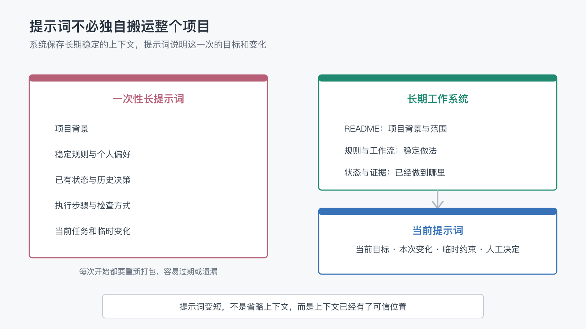

# 有了长期工作系统，还需要每次给 AI 写很长的提示词吗？

上一篇文章最后，我留下了一个问题：

> 有了长期工作系统，我们还需要每次给 AI 写很长的提示词吗？

这个问题很容易得到两个相反的答案。

一种答案是：当然需要。你给 AI 的信息越完整，它越不容易误解，所以提示词应该尽可能详细。

另一种答案是：以后不需要提示词了。只要 AI 有长期记忆，它应该自动知道我想要什么。

这两个答案都忽略了一件事：提示词和长期工作系统承担的并不是同一种职责。

长期工作系统负责保存那些跨任务仍然成立的背景、规则和状态。

提示词负责说明这一次想做什么，以及这一次有什么不同。

所以，真正的变化不是提示词消失了，而是提示词不必再独自搬运整个项目。

## 1. 很多长提示词，其实是在重复搬运上下文

当 AI 只存在于一个临时聊天窗口里时，长提示词通常有充分理由。

为了让它完成一次任务，我们可能需要写清楚：

- 项目是什么。
- 面向哪些读者或用户。
- 已经完成了什么。
- 哪些做法不能使用。
- 输出应该采用什么格式。
- 完成后还要检查哪些内容。
- 遇到问题时应该停在哪里。

如果不写，AI 就没有其他地方获得这些信息。

问题是，当同一个项目持续几周或几个月时，这段背景会被一次次复制。每次开始新会话，人都要从旧聊天、笔记和记忆里重新拼出一份“完整版提示词”。

提示词越写越长，并不一定因为当前任务更复杂，而是因为项目没有其他稳定的上下文入口。

这种长提示词本质上是一份临时打包的项目说明书。

它可以解决眼前问题，却很难持续维护。

## 2. 长提示词为什么会越来越难用

把全部背景都塞进提示词，看起来最保险，实际会带来几个问题。

### 它容易过期

复制上一次提示词时，其中某条规则可能已经被新流程替代，某个任务状态可能已经完成，某个平台限制也可能发生变化。

人通常只修改当前关注的几句话，很难每次重新检查整段背景。

### 它容易互相矛盾

提示词前面保留了旧要求，后面又补了一条新要求。AI 虽然同时读到了两条，却仍要猜哪一条优先。

文字更多，并没有消除不确定性。

### 它让重要变化被淹没

当前任务真正新增的要求可能只有一句，却埋在几十段固定说明中。

对人和 AI 来说，都更难看出“这一次究竟有什么不同”。

### 它只能服务当前会话

提示词里写得再完整，如果结果、决策和状态没有回到项目中，下次仍然要重新打包。

长提示词解决的是一次上下文输入，不自动形成长期协作能力。

## 3. 系统应该保存稳定上下文，提示词只携带当前变化

长期工作系统建立后，可以把信息分成两类。

### 稳定上下文

这些信息在多个任务中重复成立：

- 项目的目标和范围。
- 内容或代码的唯一可信源头。
- 稳定的协作规则。
- 已经确认的读者定位和表达偏好。
- 当前阶段和最近进展。
- 固定的测试、发布和检查方式。

它们适合放进 README、`AGENTS.md`、状态文件、操作指南、脚本和测试，而不是每次重新写进提示词。

### 当前变化

这些信息只与眼前任务有关：

- 这一次要完成什么。
- 和默认规则相比，有什么例外。
- 当前有哪些新材料或新约束。
- 哪个问题需要人选择。
- 做到什么阶段应该暂停。

这些才是提示词最应该承载的内容。

两者的关系可以简单理解为：系统保存地图，提示词说明这一次要去哪里。

提示词变短，不是因为 AI 可以读心，而是因为稳定信息已经有了可信位置。

## 4. 一个真实变化：从完整说明变成一句当前目标

在这个项目刚开始时，如果要让 AI 继续写文章，我可能需要提醒：

> 这是一个关于长期 AI 工作系统的系列文章。文章正文在 `content/articles/`，需要使用中文，面向不一定懂技术的读者。写之前要看上一篇结尾，避免和已有文章重复。完成后先进入 `review`，不要直接发布。如果适合配图，要生成简单图片并检查本地预览。确认后再改成 `ready`，更新中英文 README，提交并推送。

这段提示并没有错。

但如果每次写文章都需要重新输入，说明项目还没有真正记住自己的工作方式。

现在，同样的任务可以只说：

> 今天继续创作下一篇，参考之前的主题，直接推进到 `review` 状态。

这句话没有包含所有细节。

AI 仍然需要从项目中读取写作规则、上一篇钩子、Roadmap、文章格式和配图要求。区别在于，这些稳定信息已经由项目维护，不需要人再次手工拼装。

短提示词能够工作，依赖的不是省略，而是外部上下文已经完整。

## 5. 提示词仍然应该说清楚四件事

有了长期系统，不代表可以只说“继续”然后期待 AI 永远猜对。

一个当前任务提示，仍然应该尽量说明四件事。

### 当前目标

这一次真正要得到什么结果？

“继续处理文章”比较模糊；“把下一篇推进到 `review`，等待我阅读”就更清楚。

### 与默认方式不同的地方

如果这次不需要配图、不允许提交、只修改一个文件，或者要跳过某个常规步骤，应该明确说明。

例外不适合悄悄藏在长期规则里，因为它可能只对这一次成立。

### 新出现的材料和约束

例如新增截图、外部链接、读者反馈、截止时间或平台变化。

系统只能保存已经进入项目的信息，无法自动知道现实世界刚刚发生了什么。

### 需要人决定的位置

如果任务中有多个可行方向，可以要求 AI 先给出选项，并在关键选择处暂停。

提示词不必写出所有执行步骤，但要让 AI 知道最终目标和决定权在哪里。

## 6. 提示词不是越短越好

长提示词的问题不在于字数，短提示词也不天然更高级。

真正需要判断的是：这些内容应该只服务当前任务，还是应该长期影响未来工作。

下面几种情况，较长的提示词仍然合理。

### 一次性任务

如果任务不会重复，也没有必要建立项目文件，那么把背景一次说明清楚通常最省成本。

### 外部临时材料

一段尚未整理的会议记录、客户反馈或临时数据，可能只需要在当前会话中使用，不适合立刻进入长期系统。

### 高风险例外

当这次操作与默认流程明显不同，或者涉及生产环境、公开发布和不可逆影响时，宁可把边界写得更明确。

### 跨系统交接

如果接收任务的 AI 无法访问原项目，就需要提供一份足够完整的交接说明。此时长提示词更像一个便携的上下文包。

所以，目标不是追求最短提示词。

目标是让每条信息出现在最合适的位置。

## 7. 什么时候应该把提示词里的内容移进系统

如果一段提示反复出现，可以用几个问题判断它是否应该离开聊天窗口。

- 这条说明是否已经在多个任务中重复使用？
- 它未来是否仍然成立？
- 如果忘记它，是否会反复产生同类错误？
- 它应该由文档、规则、脚本还是测试承载？
- 进入系统后，谁负责更新或删除？

例如：

- “文章进入 `review` 前要判断是否需要配图”属于稳定写作规则。
- “所有 `ready` 文章都要进入发布范围”适合由脚本读取状态。
- “这次先不要提交”只是当前任务约束。
- “我觉得这张图右侧太挤”是一次 Review 反馈，除非反复出现同类问题，否则不必永久写入规则。

把重复、稳定、可验证的信息移进系统后，提示词才会自然变轻。

这不是删掉上下文，而是给上下文找到长期负责人。

## 8. 也要警惕系统反过来制造提示负担

有时项目已经建立了很多规则，人却仍然要写很长的提示词解释“应该读哪个文件、哪些规则已经失效、这次到底按哪套流程”。

这通常说明系统本身需要治理。

可能的原因包括：

- 同一规则存在多个副本。
- 核心入口只列文件，没有说明读取时机。
- 当前状态长期没有更新。
- 规则数量太多，却缺少优先级和适用范围。
- 自动化行为与文档描述不一致。

这时，不应该继续用更长的提示词覆盖问题。

应该回到系统中，修正可信源头、清理旧规则，并让默认路径重新变得清楚。

如果每次都要靠人临时解释系统怎么使用，系统就还没有真正接住上下文。

## 9. 好的提示词，是当前任务和长期系统之间的接口

有了长期工作系统之后，提示词依然重要。

只是它的角色发生了变化。

过去，提示词既要解释整个项目，又要描述当前任务，还要提醒执行步骤和验收方式。

现在，稳定背景由项目文件保存，重复动作由规则和工作流承载，验证方式由脚本和测试落实。提示词可以更专注地表达：这一次要什么、哪里发生了变化、有什么临时约束，以及哪里需要人决定。

因此，提示词的质量也不再主要取决于长度。

更重要的是，它是否准确描述了当前意图，并且没有重复制造另一套项目事实。

一个成熟的长期工作系统，不会让提示词消失。

它会让提示词从一份反复复制的项目说明书，变成当前任务与长期上下文之间的接口。

而当我们不再需要把所有任务都塞进长提示词时，另一个边界问题也会出现：

> 哪些工作值得进入长期 AI 系统，哪些只适合临时聊一次？

这可能是下一篇值得继续讨论的问题。
