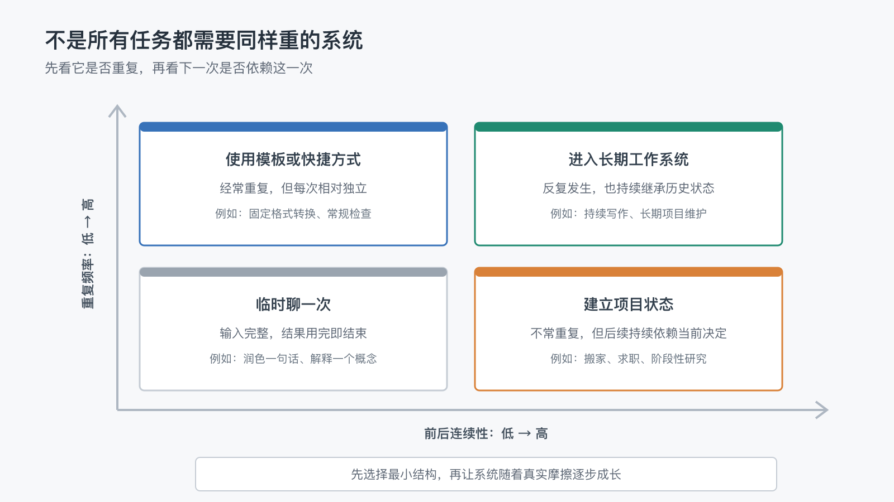

# 哪些工作值得进入长期 AI 系统，哪些只适合临时聊一次？

上一篇文章最后，我留下了一个问题：

> 哪些工作值得进入长期 AI 系统，哪些只适合临时聊一次？

如果长期工作系统能够减少重复解释、保存项目状态，还能在失败后继续，那么很容易产生一种冲动：把所有与 AI 的协作都放进系统。

每个任务都建一个目录，每次讨论都写进状态文件，每条经验都变成规则，能自动化的步骤再加一个脚本。

这样看起来很完整，却可能让维护系统比完成工作更费力。

长期系统的价值，不在于收纳所有 AI 对话。

它应该接住那些会持续产生上下文、重复劳动和恢复成本的工作；至于边界清楚、做完即结束的事情，一次对话往往已经足够。

## 1. 不是所有任务都需要长期上下文

有些事情天生适合临时聊一次。

例如：

- 把一段已经写好的文字改得更简洁。
- 解释一个临时遇到的概念。
- 比较两个当天就要决定的普通选项。
- 根据一份完整材料生成一次性摘要。
- 检查一句英文是否自然。

这些任务通常有几个共同点：输入已经完整，目标边界清楚，结果很快被使用，之后也不太依赖这次过程。

如果为每一次临时问答都建立状态、规则和索引，新增的结构未必能在未来收回成本。

一次对话并不低级。

它只是适合解决一次性问题。

## 2. 系统化本身也有成本

把一项工作放进长期系统，不只是多保存一个文件。

系统需要持续回答：

- 当前事实应该写在哪里？
- 哪些内容需要长期保留？
- 谁负责更新状态？
- 规则改变后，旧说明怎么清理？
- 自动化失败时，如何恢复？
- 以后换工具时，哪些内容需要迁移？

这些工作可能很值得，但不会免费发生。

如果任务只会做一次，或者背景每次都完全不同，维护一套长期结构可能比重新说明更麻烦。

所以，判断一项工作是否值得系统化，不能只看“能不能做”，还要看它以后会不会继续产生价值。

## 3. 先问两个最重要的问题

面对一项新任务，可以先不研究工具，只问两个问题。

### 它会不会重复出现？

重复并不一定意味着每天执行。

每周写一次报告、每个月整理一次账单、每次发布前检查相同项目，显然会重复。

一年只发生几次，但每次都要重新寻找同一批材料、重新解释相同背景，也算重复。

重复越明显，模板、规则和自动化越可能产生长期回报。

### 下一次是否依赖这一次的结果？

有些任务只发生一次，却有很强的连续性。

例如装修一套房子、准备一次长期旅行、处理一个跨月项目。它们未必会重复，但后续决定持续依赖之前的预算、选择、材料和进度。

这类任务不一定需要完整工作流，却需要一个可靠的项目入口和当前状态。

重复频率和前后连续性组合起来，会得到四种不同的处理方式：

这说明“要不要进入系统”并不是一个简单的是非题。

## 4. 四种任务，适合四种投入

### 低重复、低连续：临时聊一次

输入完整，结果用完就结束，也不会影响后续任务。

例如润色一封临时邮件、解释一个概念、把一段内容改成表格。

这类任务直接对话即可。最多保留最终结果，不需要保存全部过程。

### 高重复、低连续：先用模板或快捷方式

任务经常出现，但每次之间没有太多历史依赖。

例如把固定格式的数据整理成周报、检查一段文字是否符合统一格式、将会议记录转换成固定结构。

这类任务可能只需要一个模板、一段可复用提示或一个小脚本，不一定需要完整的项目记忆。

### 低重复、高连续：建立项目状态

任务未必会再次发生，但当前过程持续较久，后续选择依赖之前的决定。

例如求职准备、搬家规划、一次复杂采购或一项阶段性研究。

这类任务适合使用一个项目 README、材料目录和状态文件。重点是保存当前事实和下一步，不必提前建设大量规则和自动化。

### 高重复、高连续：进入长期工作系统

任务会反复发生，每次又会继承过去的状态、规则和经验。

例如持续写作、长期维护软件项目、定期运营内容、反复处理同一类客户流程。

这类工作最适合逐步建立外部记忆、稳定规则、工作流、验证和恢复机制。

它们不是因为看起来“重要”才系统化，而是因为不系统化会持续付出重复成本。

## 5. 用成本和边界修正四象限判断

四象限给出的是默认投入，不是机械结论。落到真实任务时，还要用几个条件修正判断。

- **错误成本**：同类错误反复出现，而且会影响后续工作时，即使任务频率不高，也值得增加检查或保存关键决定。
- **恢复成本**：任务阶段多、交接多，中断后很难判断做到哪里时，至少应该留下状态和证据。
- **维护成本**：如果维护脚本和规则比重新完成任务更费力，就应该停在模板或临时对话，而不是继续扩建。
- **信息边界**：密码、token、客户敏感信息和不必要的私人数据，不应因为“以后方便”就进入长期记忆。
- **成熟程度**：任务仍在探索、背景每次都完全不同，或者判断高度依赖当下时，先保留观察，不急着建立正式流程。

这些条件不会推翻“重复频率 x 前后连续性”这个主框架，只会帮助我们决定在对应象限里投入到什么程度。

保持轻量不是拒绝长期协作，而是避免系统提前承担尚未证明有价值的责任。

## 6. 不要一步就走到自动化

一项工作值得长期处理，也不代表应该立即写脚本、接入持续集成或建立复杂知识库。

更稳妥的做法，是让结构随着真实摩擦逐步升级。

### 第一步：保留一个入口

写清楚任务目标、材料位置和当前状态，让下一次不必从零开始。

### 第二步：提炼重复内容

当相同背景或要求再次出现，把它变成模板、规则或检查清单。

### 第三步：固定稳定步骤

只有步骤已经反复走通，输入输出也比较清楚时，再考虑脚本和工作流。

### 第四步：增加验证与恢复

自动执行之后，再补充完成证据、失败处理和恢复入口。

这条路径允许系统只成长到需要的程度。

有些任务停在模板就够了，有些只需要项目状态，少数任务才真正需要完整工作流。

## 7. 从这个写作项目看系统化边界

当前项目里，不同工作也采用了不同投入。

“把某句话改得更顺”通常只是一次 Review，不会单独建立流程。

“每篇文章进入 `review` 前判断是否需要配图”会反复出现，也会影响阅读体验，所以进入了写作规则。

“根据 `ready` 状态更新 README 和 Wiki”步骤稳定、结果可检查，因此进入了脚本和流水线。

“这张图右侧看起来有点挤”先作为当前反馈处理。只有类似问题反复出现，才值得抽象成更稳定的制图规则。

同一个项目里，也不是所有动作都处在相同层级。

长期系统不是把每件小事都变成机制，而是让机制只接住那些已经证明会反复影响工作的部分。

## 8. 合适的系统，应该允许任务进出

任务进入长期系统，不代表永远留在里面。

项目结束后，当前状态可以归档；不再重复的流程可以降级为参考；失效的自动化应该关闭；证明没有复用价值的规则可以删除。

反过来，一个最初只在聊天里完成的小任务，如果开始频繁出现，也可以逐步进入模板、项目状态和工作流。

因此，真正健康的边界不是一次划定的。

它会随着使用频率、连续性、风险和维护成本变化。

长期 AI 工作系统应该帮助我们减少长期摩擦，而不是把所有任务都永久收编。

有些工作值得被系统接住，有些工作只需要一次清楚的对话。成熟的选择，不是尽可能系统化，而是为每项工作提供与它真实需要相匹配的结构。

而当我们决定把一项工作放进长期系统时，当前系列还剩最后一个边界需要讨论：

> 当 AI 越来越了解你的工作，哪些信息不应该进入系统？

这会是本系列最后一篇要回答的问题。
