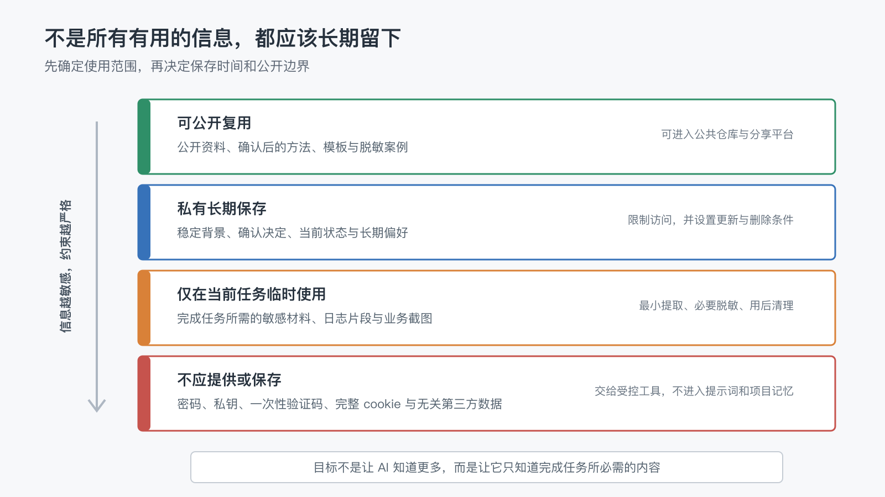

# 当 AI 越来越了解你的工作，哪些信息不应该进入系统？

上一篇文章最后，我留下了当前系列的最后一个问题：

> 当 AI 越来越了解你的工作，哪些信息不应该进入系统？

长期工作系统解决了很多上下文问题。

AI 可以知道项目正在做什么、之前做过哪些决定、哪些规则已经确认、下一步从哪里继续。我们不必每次重新解释全部背景，任务中断后也更容易恢复。

但系统越能记住，另一个风险就越容易被忽略：我们可能开始把“以后也许有用”当成保存一切的理由。

密码放进项目文档，客户资料复制进长期记忆，临时情绪变成稳定偏好，未经确认的猜测被当成事实，私有工作记录又随着自动发布进入公共仓库。

这些问题不是因为 AI 记得太少，而是因为系统没有回答另一个同样重要的问题：

> 什么不应该被记住，什么只能临时使用，什么即使可以保存也不能公开？

## 1. 知道得更多，不一定协作得更好

上下文不足会让 AI 反复询问、误解背景和重复犯错。

但上下文过多也会带来新的问题：

- 真正重要的信息被大量无关内容淹没。
- 临时判断和长期事实混在一起。
- 已经过期的状态继续影响后续决定。
- 不必要的敏感信息出现在日志、提交或同步平台中。
- AI 获得了完成当前任务根本不需要知道的内容。

所以，长期系统追求的不是“知道得最多”，而是“在正确的时间，知道完成任务所必需的内容”。

这可以叫作**最小必要上下文**：只向当前任务提供足够完成工作的背景，不因为获取方便，就把所有可能相关的材料都放进去。

## 2. “不应该进入系统”有四种不同含义

讨论信息边界时，最容易出现两个极端。

一种认为敏感信息全部不能交给 AI，于是很多真实任务根本无法完成。

另一种认为只要系统是私有的，什么都可以长期保存。

更实用的做法，是把信息分成四层：

### 可公开复用

经过确认的方法、模板、公开资料和脱敏案例，可以进入公共仓库、文章或共享知识库。

这里的重点不是“内容看起来没有密码”，而是它已经经过公开边界检查：不包含真实客户数据、私人对话、内部地址、账号信息，也不会通过上下文组合反推出不应公开的事实。

### 私有长期保存

稳定的项目背景、已经确认的决定、当前状态和长期协作偏好，可以保存在访问范围明确的私有系统中。

它们仍然需要用途、维护者和删除条件。私有不等于永久，也不等于可以无限复制到每个工具。

### 仅在当前任务临时使用

有些材料确实是完成任务所必需的，但没有长期保存价值。

例如一份需要摘要的内部合同、一段需要排查的错误日志、一张包含个人信息的业务截图。系统可以只提取当前任务需要的部分，必要时做脱敏，并在任务完成后删除临时副本。

### 不应提供或保存

密码、私钥、一次性验证码、完整会话 cookie，以及与当前任务无关的第三方敏感数据，不应该写进提示词、项目记忆、普通文档或 Git 仓库。

如果自动化必须调用外部服务，应该让受控工具从环境变量或专门的凭据管理服务读取授权，而不是让 AI 在上下文里看到并复述真实凭据。

## 3. 凭据不是项目记忆

很多信息泄露并不是因为有人主动公开秘密，而是因为“先记下来，之后方便”。

例如：

- 把 API token 写进操作说明。
- 把数据库密码放进项目状态文件。
- 把登录 cookie 复制进共享问题记录。
- 把一次性验证码留在完整聊天归档里。

这些内容可能帮助系统完成一次操作，却不属于项目应该理解和继承的知识。

项目真正需要记住的是：凭据由什么工具管理、从哪里安全读取、缺失时如何提醒，以及哪些操作需要授权。

也就是说，系统应该保存**凭据的使用规则和安全入口**，而不是保存凭据本身。

## 4. 别人的数据，不会因为进入了你的任务就变成你的记忆

长期系统里还有一类容易被忽视的信息：客户、同事、合作方和家人的数据。

一份材料发给了你，不代表其中所有内容都应该进入 AI 的长期记忆。能够在当前任务中查看，也不等于可以用于其他任务、同步到其他平台或长期保留。

处理这类信息时，可以依次缩小范围：

1. 当前任务是否真的需要这份材料？
2. 是否只需要其中一段，而不是完整文件？
3. 姓名、电话、地址和业务编号能否替换为占位符？
4. AI 是否只需要分析结构，而不需要知道真实值？
5. 任务完成后，临时材料是否还需要保留？

让 AI 看见更少，不一定会降低结果质量。很多时候，清理无关信息反而会让任务更清楚。

## 5. 临时感受和未经确认的猜测，不应伪装成长期事实

不适合长期保存的内容，不只有传统意义上的隐私。

人在某一天说“我最近不想再做这件事”，可能只是疲惫，不一定是长期偏好。

一次排查中怀疑“问题可能来自数据库”，也只是调查方向，不是已经确认的原因。

会议里有人随口提出的方案，也不等于团队已经做出决定。

如果这些内容直接进入长期记忆，后续 AI 可能会用一条过期情绪替用户做选择，用一个未验证猜测解释新问题，或者把讨论意见当成正式规则。

更稳妥的方式是明确区分：

- 已验证事实。
- 已确认决定。
- 当前假设。
- 临时偏好或感受。
- 待进一步确认的问题。

需要保存的假设也应该带上来源、时间和验证状态，而不是只留一句没有上下文的结论。

## 6. 私有系统与公开系统之间，必须有一道明确边界

长期工作经常同时存在两个空间。

私有空间保存真实项目状态、内部材料、个人偏好和未公开讨论；公共空间保存文章、模板、脱敏案例和可以复用的方法。

两边都可能使用 Markdown、Git 和自动化脚本，但用途完全不同。

当前这个写作项目就是一个例子。

公开仓库可以展示文章源稿、最小记忆模板、配图和发布流水线。真实项目中的客户信息、个人长期记录、内部工具凭据和未经脱敏的案例，则不应该因为“和文章有关”就被复制进来。

从私有空间进入公共空间，不应该只是一次文件复制，而应该经过一次转换：

- 去掉真实身份和敏感值。
- 保留理解方法所需的结构。
- 确认案例不会通过细节组合重新识别具体对象。
- 重新检查图片、日志和文件历史中是否仍有残留。
- 由有权负责的人确认可以公开。

长期系统可以自动同步已经确认的公开内容，但不应该自动决定什么内容可以公开。

## 7. AI 知道一件事，不等于它获得了决定权

信息边界之外，还有一条容易混淆的权限边界。

AI 可以知道发布流程，却不代表它可以在任何时候公开发布。

AI 可以分析合同，却不代表它可以代表用户接受条款。

AI 可以看到生产环境的故障证据，却不代表它可以自行执行不可逆的数据修改。

长期系统应该记住哪些操作需要授权、谁有权决定、需要什么证据，而不是因为 AI 已经掌握上下文，就默认把决定权一起交出去。

保存信息和授予权限是两件不同的事。

系统越了解工作，越应该把这两者分开。

## 8. 一个五问检查法

准备把一条信息交给 AI 或写进长期系统前，可以先问五个问题。

1. 当前任务真的需要这条信息吗？
2. AI 需要真实值，还是摘要、占位符或文件入口已经足够？
3. 它会被保存在哪里，又可能同步到哪些平台？
4. 谁可以访问它，AI 又获得了哪些操作权限？
5. 它什么时候应该更新、降级或删除？

如果第一个问题答不清，就先不要提供。

如果摘要或占位符已经够用，就不要提供真实值。

如果不知道它会流向哪里，就不要假设“当前对话是私密的”已经解决所有问题。

如果一条信息没有删除条件，它很可能会在系统里停留得比预期更久。

## 9. 安全边界也需要进入工作流

仅靠每次临时提醒“注意隐私”，很难长期稳定执行。

真正反复出现的边界，应该逐步进入系统：

- 在项目规则里说明哪些内容禁止写入仓库。
- 在提交前检查疑似凭据和敏感文件。
- 用环境变量或凭据管理服务承接外部授权。
- 在公开发布前执行脱敏和人工确认。
- 为临时材料设置清理步骤。
- 定期检查长期记忆里是否存在过期、越界或不再必要的内容。

但这并不意味着所有判断都要自动化。

脚本可以发现像 token 的字符串，可以检查某个文件是否被错误加入 Git，也可以验证公开页面是否包含禁止路径。

至于一段真实案例是否已经充分脱敏、一次公开是否会伤害相关人员、某个高风险决定是否应该执行，仍然需要人承担判断和责任。

## 10. 一个成熟的系统，也要知道自己不该知道什么

回看这个系列，我们从 AI 为什么总是忘记开始，逐步讨论了外部记忆、最小项目结构、经验沉淀、规则、工作流、Review、人的职责、系统价值、清理、任务连续性、提示词和系统化边界。

这些方法都在帮助 AI 更稳定地理解和继续工作。

但长期协作并不是把更多信息交给系统，把更多决定交给自动化。

真正成熟的长期 AI 工作系统，应该同时具备两种能力：

- 需要继承的事实，能够可靠留下来。
- 不该保存、公开或自动代理的内容，能够被明确挡在边界之外。

记忆让系统拥有连续性，遗忘和拒绝则让这种连续性保持健康。

当前系列到这里暂时结束。

不过，知道哪些信息不该进入系统之后，还会出现一个更具体的实践问题：那些确实值得保留的信息，也不应该全部以同一种方式常驻。

接下来的“AI 长期记忆实战”系列，我们可以从这里继续：

> 工作记忆、长期记忆和可索引资料，为什么需要分层？
