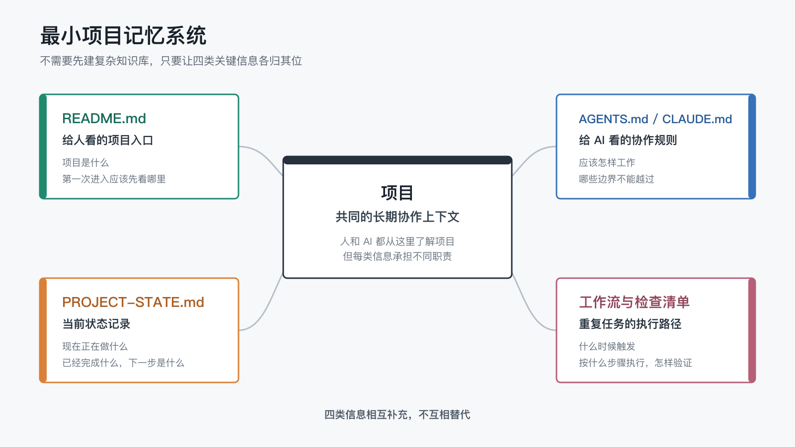

# 如果要给 AI 建一个最小可用的项目记忆系统，先写哪些文件？

上一篇文章讲到，AI 写作之所以不那么显 AI 味，不是因为它突然更会模仿人，而是因为它站在了一个有上下文、有规则、有反馈、有工作痕迹的系统里。

第二篇文章结尾还留下了一个更具体的问题：如果真的要给 AI 建一个最小可用的项目记忆系统，哪些文件应该先出现，哪些规则应该先写下来，哪些东西反而不应该急着记？

这篇就先回答这个问题。

我想强调“最小可用”，是因为很多人一想到 AI 记忆系统，就会立刻想到知识库、向量数据库、检索增强生成（RAG）、自动摘要、长期记忆、跨工具同步。那些东西当然可能有用，但一开始就做它们，往往会把问题弄复杂。

对大多数个人项目来说，最先需要的不是一个复杂知识库，而是一组很朴素、很稳定、AI 每次进入项目时都能读取的文件。

它们要先解决三个问题：

- 这个项目是什么？
- AI 应该按什么规则继续？
- 现在进行到哪一步？

只要这三个问题能被稳定回答，AI 就已经不再是完全从零开始。

对应到项目结构，一个最小版本可以先保存四类核心信息：

- **项目入口**：通常由 `README.md` 承担，说明项目是什么。
- **AI 规则入口**：由 `AGENTS.md`、`CLAUDE.md` 或对应工具的规则文件承担，说明应该怎样继续。
- **当前状态**：由 `WORKLOG.md`、任务状态或文章元信息承担，说明现在做到哪里。
- **执行与验证方法**：先用简短工作流或检查清单记录重复步骤，稳定后再逐渐变成脚本。

项目的真实内容，例如 `content/` 里的文章或 `docs/` 里的文档，是这些信息共同指向和维护的资产，不需要为了凑结构把它算成“第五份固定文件”。

这四类信息也不需要一开始就全部配齐。如果只能先写两份，我会选 README 和 AI 规则入口；状态、工作流和脚本再随着真实任务逐渐长出来。

## 1. 先不要急着做知识库

“给 AI 记忆”这个说法很容易把人带偏。

它听起来像是要把所有聊天记录、所有文件、所有想法都存起来，然后让 AI 永远记住。可真实协作里，问题经常不是“信息太少”，而是“信息散在太多地方，AI 不知道该相信哪一份”。

比如在这个项目里，信息同时存在于很多地方：

- 主仓库 README。
- 文章源稿。
- GitHub Wiki。
- Gitee Wiki。
- 发布脚本。
- 工作流文档。
- 历史对话。
- 本地工作日志。

如果没有规则，AI 看到这些材料时并不会自动知道哪一个才是源头。它可能看见 Wiki 页面，就以为应该直接改 Wiki；也可能看见旧的草稿状态，就以为文章还没发布；还可能把一次临时讨论当成长期规则。

所以最小可用项目记忆系统的第一步，不是存更多，而是让关键上下文有位置、有优先级、有边界。

复杂系统会让你误以为“只要都存进去，AI 就会懂”。但如果没有源头、规则和状态，存得越多，反而越容易让 AI 在旧信息里迷路。

## 2. 第一类信息：给人看的项目入口

最先应该出现的文件，通常是 `README.md`。

这听起来很普通，但它很关键。

README 不是写给 AI 的专用文件，它首先是写给人看的入口：这个项目为什么存在，现在有哪些内容，读者应该从哪里开始。

在这个项目里，README 现在承担了几个职责：

- 说明这是一个公开写作和发布实验。
- 解释 `CodexClaw` 是什么。
- 给出推荐阅读顺序。
- 列出已发布文章。
- 说明 GitHub Wiki 和 Gitee Wiki 的阅读入口。
- 指向发布工作流和日常操作检查单。

这些信息对读者有用，对 AI 也有用。README 写得清楚，AI 就能判断自己处理的不是普通代码仓库，而是一个以长期 AI 工作系统为主题的公开写作项目。

比如它不会随便把内部工作日志发布出去；不会把 Wiki 当成源文；也不会在 README 里堆一堆只适合维护者看的细节。

好的 README 不需要很长，但它应该回答一个问题：

> 一个第一次进入项目的人，能不能在几分钟内知道这个项目是什么、现在有什么、下一步该看哪里？

如果人都看不明白，AI 也很难稳定接住。

## 3. 第二类信息：给 AI 看的规则入口

README 解决的是“项目是什么”，但它不一定适合放所有协作规则。

这时就需要一份给 AI 看的规则入口。

在 Codex 里，这通常是 `AGENTS.md`。在 Claude Code 里，常见的是 `CLAUDE.md`。不同的 AI 智能体工具（agent tool）可能默认加载不同的规则文件。

文件名不是重点，重点是：项目里应该有一个位置，专门告诉 AI 如何工作。

这类文件可以写：

- 内容源头在哪里。
- 修改文章后要运行哪些脚本。
- 哪些展示层不能反向修改。
- 新文章要按哪些阶段推进。
- 写系列文章时要回看上一篇末尾的钩子。
- 本地工作日志是否提交。
- 什么信息不能公开。

这些规则如果只存在于人的脑子里，每次都要重新解释；写进规则入口，AI 每次进入项目时就能先读到它们。

这个项目里就有一个很小但很典型的例子：我们后来在 `AGENTS.md` 里加了一条规则，要求写系列文章新篇章时，先回顾上一篇文章末尾留下的钩子、预告或开放问题。

这条规则不是凭空设计出来的，而是因为我们真的踩到了这个问题：第二篇结尾预告的是“最小项目记忆系统”，第三篇却先写了“AI 写作为什么不显 AI 味”。如果不补桥，读者连续阅读时会疑惑。

这就是项目记忆真正有价值的地方：不保存所有聊天，而是把已经验证过、未来还会重复影响工作的规则放到正确位置。

## 4. 第三类信息：当前状态记录

有了 README 和规则入口还不够，因为项目会一直变化。

今天可能在写一篇新文章，明天可能在修 Wiki 展示，后天可能又在调整 README 的阅读路径。AI 如果只知道项目目标，却不知道当前状态，还是很容易重新问一遍背景。

所以最小系统还需要一个状态记录。

状态记录不一定一开始就很正式。它可以是 README 里的“当前写作中”，也可以是本地 `WORKLOG.md`，也可以是一个更结构化的任务文件。

关键是它要回答：

- 现在正在推进什么？
- 哪些已经完成？
- 哪些只是备选？
- 下一步应该先看哪里？

在这个项目里，`content/articles/<series-id>/*.md` 通过文章元信息记录 `status`。文章元信息指 Markdown 正文前面那段用 `---` 包起来的结构化信息，英文常叫 `frontmatter`。这里的 `status: ready` 表示文章可以进入自动发布链路；`status: review` 表示文章已经成稿，但还在审阅，不会同步到 Wiki。

这比靠聊天记录说“这篇好像可以发了”稳定得多：脚本可以读取，人可以检查，AI 也可以据此判断文章阶段。状态记录不是为了让项目显得正式，而是为了减少重复确认。

## 5. 第四类信息：执行与验证方法

当一个项目开始有重复动作时，就需要把执行与验证方法写下来。

比如这个项目里，文章发布不是只把 Markdown 写完就结束。它还涉及：

- 更新 README 文章索引。
- 检查哪些文章是 `ready`。
- 同步 GitHub Wiki 和 Gitee Wiki，并检查展示效果。
- 避免直接修改 Wiki 页面。

这些事情如果每次都靠人记，很容易漏。

最初可以只是一份简短工作流或日常操作检查单（runbook）：平时怎么做，出问题先查哪里，哪些结果能够验证当前状态。只有当步骤反复走通、输入输出稳定后，才需要进一步写成脚本或接入持续集成（CI）。

它们不需要一开始就很完美。先写下最常用的几步，再随着项目真实运行把踩过的坑补进去。

比如这次我们发现 GitHub Wiki 支持 `[[title|page]]` 这样的专用 Wiki 语法，但 Gitee Wiki 不支持，会把它原样显示出来。后来同步脚本改成了标准 Markdown 链接。

这不是一开始想出来的“完美设计”，而是系统运行后长出来的兼容规则。

把前面四类核心信息放在一起看，最小项目记忆系统的结构其实很简单：

它们共同帮助人和 AI 理解项目，但各自承担不同职责，不能互相替代。

## 6. 什么东西不要急着记

最小可用项目记忆系统还有一个重要原则：不要什么都记。

有些信息不适合进入长期记忆。

比如：

- 临时猜测。
- 还没有验证的判断。
- 已经过期的页面状态。
- 平台 UI 里的隐藏配置。
- 私有 cookie、token、密钥。
- 不该公开的个人或项目细节。

如果把这些东西都沉淀下来，AI 反而会更容易被误导。

这次 Gitee Wiki 的拖拽排序就是一个好例子。

页面上看起来可以手动调整顺序，但推送后顺序又会变化。后来我们确认，那个顺序大概率不记录在 Wiki Git 仓库里，而是存在 Gitee 平台自己的隐藏状态里。

这种状态就不适合作为系统规则依赖。

更稳的做法，是回到可版本化、可检查、可自动同步的文件：页面文件名、Home 页目录、同步脚本、README 链接。

长期系统不是把所有现象都记住，而是分清哪些信息可以成为规则，哪些只是当时的观察。

## 7. 最小可用之后

最小可用项目记忆系统的目标，不是让 AI 永远记住你。

它的目标更朴素：

> 当 AI 进入这个项目时，它不需要每次都从零开始。

它知道项目是什么，知道内容源头在哪里，知道哪些状态可以发布，知道哪些规则要遵守，也知道遇到展示层问题时应该回到主仓库修源文。

这已经能解决很多日常协作里的“失忆”问题。

后面当然还可以继续扩展任务状态、发布链路、知识索引和回顾机制，但前提是最小系统已经跑起来，而且真的减少了重复解释。否则，复杂系统只会变成另一堆需要维护的上下文。

所以，如果你也想开始搭一个长期 AI 工作系统，我不会建议你先去研究复杂工具。

先建一个仓库，写清楚 README，再写一份给 AI 看的规则入口。

然后在一次次真实协作里，慢慢问自己：

> 这件事以后还会重复吗？如果会，它应该沉淀到哪里？

这个问题，比“我要不要给 AI 做一个知识库”更重要。
