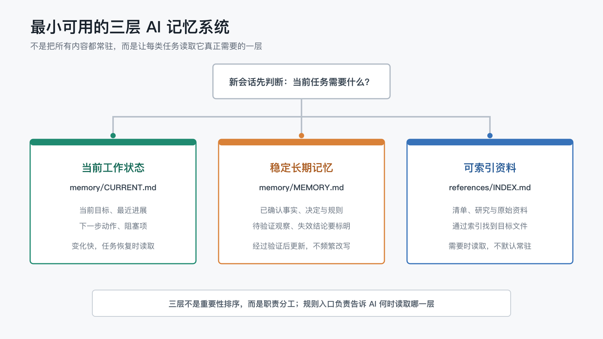

# 只用文件夹和 Markdown，怎么搭一个最小可用的三层 AI 记忆系统？

在“长期 AI 工作系统”系列的最后，我留下了一个更具体的问题：那些确实值得保留的信息，也不应该全部以同一种方式常驻。

当前目标每天都可能变化，已经确认的规则应该相对稳定，参考资料则可能几周才用一次。如果把它们全部塞进同一个文件，AI 每次进入项目时都要重新读一遍，还要自己判断哪些是当前状态、哪些是长期事实、哪些只是以后可能用到的资料。

那么，把这些内容分开，真的会更好吗？

这一次我没有先写概念稿，而是先做了一个可重复的本地实验：保持信息内容相同，只改变文件组织和加载入口，让新的 AI 会话分别完成恢复当前任务、识别稳定规则和查找参考资料三个任务。

结果有一点符合预期，也有一点值得警惕：

- 三层结构明显减少了单个任务读取的项目文本。
- 两种结构的答案正确性都是满分，分层没有表现出更高准确率。
- 分层没有让回答更快，也不保证工具调用更少。
- 不同模型即使都答对，也可能选择不同的文件导航路径。

所以这篇文章要分享的，不是“分层一定更快”的结论，而是一种已经跑过真实实验、可以从最小规模开始复现的项目记忆结构。

## 1. 先分清三种不同的信息

这里说的“三层”，不是数据库里的三层架构，也不是模拟人脑的完整记忆模型。

它只是把 AI 项目中常见的信息按职责分开：

- **当前工作状态**：现在做什么、做到哪里、下一步是什么、有什么阻塞。
- **稳定长期记忆**：已经确认的事实、决定、规则，以及需要明确标记的失效结论。
- **可索引资料**：检查清单、研究材料、历史分析和原始来源，需要时通过索引找到。

对应到最小目录，可以只有这些文件：

```text
project/
├── AGENTS.md
├── memory/
│   ├── CURRENT.md
│   └── MEMORY.md
└── references/
    ├── INDEX.md
    └── ...
```

如果使用 Codex App 或 Codex CLI，可以让 `AGENTS.md` 作为规则入口；如果使用 Claude Code，通常会使用 `CLAUDE.md`。不同 AI 智能体工具默认读取的规则文件可能不同，但职责相同：告诉 AI 这个项目有哪些记忆层，以及什么任务应该读取哪一层。



三层不是重要性排序，也不是要求 AI 每次从上到下全部读取。

恰恰相反，它们的价值来自**按需加载**：恢复任务时先看当前状态；查询已经确认的规则时看长期记忆；需要引用清单或研究资料时，再从索引进入具体文件。

## 2. 当前工作状态：让新会话知道从哪里继续

`memory/CURRENT.md` 只回答当前阶段的问题。

一个最小版本可以这样写：

```markdown
# Current Work

## Goal

完成三层记忆 POC，并根据证据撰写第一篇文章。

## Recently Completed

- 正式实验已完成。
- 公开证据已脱敏并提交。

## Next Step

根据实验报告整理文章大纲和结论边界。

## Blockers

- Windows 尚未验证。
```

这份文件允许频繁变化，因为它保存的就是“现在”。任务完成后，旧目标可以被替换，不需要把每次状态变化都永久堆在正文里。

它解决的是连续性问题：新会话不必从聊天记录中猜测上次停在哪里，也不必先读完整项目历史才能找到下一步。

## 3. 稳定长期记忆：只保存已经确认的内容

`memory/MEMORY.md` 不应该成为另一本流水账。

适合放进去的是：

- 多次任务都会用到的稳定事实。
- 已经由人确认的决定。
- 反复发生后形成的规则。
- 已失效但容易再次误用的旧结论，并明确标记为失效。
- 仍需保留的待验证观察，并明确标记为待验证。

“明确标记”很重要。同一句话写在长期记忆里，不代表它自动变成事实。

例如：

```markdown
# Stable Memory

## Confirmed Rules

- Markdown 源文是唯一内容源头。
- 发布后的远端页面必须经过检查。

## Pending Observations

- 待验证：某个平台的页面排序可能不会保存在 Git 仓库中。

## Superseded

- 已失效：发布完成只需要检查流水线状态。
```

这层的重点不是“长期保存得越多越好”，而是提高进入门槛。临时猜测、一次性状态和未经确认的偏好，不应该因为写进文件就伪装成长期事实。

## 4. 可索引资料：保存入口，不让正文全部常驻

项目做久以后，检查清单、研究文献、故障记录和历史方案会越来越多。

它们可能很重要，但不需要每次都进入 AI 的上下文。更简单的做法，是先维护一份 `references/INDEX.md`：

```markdown
# Reference Index

- Wiki 发布后检查：`wiki-publishing-checklist.md`
- 平台验证规则：`platform-validation-policy.md`
- 文章 Review 清单：`article-review-checklist.md`
```

当任务是检查 Wiki，AI 先通过索引找到前两个目标文件；当任务只是恢复当前写作进度，这些资料就不需要读取。

检索增强生成（Retrieval-Augmented Generation，简称 RAG）也展示了一种外部知识检索机制：系统通过检索器访问外部文档索引，再把相关文档交给生成模型[3]。不过，这并不等于 RAG 论文替我们定义了“什么是长期记忆”。

在这个项目里，把稳定记忆与可索引资料分开，是一个工程判断：前者保存已经确认、会持续影响工作的规则和事实；后者负责在需要时找到原始资料。

## 5. 规则入口：不只告诉 AI 文件存在

只有目录，没有加载规则，AI 仍然可能每次把所有文件都读一遍。

因此，`AGENTS.md` 或对应工具的规则入口还需要说明读取条件：

```markdown
# Project Memory

- 恢复当前任务时，先读取 `memory/CURRENT.md`。
- 查询稳定规则和已确认决定时，读取 `memory/MEMORY.md`。
- 查找清单、研究或原始资料时，先读取 `references/INDEX.md`，再读取目标文件。
- 不要因为文件存在，就默认加载全部历史资料。
```

这种做法与一些 Agent 记忆研究的方向相呼应，但规模更小。

MemGPT 把有限窗口内的主上下文与窗口外的外部上下文分开，并要求外部信息被明确移入主上下文后才能参与推理[1]。Generative Agents 则分别描述了经历记录、相关记忆检索、高层反思和计划等职责[2]。

本文没有复现这些系统，也没有声称三份 Markdown 文件等同于它们。它们提供的启发是：保存、检索、提炼和使用信息，本来就不必由同一个容器承担。

## 6. 我怎样验证这套结构

为了避免先相信自己的设计，再挑选支持它的例子，我建立了两组信息完全相同的测试材料，也就是实验中用于重复运行的固定输入。

**Baseline（对照组）**把当前状态、稳定规则、参考资料入口、待验证观察和失效结论混在一个 `PROJECT_NOTES.md` 中。

**Layered（分层组）**把相同信息拆进：

- `memory/CURRENT.md`。
- `memory/MEMORY.md`。
- `references/INDEX.md` 和对应资料文件。

然后让每个全新的 AI 会话只完成一种任务：

1. 恢复当前目标、下一步和阻塞。
2. 找出稳定规则、待验证观察和失效结论。
3. 查找 Wiki 检查清单和平台验证规则，并给出来源路径。

主实验环境为：

- 平台：macOS 26.5，Apple Silicon。
- 模型：`gpt-5.6-sol`。
- 推理强度：`medium`。
- 执行器：`codex-cli 0.144.1`。
- 会话：每次使用独立的临时新会话。
- 权限：只允许读取文件，不能修改测试材料。
- 样本：3 个任务 × 2 个条件 × 3 次，共 18 次正式运行。

另使用 `gpt-5.6-terra`、`medium` 做了 6 次探索性对照。每种任务和条件只有 1 次，因此只用于观察模型行为差异，不用于模型排名。

## 7. 实验结果：少读了文本，但没有更快

两组在三个任务中的正确性都是满分。

这意味着本实验不能证明分层结构让回答更准确。对照文件虽然混杂，但模型仍然能够从中找到正确答案。

真正明显的差异，是 AI 为完成单一任务读取了多少项目文本。下面使用每个正式条件 3 次运行的中位数：

| 任务 | Baseline | Layered | 减少比例 |
| --- | ---: | ---: | ---: |
| 恢复当前任务 | 3,628 B | 575 B | 84.2% |
| 识别稳定规则 | 3,628 B | 1,595 B | 56.0% |
| 查找参考资料 | 4,058 B | 895 B | 77.9% |

这里的 `B` 是字节，表示工具命令返回给 AI 的项目文本大小。它只能说明“工作区内容读了多少”，不能直接换算成模型计费 token。

在当前测试材料中，分层结构让 AI 能够读取更小、更明确的目标文件，同时保持答案正确。

但另外两项结果没有变好：

- 三个任务中，Layered 的耗时中位数都没有低于 Baseline。
- 稳定规则任务里，Layered 的工作区调用中位数是 2 次，Baseline 是 1 次。

索引和文件入口减少了正文读取量，也可能增加一次导航。延迟还会受到模型服务、缓存和运行时上下文影响，所以不能从这组小样本推出“分层会让 AI 更快”或“分层会减少工具调用”。

## 8. 失败记录比漂亮结果更重要

这次实验并不是从第一轮就顺利成立。

第一次试跑出现了正确性天花板：两种结构都很容易答对，而且一个综合问题无法看出 AI 是否真的按需加载。于是我把任务拆成三个独立新会话，分别观察当前状态、稳定规则和参考资料读取。

第二次试跑又发现一个更严重的问题：Baseline 只记录了参考资料路径，却没有真正创建对应文件；Layered 则拥有完整资料。两组输入并不等价。

这组失败运行被保留下来，没有进入正式比较。修正夹具后，我只重跑受影响的参考资料任务。

正式实验结束后，指标审计还发现一条命令同时读取了全局技能和项目文件。旧统计逻辑把整条命令排除，导致项目文本被低估。修正后的脚本只在能够精确识别全局前缀时剥离它，无法精确匹配就把指标标记为不可靠，而不是猜一个数字。

如果只保留最后那张漂亮的结果表，这些边界就会消失。但它们恰恰说明：验证一个记忆结构，不只是让 AI 跑几次，还要检查两组输入是否等价、指标是否真的测到了声称的东西。

## 9. 不同模型会走不同的路

探索性模型对照中，两个模型配置的答案同样全部正确，Layered 也都读取了更少的项目文本。

但路径并不相同：

- 一个模型通常直接读取目标文件，另一个会先列出目录再读取。
- 在一次分层参考资料任务中，对照模型额外读取了无关的文章 Review 清单。
- 不同任务的回答长度和工具调用方向并不一致。

这说明文件结构提供的是导航信号，不是强制执行的最短路径。

如果读者用另一个模型复现实验，更合理的检查目标是：它是否找到了正确层级和来源，是否避免把临时观察当成稳定事实，是否能在单一任务中不读取无关层。不要要求它复现完全相同的调用次数、耗时或 token。

## 10. 实验与复现

本篇文章依赖的概念验证（Proof of Concept，简称 POC）已经脱敏后公开：

<https://github.com/ExDevilLee/ai-work-system/tree/main/experiments/practical-ai-memory/01-three-layer-memory>

公开目录包含：

- 实验协议、冻结夹具、任务提示和标准答案。
- 18 次正式运行与 6 次模型对照的聚合数据。
- 覆盖全部 36 次运行的证据清单。
- 10 组代表性运行，包括真实失败、正式对照和模型差异样本。
- 评分、指标审计、脱敏导出和公开证据验证脚本。

完整原始事件保留在本地私有证据区，不进入公开仓库；公开证据去除了本机绝对路径、会话标识和不适合公开的运行上下文。

当前只完成了 macOS 实测。文件夹和 Markdown 本身可以在 Windows 上使用，但在真实 Windows 环境完成同一套夹具、提示和评分之前，本文不声称已经验证跨平台效果。

## 11. 什么时候值得采用三层结构

如果项目只有一次任务、几段背景，而且完成后不会继续，单独建立三层目录可能只是额外维护成本。

它更适合这些情况：

- 任务会跨越多个会话继续。
- 当前状态变化频繁，但稳定规则不应该跟着反复改写。
- 参考资料越来越多，却不是每次任务都需要。
- 项目需要区分已确认事实、待验证观察和失效结论。
- 人希望能够直接查看、修改和版本管理 AI 使用的记忆。

开始时不需要数据库，也不需要先做自动摘要。

先把当前状态、稳定记忆和资料索引放到不同文件，再给 AI 一个清楚的加载入口。等真实使用暴露出检索规模、冲突治理或可视化问题后，再决定是否增加脚本、搜索工具、向量检索或关系图。

这次 POC 支持的结论很有限，但也足够实用：在当前模型、任务和小型项目夹具下，按职责分层可以明显减少单一任务读取的项目文本，同时保持答案正确。

它没有证明分层更快，也没有证明所有模型都会按同一条路径工作。

下一篇，我们继续处理这套结构里最容易失控的问题：

> 哪些信息应该常驻，哪些应该按需读取？

## 参考文献

[1] Packer, C., Wooders, S., Lin, K., Fang, V., Patil, S. G., Stoica, I., & Gonzalez, J. E. (2023). *MemGPT: Towards LLMs as Operating Systems*. arXiv:2310.08560. <https://arxiv.org/abs/2310.08560>

[2] Park, J. S., O'Brien, J. C., Cai, C. J., Morris, M. R., Liang, P., & Bernstein, M. S. (2023). Generative Agents: Interactive Simulacra of Human Behavior. *Proceedings of the 36th Annual ACM Symposium on User Interface Software and Technology*. <https://arxiv.org/abs/2304.03442>

[3] Lewis, P., Perez, E., Piktus, A., Petroni, F., Karpukhin, V., Goyal, N., Küttler, H., Lewis, M., Yih, W., Rocktäschel, T., Riedel, S., & Kiela, D. (2020). Retrieval-Augmented Generation for Knowledge-Intensive NLP Tasks. *Advances in Neural Information Processing Systems, 33*. <https://arxiv.org/abs/2005.11401>
