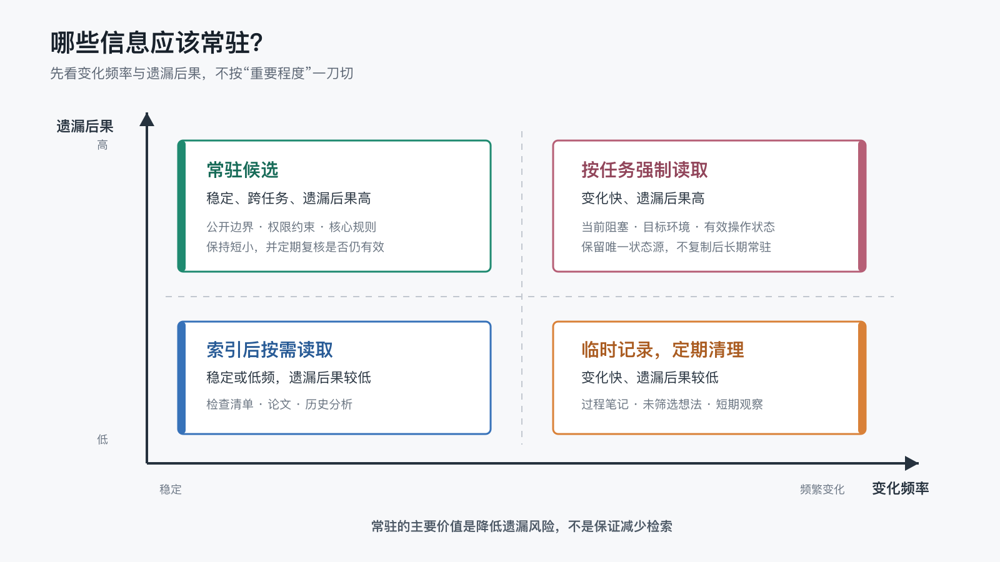

# 长期记忆里，哪些信息应该常驻，哪些应该按需读取？

上一篇搭完三层记忆结构后，我留下了一个没有解决的问题：文件已经分层，并不代表 AI 就知道每次应该带上多少内容。

当前状态、稳定规则、待验证观察、失效结论和参考资料都值得保存，但“值得保存”不等于“值得在每个新任务中自动加载”。如果全部写进 AI 的规则入口，检索步骤确实可能减少，入口却会持续变长；如果只留一份索引，每次都从文件中查找，又可能增加导航成本，甚至遗漏高后果规则。

这里说的**常驻：** 不是把信息永久放在计算机内存里，而是让它通过当前执行器规定的规则入口，在每个新任务开始时自动进入 AI 的上下文。本 POC 使用的 Codex CLI 配置以 `AGENTS.md` 作为该入口；其他工具和版本应以各自文档与项目配置为准。

这里说的**按需读取：** 是只保留入口，让 AI 在任务需要时再读取目标文件。

那么，哪一种更好？

我在 macOS 上用两组模型配置各完成了 36 次正式实验，并在原生 Win11 上用其中一组补充了跨平台验证。结果没有选出一个万能答案，但暴露出一个比平台差异更值得注意的现象：

- 两种模型配置在“全部常驻”下都接近满分，可一旦改成按需读取，差异就出现了。
- 第一组模型配置 `gpt-5.6-sol`（推理强度 `medium`）在仅索引条件下有三次没有独立提出公开脱敏证据的替代方案；第二组模型配置 `deepseek-v4-flash`（推理强度 `max`）每次都补上了这一步，代价是主动读回更多规则文件。
- 本实验直接观察到的平台差异集中在工具链路径，例如 Win11 的沙箱拒绝与重试；这些结果不能进一步归因于操作系统本身。
- 选择性常驻也没有稳定减少读取；模型拿到规则后，仍可能主动核对文件。
- 信息放在哪里，最终取决于变化频率、遗漏后果、复用范围和维护风险，而不是只看 token 或工具调用次数。

所以这篇文章讨论的不只是“应该常驻多少字节”，还有“谁来执行这个加载策略，会不会改变它的实际成本”。

## 1. 我比较了三种加载策略

实验中的三组拥有完全相同的项目事实和目录，只替换根目录的 `AGENTS.md`。

### 全部常驻

把当前状态、稳定规则、观察、失效结论和参考资料正文全部复制到规则入口。

好处很直接：AI 不读其他文件，也可能回答所有测试问题。代价是无论当前任务需要什么，全部内容都会自动进入上下文。

### 选择性常驻

只把三条稳定、跨任务、高后果且足够短的规则复制到入口：

- 公开文章中的实践结论必须来自已经运行的真实实验。
- 平台结论只能覆盖已经完成真实验证的平台。
- 完整原始证据只保留在私有区，公开仓库只放脱敏证据。

当前状态、低频资料、待验证观察和失效结论仍通过索引按需读取。

### 仅索引

规则入口只说明各类信息位于哪里，不直接包含任何测试答案。每个任务都需要从对应文件获取事实。

这三种策略并不是三种产品架构，而是同一个文件系统的三种加载边界。

## 2. 我怎样避免只挑一个有利例子

正式实验包含四类任务：

1. 判断两项高风险发布操作是否允许，并给出修正方式。
1. 找到公开脱敏证据包的三项检查要求。
1. 恢复当前目标、下一步、阻塞和最近完成项。
1. 区分待验证观察与已失效结论，判断它们能否成为公开结论。

每个任务在三个条件下各重复 3 次，每组和平台各 `4 × 3 × 3 = 36` 次。macOS 是主体实验平台，在上面跑了两轮：一轮用 `gpt-5.6-sol`（推理强度 `medium`，Codex CLI `0.144.1`），一轮用 `deepseek-v4-flash`（推理强度 `max`，Codex CLI `0.146.0`）。原生 Win11 用 `gpt-5.6-sol` 补充了同一套正式矩阵，共 36 次。每次都使用独立临时会话和只读夹具；为避免本机安装状态进入实验变量，两个矩阵都显式关闭了 Codex 插件。

实验同时记录：

- 冻结评分表下的正确性。
- 自动加载入口的 UTF-8 字节数。
- AI 通过工作区工具实际获得的项目文本字节数。
- 两者相加得到的项目上下文字节近似值。
- 工具调用、耗时、token 和人工 Review 成本。

项目上下文字节只表示“这个项目有多少文本通过自动加载或工具读取进入本次任务”，不等于模型计费 token，也不能单独代表质量或生产率。

比较两个模型配置时，只取同为 macOS 的两轮各 36 次，保持平台受控；比较两个平台时，只取同为 `gpt-5.6-sol` 的 macOS 与 Win11 数据，保持模型受控。两个正交切片都不混合不同模型或不同平台。

## 3. 正确性：第二组模型配置下，仅索引的遗漏未再出现

先看 macOS 上两个模型配置的敏感性复核。每个条件的四个任务各重复 3 次，满分 60：

| 模型配置 | 全部常驻 | 选择性常驻 | 仅索引 |
| --- | ---: | ---: | ---: |
| `gpt-5.6-sol` / `medium` | 60/60 | 60/60 | 57/60 |
| `deepseek-v4-flash` / `max` | 60/60 | 60/60 | 60/60 |

两个模型配置在全部常驻和选择性常驻下都是满分。唯一的正确性差异出现在仅索引：`gpt-5.6-sol` 有三次高后果任务没有独立提出“公开脱敏证据”的替代方案，各扣 1 分；`deepseek-v4-flash` 每次都补上了这一步。

这不是说后一个模型更聪明。`deepseek-v4-flash` 用的是最大推理强度，`gpt-5.6-sol` 用的是中等推理强度，而且两轮使用的 Codex CLI 版本也不同——本实验无法把这些变量的影响分开。但它说明一件更有用的事：同一个按需读取策略，在当前第二组模型配置下没有再出现这类遗漏。评估一种加载策略是否可靠，不能只看文件组织，还要看具体执行配置。

再看平台。下面是 `gpt-5.6-sol` 在 macOS 与 Win11 上的对比：

| 平台 | 全部常驻 | 选择性常驻 | 仅索引 |
| --- | ---: | ---: | ---: |
| macOS | 60/60 | 60/60 | 57/60 |
| Win11 | 60/60 | 59/60 | 55/60 |

macOS 的三次仅索引扣分和上面同一组数据。Win11 的选择性常驻和仅索引也各有一次相同遗漏；此外，一次仅索引参考资料任务在工作区读取被 Windows 沙箱拒绝后没有成功恢复，最终未回答问题，得到 `0/4`。

108 个答案都没有发现无依据断言或无关项目事实。扣分来自遗漏与检索失败，不是编造。

全部常驻在这个静态小夹具中正确性最高，但这仍不能证明它是长期项目的最佳方案。实验没有模拟入口持续膨胀、状态过期和副本冲突；选择性常驻与仅索引暴露的失败，则提醒我们不能把“有索引”直接等同于“每次都能可靠找到”。

## 4. 上下文：模型会主动核对，“省读取”不是免费的

先看 macOS 上两个模型配置的项目上下文中位数（自动加载入口 + 工具读取的项目文本）：

| 模型配置 | 全部常驻 | 选择性常驻 | 仅索引 |
| --- | ---: | ---: | ---: |
| `gpt-5.6-sol` / `medium` | 2,438 B | 3,149 B | 1,425 B |
| `deepseek-v4-flash` / `max` | 2,810 B | 2,878 B | 2,223 B |

全部常驻的固定入口是 2,438 字节，`gpt-5.6-sol` 几乎不再读取项目文件；`deepseek-v4-flash` 在全部常驻下偶尔还会主动多读一两步，使中位数略高。

值得对比的是仅索引这一列。`gpt-5.6-sol` 的仅索引上下文最小（1,425 B），三次遗漏也出现在这一组；代表性运行显示，发生遗漏时它拿到索引后没有继续核对规则，因此没有提出脱敏替代方案。`deepseek-v4-flash` 的仅索引上下文明显更高（2,223 B），代表性运行显示它会顺着索引把规则文件读回来核对；这些行为分别与遗漏和补齐三分的表现一致，但本实验不能证明读取路径是两组得分差异的唯一或充分原因。

换句话说，“仅索引”省下的上下文，在第二组配置中被部分花回了核对上。这不是坏数据，而是两种不同的取舍：少读更省上下文，多读在当前样本中与更少遗漏同时出现。

按任务拆分，macOS 上 `gpt-5.6-sol` 的项目上下文如下：

| 任务 | 全部常驻 | 选择性常驻 | 仅索引 |
| --- | ---: | ---: | ---: |
| 高后果边界判断 | 2,438 B | 3,587 B | 1,711 B |
| 低频参考细节 | 2,438 B | 2,132 B | 1,090 B |
| 易变当前状态 | 2,438 B | 1,331 B | 996 B |
| 观察与失效结论分类 | 2,438 B | 4,087 B | 1,711 B |

仅索引在四类任务中都使用了最少项目上下文。目标文件短、位置明确，AI 通常只读取当前状态或目标清单，不必同时携带其他事实。

平台层面，`gpt-5.6-sol` 在 Win11 没有复制这条路径。24 次需要读取文件的运行曾出现 Windows 沙箱拒绝，23 次通过重试恢复，一次没有恢复。拒绝信息与重试输出也进入了工作区输出统计，使按需组的上下文明显增加——例如仅索引的高后果任务在 Win11 达到 6,118 B，是 macOS 同组的三倍多。

因此，按需读取的实际成本不只由文件结构决定，还受到两件事影响：模型会不会主动核对，以及 Agent 工具链能不能稳定完成读取。

## 5. 为什么“全部常驻”不能直接成为最佳方案

如果只看这几轮共 108 次运行，全部常驻很有吸引力：答案正确，读取少，耗时也短。

但实验有一个重要边界：所有事实在运行期间保持静态且同步。它没有模拟真实项目中更麻烦的情况：

- 当前状态每天变化，入口里的副本可能忘记更新。
- 规则越来越多，彼此可能重复或冲突。
- 待验证观察写久以后，看起来越来越像确认事实。
- 已失效结论继续常驻，可能在无关任务中产生干扰。
- 每次修改都要同时维护原始文件与自动加载入口。

论文 *Lost in the Middle* 在多文档问答和键值检索任务中发现，模型利用长上下文的能力会受到相关信息位置影响，并不能稳健地使用所有输入内容[2]。这项研究不能直接证明本项目的常驻入口会失败，但提醒我们：上下文窗口能装下更多内容，不等于模型会同样可靠地使用每一部分。

因此，全部常驻在本实验中减少的是**当前读取步骤。**

没有被测量的是**长期更新和冲突成本。** 不能用前一个结果替后一个问题下结论。

## 6. 为什么选择性常驻也没有自动胜出

我原本的待验证假设是：选择性常驻可能同时减少无关注入，并降低高后果规则的检索成本。

正式结果只支持了前半句的一部分。选择性常驻入口为 812 字节，确实比全部常驻的 2,438 字节短；但 macOS 的高后果边界任务项目上下文中位数达到 3,587 字节，Win11 的四类任务中也有三类超过全部常驻。

这不是需要通过修改提示词消除的“坏数据”。

它揭示了一个真实行为：常驻规则可以让边界更早出现，却不能强制模型停止核对来源，也不能保证规则一定被完整执行。选择性常驻的设计目标更接近**降低遗漏风险，** 但本轮 Win11 仍出现一次高后果修正项遗漏，不能把目标直接写成已经得到保证的效果。

MemGPT 使用不同记忆层和虚拟上下文管理来扩展有限上下文[1]；RAG 则通过检索器访问外部非参数记忆，再把相关内容交给生成模型[3]。它们都说明“保存在哪里”和“什么时候进入当前上下文”是两个不同问题。不过，本 POC 只是文件与规则入口实验，并没有复现 MemGPT 或 RAG 系统。

## 7. 用两个维度判断信息放在哪里

实验没有给出通用阈值，但结合运行结果和实际维护风险，可以先问两个问题：

1. 这条信息变化得有多快？
1. 如果 AI 没有在任务开始时看到它，后果有多大？

**稳定且遗漏后果高**的信息，适合作为常驻候选。例如公开边界、权限约束、平台声明规则和不可逆操作前的人工门禁。

**变化快且遗漏后果高**的信息，不适合复制一份后长期常驻。更稳妥的做法是保留唯一状态源，并要求相关任务开始时强制读取，例如当前发布阻塞、正在使用的目标环境和当天有效的操作状态。

**稳定但低频**的信息，适合通过索引按需读取。例如某个平台的发布清单、研究论文、历史分析和只在特定任务中使用的参考资料。

**变化快且遗漏后果低**的信息，可以先保留在临时记录中，并定期清理。它们不需要因为“可能以后有用”就进入长期记忆。

这张图不是自动分类器。边界仍需要结合任务判断，但它比“重要的都常驻”多考虑了一项关键因素：信息会不会很快变旧。

## 8. 一套可以直接采用的最小规则

不需要先给每条记忆打复杂分数。一个项目可以从下面四条开始：

1. 只有稳定、跨任务、高后果且足够短的规则，才进入自动加载入口。
1. 当前目标、阻塞和环境状态只保留一个可更新源，在相关任务开始时读取。
1. 低频清单、研究资料和历史记录通过索引定位，不默认全部加载。
1. 待验证观察与失效结论必须带状态标签；保留它们是为了治理，不是让它们继续充当事实。

还需要定期反问：

- 这条常驻规则最近是否真的跨任务使用？
- 它是否已经变成某个流程或脚本，不再需要保留长篇解释？
- 它是否与新规则冲突，应该降级或移出入口？
- 如果删掉它，最坏后果是什么？

常驻入口不是荣誉榜，也不是只进不出的知识仓库。它更像每次任务都会支付的一笔固定上下文成本。

## 9. 失败记录与实验限制

正式矩阵前，我做了三轮 Pilot。

第一轮发现，高后果任务同时要求规则判断和来源审计，导致所有条件都倾向于继续读取文件。第二轮移除来源要求后，条件入口仍然无条件要求回答给出来源。第三轮修正为“题目要求时才给来源”，三组才通过协议门禁。

即便如此，选择性常驻仍会自主核对文件。此时提示、夹具和评分表已经冻结，正式矩阵不再为了追求预期结果继续修改。

首次 Win11 Smoke 的 12 次命令全部成功，但其中 9 次读取了本机 Codex 插件技能，因此整批隔离，没有启动正式矩阵。修复运行器后，我回扫 macOS 旧正式矩阵，又发现 12/36 次存在同类插件读取。旧 macOS 结果和公开代表样本因此全部作废并重跑，而不是只替换看起来受影响的 12 次。

新的两个平台矩阵都显式关闭插件，并要求运行时路径访问为 0。Win11 正式矩阵仍出现统一的 PowerShell shell snapshot 警告，以及前面提到的沙箱拒绝与重试；这些作为平台表现保留，没有通过改提示或补跑消除。

第二组模型配置（`deepseek-v4-flash`）的正式矩阵首轮也触发了一次隔离门禁失败：模型自主读取了运行时环境中的技能文件，使运行时路径访问不为零。`--sandbox read-only` 只禁止写入、不禁止读取用户主目录下的文件，因此我把运行器改成把主目录指向临时隔离目录后，36 次才全部通过。这个细节本身也是一种模型行为数据：更主动的模型在遇到不确定时，会更倾向于翻找自己运行环境里的东西。

本轮结论仍有明确限制：

- 当前只覆盖 macOS 与原生 Win11；模型对照只在 macOS 上比较两组配置（`gpt-5.6-sol` / `medium` 与 `deepseek-v4-flash` / `max`），Win11 只有第一组。各平台每个任务与条件只有 3 次重复，不支持稳定的耗时或 token 排名。
- 夹具远小于真实长期项目，没有直接测量入口膨胀和陈旧信息成本。
- 人工 Review 采用按任务批量计时，不能比较单个条件的细微审查差异。
- 两个模型配置与推理强度没有分离，本实验无法判断正确性差异有多少来自模型本身、多少来自推理强度；两组还使用了不同的 Codex CLI 版本，耗时与 token 不完全可比。

## 10. 这套加载策略怎样被复查

本篇依赖的 macOS 与 Win11 POC 已经脱敏后整理到：

<https://github.com/ExDevilLee/ai-work-system/tree/main/experiments/practical-ai-memory/02-resident-vs-on-demand>

公开目录包含：

- 冻结实验协议、三种条件夹具、四类任务提示和评分表。
- macOS 两组模型配置各 36 次、Win11（`gpt-5.6-sol`）36 次正式运行的聚合 CSV 与 JSON。
- 第二组模型配置（`deepseek-v4-flash`）的 macOS 36 次聚合数据，作为模型敏感性对照单独存放，文件名标注模型与推理强度，不与第一组混同。
- macOS 全部运行的 manifest 和第 1 轮 12 个脱敏代表样本。
- 两个平台的正式结果与跨平台对照报告。
- 按三种条件去重的真实运行夹具。
- 评分、聚合、公开证据构建和敏感信息校验脚本。

完整 `raw.jsonl`、本机绝对路径、会话标识和私有运行上下文只保留在各自设备的本地证据区，不进入公开仓库。Win11 只回传脱敏聚合文件；公开代表样本仍来自 macOS。

## 11. 把信息放对入口，而不是选择唯一策略

长期记忆的边界，不是“这条信息重不重要”，而是“它是否需要在每个任务开始时自动出现”。

本轮实验支持的结论很克制：

- 全部常驻在两个模型配置和两个平台上都接近满分，并消除了当前静态夹具中的项目文件读取，但持续携带全部内容。
- 仅索引在 macOS 显著减少了项目上下文，在 Win11 却因沙箱拒绝和重试失去这一优势。
- 选择性常驻适合作为保护高后果边界的设计方向，但不能保证模型不再检索，也没有完全消除遗漏。
- 按需读取把一部分风险从“入口会不会过期”转移成“检索链路能不能稳定完成”。
- 加载策略的效果因模型配置而异：同一个仅索引策略，`gpt-5.6-sol` 出现三次遗漏，`deepseek-v4-flash` 配最大推理强度则全部补上，代价是主动读回更多规则。
- 正确做法不是选择唯一策略，而是让不同信息走不同加载路径，并记住这个选择是在哪个模型配置上验证过的。

下一篇，我们继续追问信息进入长期记忆之前最关键的一步：

> 一条真实经验，什么时候才应该从原始记录晋升为长期记忆？

## 参考文献

[1] Packer, C., Wooders, S., Lin, K., Fang, V., Patil, S. G., Stoica, I., & Gonzalez, J. E. (2023). *MemGPT: Towards LLMs as Operating Systems*. arXiv:2310.08560. <https://arxiv.org/abs/2310.08560>

[2] Liu, N. F., Lin, K., Hewitt, J., Paranjape, A., Bevilacqua, M., Petroni, F., & Liang, P. (2023). Lost in the Middle: How Language Models Use Long Contexts. *Transactions of the Association for Computational Linguistics*. <https://arxiv.org/abs/2307.03172>

[3] Lewis, P., Perez, E., Piktus, A., Petroni, F., Karpukhin, V., Goyal, N., Küttler, H., Lewis, M., Yih, W., Rocktäschel, T., Riedel, S., & Kiela, D. (2020). Retrieval-Augmented Generation for Knowledge-Intensive NLP Tasks. *Advances in Neural Information Processing Systems, 33*. <https://arxiv.org/abs/2005.11401>
