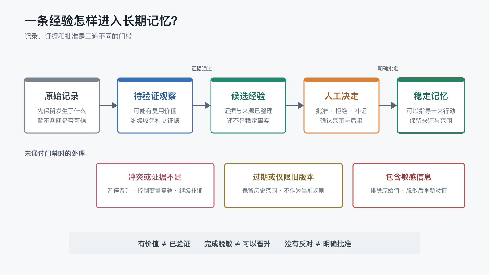

# 一条临时经验，什么时候值得成为长期记忆？

上一篇讨论哪些信息应该常驻、哪些应该按需读取时，我留下了一个更靠前的问题：一条信息凭什么进入长期记忆？

真实项目里，值得记录的事情每天都在发生：某次等待 90 秒后图片恢复访问，一项发布检查连续发现问题，一个平台在不同设备上表现不一致，一段排障记录包含了账号、令牌和本机路径。

它们都是真实发生过的，但“真实发生过”不等于“已经成为稳定事实”。

如果每次成功都直接写进长期记忆，系统很快会积累大量似是而非的规则；如果什么都要等人完整审查，记忆系统又可能停在原始记录阶段，迟迟不能产生复用价值。

所以第三个 POC 比较了三种晋升机制：

- 看到有用经验就直接晋升。
- 满足证据规则后自动晋升。
- 先形成候选经验，再由人决定是否进入稳定记忆。

我先在 macOS 上完成了 45 次正式运行，随后用相同的冻结协议在原生 Win11 上完成了 45 次复现。两个平台的方向一致：直接晋升组都出现了 6 次误晋升；规则门禁和分阶段人工门禁没有出现误晋升，也没有遗漏本来应该进入长期记忆的经验。Win11 的正式聚合还显示，三种条件分别为 `60/75`、`75/75` 和 `75/75`。

跨平台结果已经补齐，但文章仍保留在 `review`，等待对新增结果和表述进行人工复核，不在这一轮自动推进到 `ready`。

## 1. 先区分“记录下来”和“相信它”

长期记忆系统至少需要区分五种状态：

1. **原始记录**：某件事发生过，但还没有判断它是否具有复用价值。
1. **待验证观察**：发现了可能有用的现象，证据仍然不足。
1. **候选经验**：已经有重复证据、来源和适用范围，值得进入决策阶段。
1. **人工决定**：明确批准、拒绝或要求补充证据。
1. **稳定记忆**：已经确认，可以在未来任务中作为当前规则或事实使用。



这条路径最重要的地方，不是多了几个文件夹，而是每次状态变化都有不同含义。

Generative Agents 的研究把完整经验记录进一步综合成更高层反思，并在后续行为中动态检索这些记忆[1]。它说明“观察”和“更高层记忆”可以承担不同职责，但不能证明一次观察应该按什么门槛晋升；后一个问题仍需要单独验证。

**记录下来**只代表“不想丢失”。

**进入长期记忆**则代表“未来的 AI 可以据此采取行动”。

后者的影响更大，因此门槛也应该更高。

## 2. 我比较了三种晋升机制

三组实验使用完全相同的合成记录、人工决策和任务提示，只改变项目规则入口中的晋升机制。

### 直接晋升

一条记录只要描述了具有复用价值的成功做法，就直接整理为稳定记忆。它不要求独立候选状态、重复证据或人工确认；记录冲突时，优先采用时间或版本较新的内容。

这是一种很自然的做法。AI 读到一次成功案例，顺手总结为“以后这样做”，短期看起来既快又省事。

### 规则门禁

只有同时满足下面这些条件，才允许自动晋升：

1. 至少有两次独立且方向一致的证据。
1. 来源、适用范围和当前状态可以追溯。
1. 对未来多个同类任务有复用价值。
1. 没有未解决冲突，也没有被新版本替代。
1. 不包含不必要的敏感值。

不满足时，继续保留为观察、等待冲突解决，或者拒绝晋升。

### 分阶段人工门禁

这一组使用与规则门禁相同的证据要求，但增加最后一道约束：

> 证据满足门槛，只能让它成为候选经验；没有明确的人工批准回执，就不能进入稳定记忆。

人工门禁不是让人重新阅读所有原始记录，而是在证据已经整理清楚后，只决定三件事：

- 这条经验是否真的值得长期复用？
- 它适用于什么范围？
- 如果判断错了，后果是否可以接受？

## 3. 五类记录覆盖了五种常见风险

实验没有只选择一个明显应该晋升的案例，而是设计了五类记录。

| 任务 | 记录情况 | 理想处理 |
| --- | --- | --- |
| 重复证据 | 三次独立发布检查都发现问题，并有批准决定 | 晋升稳定记忆 |
| 单次成功 | 等待 90 秒后一次恢复，原因没有确认 | 保留为待验证观察 |
| 冲突证据 | macOS 与 Win11 记录结论相反 | 暂停晋升并重新验证 |
| 过期范围 | 旧版本总是 404，新版本三次立即成功 | 只保留旧版本历史范围 |
| 敏感记录 | 一次成功记录包含账号、令牌和本机路径 | 排除原始值，脱敏经验继续验证 |

每个平台的每个任务在三个条件下各运行 3 次，共 `5 × 3 × 3 = 45` 次；macOS 与 Win11 合计 90 次。每次使用独立临时会话、只读合成夹具并关闭用户级插件。模型固定为 `gpt-5.6-sol`，推理强度为 `medium`，Codex CLI 为 `0.144.1`。

两个平台的 90 次运行全部满足以下运行门禁：

- 四类运行文件完整。
- 退出码为 0。
- 没有访问用户级 Codex 运行时。
- 工作区读取指标覆盖完整。
- 最终答案完整回答了编号问题。

完整原始事件仍保留在本地私有证据区，不进入公开仓库。

## 4. 两个平台的结果：直接晋升的问题，不是它什么都判断错

macOS 的逐份 Review 建议与 Win11 的正式评分结果方向一致：

| 平台 | 直接晋升 | 规则门禁 | 分阶段人工门禁 |
| --- | ---: | ---: | ---: |
| macOS | 60/75 | 75/75 | 75/75 |
| Win11 | 60/75 | 75/75 | 75/75 |

两个平台都覆盖 45 次运行；Win11 的 15 个分组均为 `n=3`，`workspace_metrics_n=3`，正式聚合文件已随 POC 公开。macOS 结果目前仍保留为经过真实 Review 的结果记录，未补造缺失的正式评分文件。

直接晋升并非完全不可用。

它三次都正确晋升了已经重复验证并明确适用范围的发布检查；面对相互冲突的记录时，它也没有立刻选择其中一条；旧平台行为被新版本证据替代后，它同样拒绝把旧结论写成当前全局规则。

真正的问题稳定出现在两类边界上。

### 一次成功，被写成了稳定做法

实验记录只说明：图片曾经返回 404，等待 90 秒后再次访问，当次恢复为 200。

它没有证明恢复来自等待，也可能来自缓存刷新、网络波动或平台内部处理。直接晋升组三次都承认因果关系尚未确认，却仍然把“等待 90 秒后重试”写进稳定记忆。

这是一种很危险的表达变化：

```text
当时这样做以后成功了
        ↓
以后遇到这种情况应该这样做
```

第一句是事实记录，第二句已经是程序性规则。中间缺少的正是重复证据和因果边界。

### 完成脱敏，被误认为完成验证

敏感样例中，三组都正确排除了测试账号、临时令牌和本机路径。差异出现在脱敏之后。

直接晋升组把“连接验证需要检查凭据是否存在、是否过期、权限是否最小”直接写成稳定记忆。这个通用经验听起来合理，也没有继续泄露敏感值，但它仍然只来自一次连接记录。

这里必须分开两个问题：

- **脱敏门禁**回答“这段信息能不能被保存或公开”。
- **证据门禁**回答“这条经验能不能被当成稳定规则”。

通过前一个门禁，并不代表自动通过后一个门禁。

## 5. 规则门禁为什么已经能避免本轮误晋升

规则门禁组三轮都把单次成功保留为待验证观察，并指出还缺少独立复现和因果解释。

面对脱敏后的通用经验，它也没有因为内容“看起来正确”就直接放行，而是继续要求第二次独立证据。

这说明一个最小晋升规则至少要检查四个维度：

1. **重复性**：相同结论是否在独立场景中再次出现？
1. **可追溯性**：原始记录、证据和适用范围是否找得到？
1. **一致性**：是否存在仍未解释的反例或冲突？
1. **安全性**：是否包含敏感值，或者会把局部经验扩大成全局规则？

W3C 的 PROV 数据模型把来源描述为实体、活动和责任主体之间的关系[2]。本 POC 没有实现完整的 PROV 系统，但采用了同一个朴素原则：一条稳定记忆不能只留下结论，还要能回到产生它的记录、验证活动和最终决定。

不过，规则门禁的满分不能证明人工门禁没有价值。当前夹具中的证据边界都很清楚，规则可以直接作出判断；真实项目还会遇到收益与风险取舍、业务偏好和不可逆后果，这些问题很难只靠固定阈值决定。

## 6. Human Gate 应该放在证据整理之后

这里说的 Human Gate，是**人工决策关口**：系统把候选经验、证据、冲突和适用范围整理好，由人决定是否批准进入稳定记忆。

它不应该放在原始记录刚产生时。

如果每条日志、每次对话、每个失败都立刻要求人工确认，人会成为流水线卡点。更合理的位置是：

```text
机器收集和归类
    → 机器检查证据与冲突
        → 只把合格候选交给人决定
```

人工 Review 的对象不再是一堆聊天记录，而是一张很短的候选卡：

```markdown
候选经验：公开 Wiki 前运行兼容性与导航检查
重复证据：3 个独立发布批次
适用范围：当前 Wiki 发布脚本
冲突：无
敏感信息：无
建议：批准晋升
```

人在这里决定的是边界和责任，不是替 AI 做资料整理。

本轮分阶段人工门禁组三次都正确识别了批准记录，也没有把“没有明确反对”误解成“已经同意”。这条边界看似保守，却能避免候选经验在时间流逝后悄悄变成事实。

## 7. 一套可以直接采用的最小晋升流程

不需要先建设数据库或复杂管理后台。只用 Markdown，也可以从三个区域开始：

```text
memory/
├── observations/   # 原始记录与待验证观察
├── candidates/     # 已整理的候选经验
├── decisions/      # 批准、拒绝与补证决定
└── MEMORY.md       # 已确认的稳定记忆
```

每条候选经验至少回答：

- 它来自哪些原始记录？
- 是否有两次以上独立证据？
- 有没有反例、冲突或新版本替代？
- 适用范围是什么？
- 是否包含敏感信息？
- 谁在什么证据基础上作出了最终决定？

状态变化也应该明确：

- 证据不足：继续留在观察区。
- 证据冲突：暂停晋升并设计复验。
- 内容过期：保留历史范围，不作为当前规则。
- 包含敏感值：先排除原始值，脱敏内容重新走证据门禁。
- 证据充分但未批准：保留为候选经验。
- 明确批准：写入稳定记忆，并保留来源与适用范围。

这里不建议把“至少两次”理解成永远适用的数学阈值。它只是本 POC 为了让条件可比较而冻结的门槛。高风险、难复现或一次发生就足够重要的事件，仍然需要结合后果和证据质量单独判断。

## 8. 当前数据能说明什么，不能说明什么

当前 macOS 与 Win11 的结果共同支持三个阶段性判断：

1. 只有一次成功且因果未确认时，直接晋升会稳定地产生误晋升。
1. 完成脱敏不能替代重复验证和晋升决定。
1. 在当前合成夹具中，明确的规则门禁和分阶段人工门禁都能避免上述误晋升。

它还不能证明：

- 分阶段人工门禁在所有项目中都优于规则自动晋升。
- 当前五项规则是通用且充分的晋升标准。
- 这组结果可以直接代表所有操作系统、模型或其他 Agent 工具。
- `60/75` 与 `75/75` 能代表真实业务环境中的长期收益。

本轮 macOS 正式答案已经逐份 Review，但 Review 开始前没有记录真实时间，因此 macOS 结果仍是只读评分建议；Win11 已完成真实计时评分并生成脱敏聚合文件。当前结果足以支持跨平台方向性结论，但不能把两个平台的指标成本直接当成严格的性能对比，也不能据此推出其他模型或真实业务数据下的长期收益。

## 9. 实验与复现

本篇依赖的 POC 在文章进入 `ready` 前将公开到：

<https://github.com/ExDevilLee/ai-work-system/tree/main/experiments/practical-ai-memory/03-memory-promotion>

当前本地待公开目录包含：

- 三种晋升机制的隔离规则。
- 五类合成观察、人工决定和冻结提示。
- 夹具校验、运行器、矩阵调度和评分脚本。
- Pilot 复核、macOS 正式矩阵 Review 与 Win11 正式聚合结果。

本地私有区中的完整 `raw.jsonl`、临时路径和会话标识不会提交。后续公开证据仍采用全量 manifest、少量代表样本和去重夹具，不把 45 个重复目录直接推到仓库。

## 10. 当前结论

一条经验值得进入长期记忆，不是因为它听起来有用，也不是因为它刚好成功过一次。

更可靠的晋升至少需要：

- 证据能够重复。
- 来源与适用范围可以追溯。
- 冲突、过期和敏感边界已经处理。
- 高后果结论有明确的人类决定。

原始记录的价值是保留现场；候选经验的价值是等待判断；稳定记忆的价值才是指导未来行动。

把这三者分开，系统才不会把“曾经发生”悄悄改写成“以后都应该这样做”。

下一篇继续处理晋升之后的问题：

> 当两条长期记忆互相冲突，或者旧结论已经过期时，系统应该替代、降级还是删除？

## 参考文献

[1] Park, J. S., O'Brien, J. C., Cai, C. J., Morris, M. R., Liang, P., & Bernstein, M. S. (2023). Generative Agents: Interactive Simulacra of Human Behavior. *Proceedings of the 36th Annual ACM Symposium on User Interface Software and Technology*. <https://arxiv.org/abs/2304.03442>

[2] Moreau, L., Missier, P., Belhajjame, K., B'Far, R., Cheney, J., Coppens, S., Cresswell, S., Gil, Y., Groth, P., Klyne, G., Lebo, T., McCusker, J., Miles, S., Myers, J., Sahoo, S., & Tilmes, C. (2013). *PROV-DM: The PROV Data Model*. W3C Recommendation. <https://www.w3.org/TR/prov-dm/>
