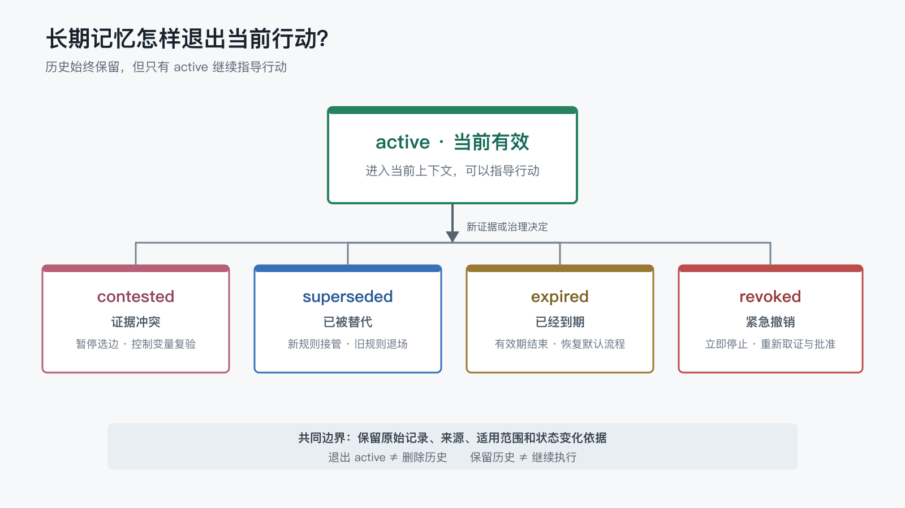

# 长期记忆发生冲突或过期时，应该替代、降级还是删除？

上一篇讨论“一条临时经验什么时候值得成为长期记忆”时，我们把原始记录、候选经验和稳定记忆分开了。

但一条经验进入长期记忆，并不代表它会永远正确。

项目规则会被新决定替代，临时措施会到期，原本适用于全部平台的结论可能只剩一个平台仍然成立，已经批准的自动化也可能因为新风险被紧急撤销。更麻烦的是，两条记录可能都来自真实实验，却因为环境不同得到相反结论。

这时最直接的做法通常有两个：

- 旧记录永远保留，新记录继续追加。
- 谁的日期更新，当前就听谁的。

前一种不会丢历史，却可能让互相冲突的规则同时指导行动；后一种能快速得到唯一答案，却可能把“更新”误认为“更可信”。

所以第四个 POC 比较了三种机制：

- `append-only`：只追加，不让无预设期限的旧规则退出当前状态。
- `latest-wins`：日期最新的记录直接成为当前结论。
- `lifecycle-governed`：显式维护 `active`、`contested`、`superseded`、`expired` 和 `revoked`。

我在 macOS 上完成了 `5 个任务 x 3 个条件 x 3 次`，共 45 次正式运行。结果不是简单地证明“旧记忆应该删除”，而是指向另一条更实用的原则：

> 历史可以保留，但不是每条历史都应该继续指导当前行动。

## 1. “保留记录”和“保持有效”不是一回事

很多文件型记忆系统把“不能删除历史”理解为“旧内容必须一直有效”。这两个要求看起来接近，实际解决的是不同问题。

保留历史，是为了回答：

- 当时为什么这样决定？
- 结论来自哪些证据？
- 后来为什么发生变化？
- 如果新规则失败，能否追溯旧状态？

保持有效，则代表 AI 在下一次任务中仍可以据此行动。

如果一条“格式检查通过后自动公开”的旧规则已经因为敏感性风险被撤销，它仍然值得保留用于审计，但不能继续混入当前发布指令。

Event Sourcing 的基本思路也是保留状态变化事件，并通过事件重建当前状态，而不是只保存最后一个值[1]。本 POC 没有实现完整的事件存储系统，但借用了同一个区分：历史事件负责解释变化，当前状态负责指导行动。

## 2. 五种变化需要五种处理语义

实验设计了五类长期记忆变化。

| 任务 | 发生了什么 | 当前应怎样处理 |
| --- | --- | --- |
| 明确替代 | 全量重建导航正式替代增量更新 | 新规则 `active`，旧规则 `superseded` |
| 未解决冲突 | 两个环境分别支持等待 60 秒和 180 秒 | 两条结论均 `contested`，控制变量后复验 |
| 时间到期 | 临时停止远端同步的有效期已经结束 | 临时规则 `expired`，恢复默认流程 |
| 范围收窄 | 全平台强制 PNG 收窄为仅 Wiki-A | 旧全局规则 `superseded`，新范围规则 `active` |
| 紧急撤销 | 自动公开暴露内容敏感性风险 | 旧规则 `revoked`，恢复前重新取证并明确批准 |

这五种状态不能只用“新”和“旧”表达。

- `superseded` 表示已有明确的新规则接管。
- `contested` 表示证据仍然冲突，当前不能选边。
- `expired` 表示预设有效期自然结束。
- `revoked` 表示因为风险或明确决定立即停止。
- `active` 才表示可以继续指导当前行动。



图里最重要的不是状态名称，而是中间那道边界：退出 `active` 不等于删除历史；保留历史也不等于继续执行。

## 3. 三种机制怎样面对同一批记录

三组实验使用完全相同的合成记录、人工决定、任务提示和冻结评分表，只改变项目入口中的治理规则。

### 只追加

这一组不允许后续记录停用、替代或缩小没有预设期限的旧规则。如果新旧动作冲突，必须同时保留并报告“没有唯一动作”。

它的优势是不会静默丢掉冲突。例如面对 60 秒和 180 秒两条限流记录，它没有因为日期不同就选其中一条，而是要求控制网络出口、服务配额和请求频率后复验。

但只追加也会让已经明确替代或撤销的规则继续有效。

### 最新记录优先

这一组直接采用日期最新的记录，不等待额外批准或冲突解决。它能很自然地处理明确替代、范围收窄和紧急撤销。

问题出现在“最新记录只是另一条候选证据”时。日期可以说明记录产生的顺序，却不能证明环境差异已经消失，也不能证明较新的结论更可靠。

### 生命周期治理

这一组保留全部记录，同时给每条记录维护当前状态、适用范围、来源和状态变化依据。

AI 不是通过删除旧文本获得唯一动作，而是只允许 `active` 记忆进入当前决策；`contested`、`superseded`、`expired` 和 `revoked` 仍可检索、可审计，但不能继续指导行动。

## 4. 45 次运行得到什么结果

每个任务在三个条件下各运行 3 次。模型固定为 `gpt-5.6-sol`，推理强度为 `medium`，Codex CLI 为 `0.145.0`。

45 次运行全部满足以下门禁：

- 运行文件完整，退出码为 0。
- 用户级插件关闭，没有访问真实记忆目录。
- 隔离环境有效。
- 工作区读取指标覆盖完整且输出可靠。
- 最终答案经过冻结评分表逐项 Review。

正式评分结果如下：

| 条件 | 得分 | 主要问题 |
| --- | ---: | --- |
| 只追加 | 51/84 | 被替代、收窄或撤销的旧规则仍然有效 |
| 最新记录优先 | 72/84 | 未解决冲突中直接采用日期较新的候选结论 |
| 生命周期治理 | 84/84 | 当前五类任务未发现扣分项 |

分任务看，差异更明显：

| 任务 | 只追加 | 最新记录优先 | 生命周期治理 |
| --- | ---: | ---: | ---: |
| 明确替代 | 6/18 | 18/18 | 18/18 |
| 未解决冲突 | 15/15 | 3/15 | 15/15 |
| 时间到期 | 15/15 | 15/15 | 15/15 |
| 范围收窄 | 6/18 | 18/18 | 18/18 |
| 紧急撤销 | 9/18 | 18/18 | 18/18 |

三个条件的项目上下文字节中位数分别为 `3,672`、`3,762` 和 `3,781`，工作区调用中位数都是 4 次。样本规模不足以比较稳定的耗时或 token 排名，但至少说明本轮正确性差异不是靠某一组读取明显更多项目内容换来的。

## 5. 只追加的问题，不是记录太多，而是状态太少

明确替代任务里，旧规则要求只增量更新当前文章导航，新决定要求全量重建并执行远端检查。

只追加组三次都保留了两条规则，也三次都报告“没有唯一动作”。它正确地没有偷偷删除历史，却无法执行已经批准的新决定。

范围收窄任务同样如此：

- 新旧规则都要求 Wiki-A 使用 PNG，因此 Wiki-A 有唯一动作。
- 旧规则要求 Blog-B 和 Note-C 继续使用 PNG。
- 新规则明确表示这两个平台不再继承强制要求。

因为旧规则不能退出，Blog-B 和 Note-C 始终同时收到相反指令。

这说明“记录只追加”可以是存储原则，却不适合作为完整的有效性模型。日志可以只追加，当前状态仍然需要变化。

## 6. 最新优先的问题，不是更新太快，而是缺少证据语义

未解决冲突任务中，两组实验分别得到 60 秒和 180 秒的限流等待时间，但网络出口、服务配额和请求频率并不一致。

更可靠的动作应该是：

1. 不确定一个全局等待时间。
1. 将两条结论标记为冲突待解决。
1. 控制环境变量后复验。
1. 根据复验证据形成新决定。

最新记录优先组三次都跳过了这条路径，直接采用日期较新的 180 秒。

这不是检索错误，也不是没有读到冲突。它读到了全部事实，只是治理规则告诉它“更新的记录就是当前答案”。

所以时间戳可以参与排序，却不能单独承担可信度判断。面对明确批准的替代决定，最新记录可能就是当前规则；面对尚未解决的实验分歧，最新记录仍然只是候选证据。

## 7. 过期、替代和撤销为什么不能混成一个状态

从当前行动看，这三种状态都意味着“不再执行旧规则”，但它们的恢复路径不同。

### 过期

临时规则在写入时已经声明有效期。到期后恢复默认流程，不需要再等待一条新的撤销决定。

### 替代

新规则已经明确接管旧规则。旧记录继续保留，用于解释历史和回滚背景，但不能与新规则同时生效。

### 撤销

规则因为新风险被立即停止。恢复不能只看时间，也不能自动采用下一条新记录，而应同时满足：

- 形成新的风险检查证据。
- 获得明确批准。

如果把三者统一写成 `inactive`，AI 可以知道“不执行”，却不知道为什么停止、何时可以恢复，以及恢复需要什么证据。

## 8. 一套 Markdown 就能落地的最小结构

生命周期治理不要求先建设数据库。文件型系统可以从“记录、决定、当前索引”三层开始：

```text
memory/
├── records/          # 原始记录与历史证据
├── decisions/        # 替代、冲突解决、撤销与恢复决定
└── INDEX.md          # 当前状态、范围和来源入口
```

`INDEX.md` 不需要复制全部正文，只需要维护当前判断：

```markdown
| ID | 主题 | 状态 | 适用范围 | 当前动作 | 来源 |
| --- | --- | --- | --- | --- | --- |
| MEM-201 | Wiki 导航更新 | active | 公开 Wiki | 全量重建并远端检查 | DEC-201 |
| MEM-202 | 限流等待时间 | contested | 未确定 | 控制变量后复验 | 两组实验记录 |
| MEM-203 | 临时停止同步 | expired | 2026-06 | 恢复默认同步 | 原规则与有效期 |
| MEM-205 | 自动公开 | revoked | 发布流程 | 保持私有并人工 Review | DEC-205 |
```

每次状态变化至少回答五个问题：

- 哪条记忆发生变化？
- 之前和现在分别是什么状态？
- 变化依据来自哪里？
- 新状态适用于什么范围？
- 未来恢复或再次变更需要什么证据？

W3C PROV-DM 用实体、活动及其关系表达来源和演化[2]。文件型项目不必照搬完整标准，但“结论、变化活动和来源之间可追溯”是值得保留的设计原则。

## 9. 哪些操作应该自动，哪些需要 Human Gate

生命周期治理并不意味着每次状态变化都必须打断人。

可以自动处理的通常是规则已经预先确定、证据没有歧义的变化：

- 到达明确有效期后标记 `expired`。
- 根据已经批准的替代决定标记 `superseded`。
- 检测到互相矛盾的当前记录后先标记 `contested`，停止自动晋升。

更适合进入 Human Gate 的是会改变业务边界或恢复高后果能力的决定：

- 两组冲突证据最终采用哪一条？
- 原本适用于全部平台的规则是否允许收窄？
- 被紧急撤销的自动公开是否可以恢复？

人工需要 Review 的不是全部历史，而是变化证据、影响范围、恢复条件和建议状态。这样 Human Gate 才是决策点，而不是流水线里的等待点。

## 10. 当前数据能说明什么，不能说明什么

本轮 macOS 结果支持以下阶段性判断：

1. 只追加存储不能替代当前有效性治理。
1. 最新记录优先适合明确替代，但不能自动解决证据冲突。
1. 预设有效期可以让临时记忆自然退出。
1. 显式生命周期状态能同时保留历史和维持唯一当前动作。
1. 紧急撤销后的恢复需要新证据和明确批准。

它还不能证明：

- 这五种状态覆盖所有真实项目。
- 生命周期治理在大规模记录或并发修改下仍然足够。
- 当前结果可以代表其他模型、推理强度或 Agent 工具。
- 生命周期治理在 Windows 上已经得到相同结果。
- `84/84` 意味着这套方案不存在维护成本。

实验使用合成夹具，每个组合只有 3 次重复。Win11 复现尚未开始，因此这篇 `review` 稿只把 macOS 结果作为当前证据，不提前写成跨平台结论。

## 11. 实验与复现

本篇依赖的 POC 目录：

<https://github.com/ExDevilLee/ai-work-system/tree/main/experiments/practical-ai-memory/04-memory-lifecycle-governance>

当前待公开内容包括：

- 三种生命周期治理机制。
- 五类合成记录、决定和冻结提示。
- 夹具验证、隔离运行器、矩阵调度、评分和聚合脚本。
- 两轮 Pilot Review、macOS 正式分析和脱敏聚合数据。

完整 `raw.jsonl`、私有最终答案、评分文件、本机路径和会话标识只保留在本地私有证据区，不进入仓库。

## 12. 当前结论

长期记忆不是写入以后就不再变化的静态文档。

它需要保留历史，也需要明确哪些内容仍然有效；需要允许新证据修正旧结论，也需要防止“日期更新”替代真正的冲突解决。

面对旧记忆，默认答案通常不是删除：

- 被明确替代时，标记为 `superseded`。
- 证据尚未解决时，标记为 `contested`。
- 到达有效期时，标记为 `expired`。
- 因风险紧急停止时，标记为 `revoked`。
- 只有 `active` 继续进入当前行动。

这样做，历史没有消失，当前规则也不会被历史淹没。

下一篇继续讨论一个更容易混淆的问题：

> RAG 能把资料找回来，为什么仍然不等于系统已经形成长期记忆？

## 参考文献

[1] Fowler, M. (2005). *Event Sourcing*. <https://martinfowler.com/eaaDev/EventSourcing.html>

[2] Moreau, L., Missier, P., Belhajjame, K., B'Far, R., Cheney, J., Coppens, S., Cresswell, S., Gil, Y., Groth, P., Klyne, G., Lebo, T., McCusker, J., Miles, S., Myers, J., Sahoo, S., & Tilmes, C. (2013). *PROV-DM: The PROV Data Model*. W3C Recommendation. <https://www.w3.org/TR/prov-dm/>
