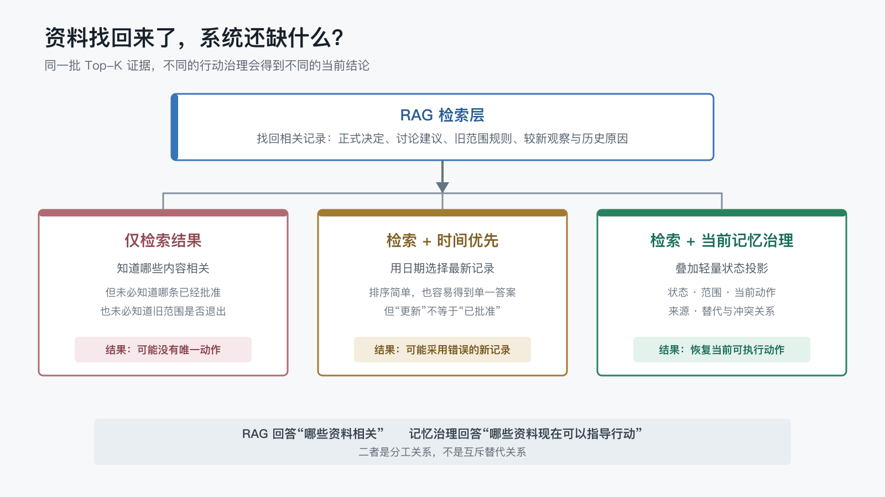

# RAG 能把资料找回来，为什么还不等于系统形成了长期记忆？

上一篇讨论长期记忆发生冲突或过期时应该怎样处理，最后留下了一个更基础的问题：

> 如果 RAG 已经能把相关资料找回来，为什么还需要单独建设长期记忆？

这个问题很容易滑向两个极端。

一种说法是：只要有向量数据库和检索，系统就已经有长期记忆。另一种说法是：RAG 只是搜索，与记忆完全无关。

这两种说法都过于绝对。

RAG 原论文确实把外部稠密向量索引称为 non-parametric memory，并将它与模型参数中的知识结合用于生成[1]。所以本文不是要纠正论文用词，也不是要证明“RAG 不能做记忆”。

我想验证的是一个更具体的工程问题：

> 当相关资料已经被正确检索出来以后，系统是否就能知道哪条资料当前有效、适用于什么范围，并据此采取行动？

第五个 POC 固定了相同的 Top-K 证据，只改变检索后的行动治理方式。在 macOS 与原生 Win11 各完成 45 次正式运行后，两个平台的三组总分都分别得到：

- 仅检索结果：`75/84`。
- 检索加时间优先：`69/84`。
- 检索加当前记忆治理：`84/84`。

差异不在“能不能找到资料”，而在“找到以后怎样决定当前应该听谁的”。
为了观察结论能否在另一组模型配置下复现，我又在 macOS 上用 `deepseek-v4-flash`（推理强度 `max`）补做了 36 次敏感性复核。结果方向一致：当前记忆治理仍然满分，仅检索和时间优先的丢分仍然集中在同样的任务上。由于模型、推理强度、CLI 版本和样本排程同时变化，这里只说明结果在当前第二组配置下得到复现，不构成单变量模型对比。

## 1. 先把 RAG 和长期记忆放回各自的问题里

RAG 主要解决的是检索与生成之间的连接：

1. 根据问题寻找相关资料。
1. 把检索结果放进模型上下文。
1. 让模型基于外部资料生成答案。

它非常适合回答：

- 哪份清单描述了 Wiki 发布检查？
- 哪条记录提到 60 秒限流等待？
- 哪次实验发现二进制索引不能直接跨平台复制？

长期项目里的“当前记忆”还要回答另一组问题：

- 两个互相冲突的方案，哪一个已经批准？
- 较新的记录只是讨论建议，还是已经可以执行？
- 原本覆盖三个平台的规则，是否已经缩小到一个平台？
- 旧方案为什么退出，它还能不能继续指导行动？

前一组是相关性问题，后一组是状态与行动问题。

CoALA 用模块化记忆、结构化行动空间和决策过程描述语言 Agent[2]。它提供了一个有用的提醒：记忆内容、从记忆中取回什么，以及最终选择什么行动，可以是相互连接但并不相同的模块。

## 2. 先排除一个干扰：这次不比赛召回

如果同时改变 embedding、切片、Top-K、rerank 和记忆治理，最终很难知道差异来自哪里。

所以本轮实验冻结了检索结果：三个条件在同一个任务中拿到相同的 Top-K 证据包。SQLite FTS5/BM25 只用于 Pilot 阶段核验这些证据包确实可以由普通检索获得，不进入正式评分。

实验不评价：

- 哪个 embedding 模型更好。
- 向量检索还是关键词检索更好。
- Top-K 应该设为多少。
- 是否需要 rerank。
- 哪个向量数据库性能更高。

正式矩阵只验证一件事：**召回已经正确时，行动治理是否仍会改变答案。**

## 3. 同一批资料，三种不同的行动解释

### 仅检索结果

Agent 根据任务阅读最相关的证据包。相关性只能说明资料与问题有关，不额外提供独立的当前状态。

如果两条材料不能支持唯一行动，Agent 应如实说明存在不同表述。

### 检索加时间优先

Agent 同样读取检索包，但同一主题存在多个记录时，默认采用日期最新的一条。

它能低成本得到单一答案，却把“时间更新”当成了“当前有效”。

### 检索加当前记忆治理

Agent 同时获得检索证据包和一份轻量 `memory/CURRENT.md`。状态投影不复制全部正文，只记录：

- 当前状态，例如 `active`、`proposed`、`contested`、`retired`。
- 适用范围。
- 当前动作。
- 记录之间的替代或冲突关系。
- 实际证据来源。

只有状态和范围匹配的记录才能指导当前行动。



这张图表达的不是“记忆治理取代 RAG”，而是两层分工：

> RAG 回答“哪些资料相关”，记忆治理回答“哪些资料现在可以指导行动”。

## 4. 用五类任务寻找检索后的判断错误

实验没有只挑 RAG 容易失败的题目，而是同时放入 RAG 擅长的静态事实任务。

| 任务 | 需要恢复什么 | 主要风险 |
| --- | --- | --- |
| 稳定参考 | 三项固定 Wiki 检查 | 增加材料中不存在的检查项 |
| 已批准决定 | 当前导航更新方式 | 未批准 proposal 覆盖正式决定 |
| 未解决冲突 | 限流等待策略 | 日期更新掩盖环境变量差异 |
| 范围限定规则 | 三个平台的 PNG 要求 | 旧全局规则继续污染新范围 |
| 历史追溯 | 当前索引迁移动作及变化原因 | 只保留最新答案而丢失退出原因 |

三种条件、五个任务、每组重复 3 次，每个平台 `3 x 5 x 3 = 45` 次，两个平台共 90 次正式运行。

## 5. 126 次运行先给出一个反常识结果

两个平台固定使用：

- macOS 与原生 Win11。
- 模型 `gpt-5.6-sol`。
- 推理强度 `medium`。
- Codex CLI `0.145.0`。
- 冻结的 `pilot-02` 合成夹具与评分表。

为观察结论能否在另一组模型配置下复现，我在 macOS 上用 `deepseek-v4-flash`（推理强度 `max`，Codex CLI `0.146.1`）补做了 36 次模型配置敏感性复核：每个条件恰好 12 次，每个任务 7 到 8 次不等。它使用同一套夹具、提示和评分规则，聚合数据按模型独立命名；但模型、推理强度、CLI 版本和样本排程均有差异，因此不构成单变量模型对比。

两组模型配置、两个平台共 126 次运行全部满足以下门禁：

- 退出码为 0，运行文件完整。
- 用户级插件关闭，没有访问真实记忆目录。
- 隔离环境有效。
- 工作区读取指标覆盖完整且输出可靠。
- 最终答案经过冻结评分表逐项 Review。

| 条件 | 正确性 | 主要表现 |
| --- | ---: | --- |
| 仅检索结果 | 75/84 | 能恢复事实，但部分当前动作无法唯一确定 |
| 检索加时间优先 | 69/84 | 能快速选择新记录，但会采用未批准 proposal |
| 检索加当前记忆治理 | 84/84 | 当前状态、范围、行动和历史来源均完整 |

两个平台的条件总分一致，但分任务并非逐项完全相同。下表使用“macOS / Win11”表示：

| 任务 | 仅检索结果 | 检索加时间优先 | 检索加当前记忆治理 |
| --- | ---: | ---: | ---: |
| 稳定参考 | 12/12 / 12/12 | 12/12 / 12/12 | 12/12 / 12/12 |
| 已批准决定 | 15/18 / 15/18 | 6/18 / 3/18 | 18/18 / 18/18 |
| 未解决冲突 | 18/18 / 18/18 | 18/18 / 18/18 | 18/18 / 18/18 |
| 范围限定规则 | 12/18 / 12/18 | 15/18 / 18/18 | 18/18 / 18/18 |
| 历史追溯 | 18/18 / 18/18 | 18/18 / 18/18 | 18/18 / 18/18 |

结果并不是“只有 memory-governed 才能回答问题”。两个平台的三组都在稳定参考、未解决冲突和历史追溯上拿到满分，这部分同样重要。

15 个分组中，13 个跨平台逐项一致。两个差异都出现在时间优先组：Win11 的已批准决定少 3 分，范围限定规则多 3 分，净值相抵后条件总分仍为 `69/84`。这说明总分一致不代表逐题行为完全相同，也不应把 3 次重复解释成稳定概率。

### 换一组模型配置，这套结果的方向还一致吗？

第二个模型配置 `deepseek-v4-flash`（推理强度 `max`）在 macOS 上补做的 36 次敏感性复核方向一致：当前记忆治理仍然满分（`66/66`），仅检索居中（`59/68`），检索加时间优先仍然最弱（`53/68`）。

| 条件 | deepseek-v4-flash | gpt-5.6-sol |
| --- | ---: | ---: |
| 仅检索结果 | 59/68（86.8%） | 75/84（89.3%） |
| 检索加时间优先 | 53/68（77.9%） | 69/84（82.1%） |
| 检索加当前记忆治理 | 66/66（100%） | 84/84（100%） |

更重要的是，三个条件下的丢分仍然出现在同样的任务上：时间优先组因为日期较新的未批准 proposal 误选当前动作，仅检索组在没有独立批准状态时无法确定唯一动作。这说明“较新即权威”和“召回正确不等于状态正确”这两类问题在当前第二组配置下仍然复现；由于模型、推理强度、CLI 版本和样本排程同时变化，不能据此分离任何单一变量的影响。

deepseek 单次耗时更短（各条件中位数 21–27 秒 vs gpt 的 40–60 秒），input tokens 更少（3.4–4.5 万 vs 6.6–8.9 万），上下文字节同量级。

## 6. 稳定资料为什么不需要复杂治理

静态参考任务要求恢复三项 Wiki 发布检查：

- Markdown 强调语法没有跨平台歧义。
- 正文图片路径能在目标展示层解析。
- 上一篇、目录和下一篇导航链接完整。

这份资料没有候选状态、范围变化或互相冲突的版本。三种条件都完成了 3 次满分回答。

如果资料本身稳定、边界明确，检索结果已经足够。为了所有文档都额外建设一套状态机，只会增加维护成本。

这也意味着长期记忆系统不应该把全部知识都变成常驻状态。大量参考资料仍然可以留在普通 RAG 语料库中，按需检索。

## 7. 找到正式决定和 proposal，仍然可能选错

已批准决定任务包含两条相关记录：

- `NAV-201`：新增或修改文章后，全量重建 Wiki 导航，并在发布后执行远端检查。
- `NAV-202`：只更新本次新增文章的导航，不再执行发布后远端检查；它只是较新的 proposal。

三组都能找到这两条资料。

仅检索组得到 `15/18`。其中两次根据任务语义和 proposal 标签恢复了正式动作，另一次认为证据没有独立当前状态，因此拒绝确定唯一方案。

时间优先组在 macOS 得到 `6/18`，在 Win11 得到 `3/18`。两个平台的三次运行都因为 `NAV-202` 日期更新而采用增量更新，并取消远端检查；Win11 在其余评分项上也更不完整。

当前记忆治理组得到 `18/18`。状态投影明确记录：

- `NAV-201` 是 `active`。
- `NAV-202` 是 `proposed`。
- 未批准建议只能解释方案演变，不能指导行动。

这里没有发生召回失败。错误来自检索后的状态判断。

在第二组模型配置下，已批准决定的丢分模式仍然一样：deepseek 在时间优先组三次都因为 `NAV-202` 日期更新而采用增量更新（`3/18`，与 gpt 的 `6/18` 同方向）；在仅检索组一次拒绝断言唯一方案、两次给出全量重建但缺批准层级（`13/18`，略低于 gpt 的 `15/18`）。当前记忆治理组仍然满分（`12/12`）——只要状态投影写明 `active` 与 `proposed`，同一任务的得分率就从最低拉回满分。

## 8. 为什么“未解决冲突”三组都满分

这组结果乍看有些反直觉。

限流任务包含两次观察：一个环境等待 60 秒恢复，另一个环境等待 180 秒恢复；两个环境的网络出口、服务配额和请求频率都不同。

三种条件全部得到 `18/18`，都拒绝确定统一等待时间，并提出控制变量后复验。

原因是冻结证据包本身已经明确写出：

- 两组环境变量不同。
- 尚未证明恢复由等待时间导致。
- 当前不能形成统一值。

换句话说，冲突语义已经被写进检索材料。此时 RAG 不需要另一份状态投影，也能恢复正确边界。

这给实践带来一个更细的判断：

> 不是每条资料都必须进入独立记忆状态表；如果证据正文已经稳定表达当前状态，检索可以直接使用它。

问题在于，这种表达需要被持续维护。真实项目中，原始记录通常只描述“发生了什么”，不一定同时更新“现在应该怎样行动”。

## 9. 时间优先什么时候有用，什么时候危险

时间排序并不是坏机制。

在历史追溯任务中，新方案要求只同步 Markdown 源文件和相对路径 manifest，再在目标平台重建索引。旧方案直接复制二进制索引，因为携带源平台缓存路径和锁状态而退出。

三种条件都得到满分。这里日期顺序、技术观察和新方案方向互相一致。

但在已批准决定任务中，日期较新的内容只是 proposal；在范围任务中，较新的记录限定 Wiki-A，却没有单独携带批准层级。时间优先组的范围任务在 macOS 得到 `15/18`，在 Win11 得到 `18/18`，说明模型有时能从正文恢复正确范围，但这种能力没有解决“较新提议不等于已批准决定”的问题。

所以时间戳适合：

- 帮助检索较新的候选资料。
- 展示方案演变顺序。
- 在已经明确约定“最新记录即当前状态”的低风险资料中参与选择。

它不适合独自判断：

- 是否已经批准。
- 冲突是否解决。
- 旧规则是否正式退出。
- 范围变化是否可以影响其他平台。

`updated_at` 是排序字段，不是可信度证明。

在第二组模型配置下，时间优先的陷阱仍然存在，也更暴露它的边界：deepseek 在范围限定任务上反而满分（`12/12`，高于 gpt 的 `15/18`）——因为最新的 `IMG-402` 恰好就是当前正确规则，日期优先在记录之间不冲突时无害甚至有益。但在已批准决定任务上，最新的 `NAV-202` 只是 proposal，时间优先组仍然踩进同一个坑（`3/18`）。这说明时间戳的价值完全取决于“较新的记录是否恰好更权威”这一前提是否成立；分数差异不用于推断模型能力。

## 10. 长期记忆层只需补上哪些判断

本次实验里的 `memory/CURRENT.md` 很小。它不保存完整证据，只维护当前投影：

```markdown
| ID | 主题 | 状态 | 范围 | 当前动作 | 来源 |
| --- | --- | --- | --- | --- | --- |
| NAV-201 | Wiki 导航 | active | 公开 Wiki | 全量重建并远端检查 | 证据包 |
| NAV-202 | 增量更新建议 | proposed | 公开 Wiki | 不指导当前行动 | 证据包 |
| IMG-401 | 全平台 PNG | retired | 三个平台 | 仅保留历史 | 证据包 |
| IMG-402 | Wiki-A PNG | active | Wiki-A | 强制转换 | 证据包 |
```

一个最小的文件型结构可以是：

```text
knowledge/
├── corpus/              # 原始资料、记录、决定与参考文档
├── retrieval-index/     # 可重建的检索索引
└── memory/
    └── CURRENT.md       # 当前状态、范围、动作和来源投影
```

三层分别承担：

- `corpus/` 保存完整事实和历史。
- `retrieval-index/` 提高按任务找回资料的效率。
- `CURRENT.md` 让当前有效内容可以被快速恢复。

MemGPT 使用分层内存启发的 virtual context management，在有限上下文窗口内调度不同记忆层级[3]。本 POC 没有复现 MemGPT，也没有实现自动换页；两者可共享的工程启发是：长期资料不必全部常驻，关键在于不同层承担不同职责。

## 11. RAG 和 Memory 更像流水线，而不是竞品

把两者画成二选一，容易产生错误架构问题：

- “已经有 RAG，还要不要 Memory？”
- “用了 Markdown 记忆，是不是不需要向量数据库？”

更实用的组合是：

1. 原始资料进入可检索语料库。
1. RAG 根据当前任务找回相关证据。
1. 当前记忆投影补充状态、范围和关系。
1. Agent 根据两者选择当前行动。
1. 新证据经过 Review 后更新资料和状态投影。

RAG 负责扩大可访问知识范围，Memory Governance 负责缩小当前可执行范围。

一个系统可以只在少量高后果主题上维护当前状态：

- 已批准决定。
- 发布和安全边界。
- 正在执行的任务状态。
- 冲突待解决的结论。
- 已替代、过期或撤销的规则。

普通参考资料继续按需检索，不必全部晋升。

## 12. 这轮实验只回答检索之后的问题

macOS 与 Win11 的独立复现共同支持以下阶段性判断：

1. 正确召回不保证能够恢复唯一当前动作。
1. 日期排序不能替代批准、冲突和范围治理。
1. 稳定参考资料可以直接依赖检索，不需要额外状态投影。
1. 如果证据正文已经明确表达当前状态，RAG 可以正确处理冲突。
1. 轻量当前记忆层可以与检索层组合，而不是重复保存全部正文。

它还不能证明：

- RAG 不能形成任何形式的长期记忆。
- 所有项目都需要 `CURRENT.md`。
- 向量数据库不能保存状态和关系字段。
- 当前结果可以推广到其他模型、推理强度或 Agent 工具：模型对照只在 macOS 上比较了两组配置（`gpt-5.6-sol` / `medium` 与 `deepseek-v4-flash` / `max`），Win11 只有第一组；两个模型还使用了不同 Codex CLI 版本，耗时与 token 不完全可比。
- 三种机制存在稳定的速度或 token 成本排序。

实验使用合成夹具，每个平台、每个组合只有 3 次重复，deepseek 对照为 2 到 3 次。macOS 正式矩阵后半段还经历了短时间请求频率限制；Win11 的工具调用路径和工作区输出也明显不同；两个模型还使用了不同 Codex CLI 版本，因此耗时、调用次数和输出字节都不适合用于操作系统或模型性能比较。第一个模型配置（gpt-5.6-sol）的 macOS 与 Win11 结果已经逐份 Review；第二个模型配置（deepseek-v4-flash）的 macOS 36 次对照已完成真实计时评分并独立聚合。当前结论只针对冻结协议下的正确性方向。

因此当前文章只把正确性与行动治理方向作为主要结果。两个平台和两组模型配置的条件总分方向一致，且当前记忆治理均为满分；这里的跨配置只表示结果在另一组配置下复现，不表示模型差异已经被单独识别。两个时间优先分组的细节差异也提醒我们，不应把总分一致包装成每次回答都完全相同。

## 13. 怎样复查这次 RAG 对照

本篇依赖的 POC 目录：

<https://github.com/ExDevilLee/ai-work-system/tree/main/experiments/practical-ai-memory/05-rag-vs-memory>

公开 POC 包含：

- 三种行动治理条件。
- 五类合成资料、冻结 Top-K 检索包和 manifest。
- SQLite FTS5/BM25 检索核验。
- 夹具验证、隔离运行器、矩阵调度、评分和聚合脚本。
- 三轮 Pilot 报告、跨平台正式分析、macOS deepseek-v4-flash 对照分析和三个脱敏聚合数据集（macOS / Win11 gpt、macOS deepseek）。

完整 `raw.jsonl`、私有最终答案、评分文件、本机路径和会话标识只保留在本地私有证据区，不进入仓库。

## 14. 找到资料之后，系统才开始做决定

RAG 能让 AI 不必把全部资料塞进上下文，也能让答案回到可追溯的外部证据。

但当项目里同时存在正式决定、讨论建议、旧规则、范围变化和冲突观察时，“相关”不等于“当前有效”，“日期更新”也不等于“已经批准”。

因此，一个长期 AI 工作系统至少需要区分两件事：

- 哪些资料与当前问题相关。
- 哪些资料现在可以指导行动。

前者可以交给检索，后者需要状态、范围、关系和来源治理。

长期记忆不是 RAG 的对立面。更准确的关系是：RAG 把证据找回来，长期记忆治理让系统知道这些证据现在意味着什么。

下一篇继续讨论：

> 当记忆越来越多，为什么需要一张可视化的“当前记忆地图”，而不能只把状态藏在文件和索引里？

## 参考文献

[1] Lewis, P., Perez, E., Piktus, A., Petroni, F., Karpukhin, V., Goyal, N., Kuttler, H., Lewis, M., Yih, W., Rocktaschel, T., Riedel, S., & Kiela, D. (2020). *Retrieval-Augmented Generation for Knowledge-Intensive NLP Tasks*. NeurIPS 2020. <https://arxiv.org/abs/2005.11401>

[2] Sumers, T. R., Yao, S., Narasimhan, K., & Griffiths, T. L. (2023). *Cognitive Architectures for Language Agents*. Transactions on Machine Learning Research. <https://arxiv.org/abs/2309.02427>

[3] Packer, C., Wooders, S., Lin, K., Fang, V., Patil, S. G., Stoica, I., & Gonzalez, J. E. (2023). *MemGPT: Towards LLMs as Operating Systems*. <https://arxiv.org/abs/2310.08560>
