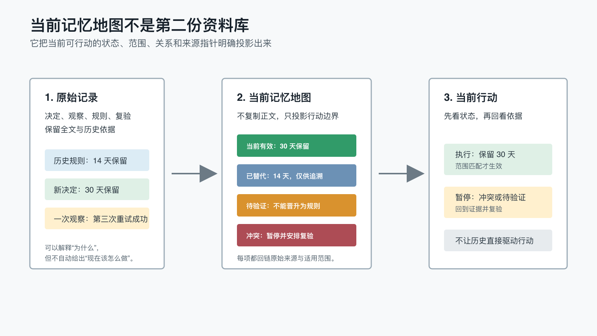

# 为什么长期记忆需要一张“当前记忆地图”，而不应只藏在文件和索引里？

上一篇讨论了 RAG 和长期记忆的区别：检索可以把相关资料找回来，但“相关”不等于“当前有效”，日期更新也不等于“已经批准”。

继续使用文件和索引，似乎已经足够了。原始记录保留事实，索引提供路径，AI 需要时再读取，不必引入数据库或复杂平台。

但项目持续半年以后，一个新的问题会出现：

- 14 天保留规则和后来批准的 30 天规则都还在。
- 一次传输在第三次重试后成功，但当前规则仍然只允许重试一次。
- macOS 已批准新的预览模式，Win11 仍沿用旧模式。
- 两组实验对缓存间隔得出了相反结果，尚未完成受控复验。

这些资料都应该保留，也都可能被检索命中。可真正执行任务时，系统不能同时采用两个保留期，不能把一次成功自动晋升为新规则，也不能把 macOS 的局部结论推广到 Win11。

问题已经不再是“资料在哪里”，而是：

> 在全部历史仍然保留的前提下，怎样让人和 AI 一眼看出，哪些信息现在可以指导行动？

这就是我在第六个 POC 中验证的对象：**当前记忆地图**。

它不是为了把所有记忆画成图，也不是要替代 Markdown。更准确地说，它是一份从原始记录派生出来的当前状态投影：

> 原始记录负责保留依据，索引负责定位资料，当前记忆地图负责声明哪些内容在什么范围内仍能指导行动。



## 1. 文件保存了历史，却不会自动给出当前答案

假设项目里有两份真实、完整且互不矛盾的记录：

```text
记录 A：发布包保留 14 天。
记录 B：发布包改为保留 30 天，明确替代记录 A。
```

如果删除记录 A，项目会失去历史解释：过去为什么在第 15 天清理文件，将来很难追溯。

如果保留两份记录，却只在索引中按日期排列，系统又需要每次重新读正文，判断 B 是正式决定、讨论建议，还是一次临时试验。

长期记忆因此有两个不同职责：

1. **保存发生过什么**，包括旧规则、失败过程和冲突证据。
1. **恢复现在该做什么**，包括当前状态、适用范围和禁止动作。

只追加的文件很擅长第一件事，却不会自动完成第二件事。

事件溯源（Event Sourcing）也区分事件历史与由事件重建的当前状态：事件持续保留，应用状态可以通过事件序列重新得到[2]。本文没有实现完整的事件系统，但借用了同一个工程直觉：**历史事实和当前投影不必挤在同一种表达里。**

## 2. 普通索引回答“去哪里找”，当前地图回答“现在怎么用”

索引当然仍然有价值。

一个普通索引可以包含：

| 标题 | 更新时间 | 摘要 | 路径 |
| --- | --- | --- | --- |
| 保留规则 A | 2026-03-14 | 发布包保留说明 | `records/a.md` |
| 保留规则 B | 2026-05-02 | 发布包保留说明 | `records/b.md` |

它让 AI 不必扫描全部目录，也让人知道应该打开哪份资料。RAG 同样通过检索器访问外部知识，再把相关文档交给生成模型[1]。

但上面的索引没有回答：

- A 是否已经失效？
- B 是否经过批准？
- B 是替代 A，还是只适用于另一个平台？
- 当前动作究竟是保留 14 天还是 30 天？

当前记忆地图增加的不是另一段摘要，而是四类治理字段：

| 字段 | 回答的问题 | 缺失时的风险 |
| --- | --- | --- |
| 状态 | 当前有效、已替代、冲突，还是待验证？ | 历史记录继续驱动行动 |
| 范围 | 适用于哪个平台、项目或流程？ | 局部结论被错误推广 |
| 关系 | 替代谁、与谁冲突、依赖什么？ | 新旧记录只能按日期猜测 |
| 来源 | 这项投影回到哪份原始记录？ | 地图变成第二份不可复核的事实库 |

因此，当前地图和索引不是竞争关系。

索引帮助系统找到证据，当前地图帮助系统解释证据的行动地位。需要细节时仍然回到原始文件，不在地图里复制整篇正文。

## 3. “地图”不等于必须画成节点连线图

这里的“地图”首先是一种信息结构，而不是一种视觉风格。

它可以是 Markdown 表格：

| ID | 状态 | 范围 | 关系 | 来源 |
| --- | --- | --- | --- | --- |
| SR-201 | superseded | project | - | `records/sr-201.md` |
| SR-202 | active | project | supersedes SR-201 | `records/sr-202.md` |

也可以是 JSON 投影：

```json
{
  "id": "SR-202",
  "status": "active",
  "scope": "project",
  "relations": [
    {"type": "supersedes", "target": "SR-201"}
  ],
  "source": "records/sr-202.md"
}
```

只有当关系密集、影响范围复杂，或者人需要快速浏览多个主题时，才有必要把同一份投影渲染成可视化节点图。

这层最少需要区分五种行动语义：

- `active`：在声明的范围内可以指导当前行动。
- `superseded`：保留历史价值，但不能继续作为当前规则。
- `conflict`：不得静默选边，需要补充受控复验或批准。
- `pending-validation`：可以保留观察，不能晋升为稳定规则。
- `scoped`：只在明确的平台、项目或流程中有效。

重点不是状态名必须完全相同，而是系统必须能表达“可以执行”“不得执行”和“只在哪里执行”。

## 4. 我比较了三种事实等价的 Agent 工作区

为了避免把“多一份结构化文件”直接当成更好的答案，我用同一份冻结 manifest 生成了三种工作区。它们拥有相同事实，只改变状态信息的呈现方式。

### Source Only：只提供原始记录

Agent 只能读取合成 Markdown 记录，从正文判断批准、替代、冲突、范围和观察状态。

这最接近很多项目的现状：资料都在，但每次都需要重新解释。

### Flat Index：增加普通索引

索引只提供标题、更新时间、中性摘要和来源路径，不直接泄露哪条记录当前有效。

它验证的是：当导航已经变好，但状态关系仍藏在正文里时，Agent 能否正确恢复行动。

### State Projection：增加当前状态投影

投影包含状态、范围、关系、行动边界和来源指针，但不复制原始正文。

Agent 先通过投影识别候选状态，再回到来源文件核对事实。地图不能脱离来源独立作答。

三种条件的差别可以概括为：

| 条件 | 原始正文 | 普通导航 | 显式状态与关系 | 来源回链 |
| --- | --- | --- | --- | --- |
| Source Only | 有 | 无 | 无 | 直接读取原文 |
| Flat Index | 有 | 有 | 无 | 有 |
| State Projection | 有 | 有 | 有 | 有 |

## 5. 五类任务分别测了什么

实验没有使用一个宽泛的“请总结项目状态”，而是拆成五类容易发生错误行动的任务：

| 任务 | 合成场景 | 关键判断 |
| --- | --- | --- |
| 当前决定 | 正式检查规则与较新的讨论建议并存 | 讨论不能替代批准决定 |
| 已替代规则 | 14 天规则被 30 天规则明确替代 | 保留旧记录，但只执行新规则 |
| 未解决冲突 | 两种负载下的缓存实验结论相反 | 不得静默选择其中一个间隔 |
| 范围边界 | macOS 与 Win11 使用不同预览模式 | 不得把单平台规则扩大为全局规则 |
| 待验证观察 | 一次第三次重试成功 | 继续执行现有一次重试规则 |

每次任务都要求回答五类内容：事实状态、当前动作、状态或范围边界、明确禁止的结论，以及实际使用的来源。

这个设计延续了前几篇 POC 的原则：不是只看最终答案像不像，而是检查 Agent 有没有把观察当规则、把历史当当前、把局部当全局。

## 6. 90 次正式运行：两个模型、三种条件全部答对

为了观察结论对模型配置是否敏感，本篇在 macOS 上用两个模型配置各跑了一次完整矩阵：

- 强力配置：`gpt-5.6-sol`，推理强度 `medium`，Codex CLI `0.145.0`。
- 快速配置：`deepseek-v4-flash`，推理强度 `max`，Codex CLI `0.146.1`。

两个配置复用同一套冻结夹具、提示和评分表，但模型、推理强度和 Codex CLI 版本均不同。因此本轮属于模型配置敏感性复核，只观察正确性方向能否在另一组配置下复现，不能把过程差异归因于模型或推理强度。这也是本系列验证策略的调整：从这一篇起，不再在 Win11 上重复完整矩阵，而是在 macOS 上用一个强力配置和一个快速配置分别运行，检查治理结论在两组配置下是否保持一致[5]。

结果都没有出现我原本可能期待的“地图组明显更准确”：

| 条件 | gpt-5.6-sol | deepseek-v4-flash |
| --- | ---: | ---: |
| Source Only | 75/75 | 75/75 |
| Flat Index | 75/75 | 75/75 |
| State Projection | 75/75 | 75/75 |
| 合计 | 225/225（100%） | 225/225（100%） |

每个配置都是 5 个任务 × 3 个条件 × 3 次、共 45 次；15 个任务/条件组合均为 `n=3`，每组都是 `15/15`。两个配置共 90 次运行的隔离环境、工作区指标覆盖和来源引用门禁也全部通过[3]。

这组结果首先否定了一个过强结论：

> 在这批规模很小、来源清晰的合成资料中，当前记忆地图没有证明自己必然提高回答正确率；而且这个判断在强力配置和快速配置下都成立。

原始记录已经明确写出批准、替代、冲突和范围，两个模型都有足够能力从正文中恢复正确动作。普通索引也没有破坏这些信息。

这不意味着地图没有价值，而是说明它的主要价值不能靠制造一个“75 分对 60 分”的故事来证明。

当前 POC 更可靠地证明了两件较小的事：

1. 当前状态可以只投影状态、范围、关系和来源，不需要复制原始正文。
1. 这份投影仍能保持完整来源链路，让人和 Agent 回到原始记录复核。

至于它是否降低大型真实项目的 Review 成本、减少状态误用，仍需要更大规模、更长周期的真实使用证据。

## 7. 为什么不把速度和读取量写成胜负

两个模型配置在三种条件下都记录了耗时、工具调用和工作区输出字节，但本篇不使用这些数字给机制或模型排名。

按条件合并的中位数（强力配置 gpt-5.6-sol / 快速配置 deepseek-v4-flash；两配置使用不同 Codex CLI 版本，只能作量级参考）：

| 条件 | 配置 | 耗时（秒） | 上下文（B） | 工作区调用 | 输出（B） |
| --- | --- | ---: | ---: | ---: | ---: |
| Source Only | gpt-5.6-sol | 30.9 | 1,921 | 4 | 1,415 |
| Source Only | deepseek-v4-flash | 23.7 | 5,466 | 6 | 4,960 |
| Flat Index | gpt-5.6-sol | 29.2 | 2,147 | 3 | 1,591 |
| Flat Index | deepseek-v4-flash | 18.2 | 2,772 | 4 | 2,216 |
| State Projection | gpt-5.6-sol | 38.4 | 3,939 | 4 | 3,361 |
| State Projection | deepseek-v4-flash | 24.0 | 4,341 | 6 | 3,763 |

可以观察到的量级差异是：快速配置尽管推理强度设为 `max`，单次耗时仍更短（各条件 18–24 秒 vs 29–38 秒），但工作区调用更多；两个配置都是 State Projection 上下文最大。这些差异不能直接归因于模型本身，因为两个配置的 Codex CLI 版本不同。

不排名的原因有三个：

1. 每个任务/条件只有 3 次重复，样本太小。
1. State Projection 需要先读投影再回读来源，导航步骤本身可能增加调用。
1. 模型服务、缓存、工具选择和运行时波动都会影响耗时与 token。

这些数字只能用于审计运行过程，不能推出“地图更快”“地图更省 token”“索引更低效”或“哪个模型更好”。如果后续要比较效率，应扩大样本，固定工具策略，并把“读取投影的成本”和“减少人工判断的收益”分开测量，而不是只比较一次回答用了多少秒。

## 8. 一套可以直接采用的最小结构

小型项目不需要先引入知识图谱、图数据库或专门的记忆服务。可以先保留三类文件：

```text
project/
├── records/                  # 原始决定、观察、实验和历史
├── references/INDEX.md       # 资料导航
└── memory/CURRENT_MAP.md     # 当前状态投影
```

`CURRENT_MAP.md` 中只维护高后果、会影响当前行动的主题：

```markdown
## 发布包保留期

- 状态：active
- 范围：当前项目
- 当前动作：保留 30 天后再清理
- 关系：supersedes -> SR-201
- 来源：records/sr-202.md
- 最近复核：2031-05-02
```

不需要把所有参考资料都放进地图。优先选择：

- 已批准、会反复执行的决定。
- 发布、安全、权限和数据边界。
- 存在新旧替代关系的规则。
- 尚未解决、不能静默选边的冲突。
- 容易被误晋升为规则的观察。
- 明确受平台、项目或流程限制的结论。

稳定的教程、规范原文和一般研究资料继续留在索引与检索层，按需读取即可。

## 9. 地图必须是派生视图，而不是第二份真相

当前地图最大的风险，是维护一段时间后与原始记录分叉。

为了避免它变成新的信息孤岛，可以设置五条门禁：

1. 每个 `active` 项都必须有可读来源。
1. 新记录不能默认替代旧记录，必须显式声明 `supersedes`。
1. `conflict` 和 `pending-validation` 默认阻止自动执行或晋升。
1. 范围不明时暂停扩大适用范围，要求补充确认。
1. 地图由规范化事实源生成或校验，人工修改也必须回写来源记录。

在本次 POC 中，冻结 manifest 是规范化事实源，状态表、JSON 投影和视觉地图都由它派生。验证器检查记录、状态、关系、来源和不同视图之间是否一致。

真实项目未必需要 manifest，但必须明确 source of truth：

- 如果原始 Markdown 是事实源，地图应由脚本生成或定期校验。
- 如果状态登记表是事实源，原始资料应通过稳定 ID 与它关联。
- 如果允许多人修改，更新流程要包含冲突检测和 Review。

地图只负责缩短“现在是什么”的判断路径，不能改写“为什么如此”的原始依据。

## 10. 哪些操作可以自动，哪些需要 Human Gate

当前状态投影适合自动完成机械工作：

- 检查来源是否存在。
- 检查关系目标是否有效。
- 生成 Markdown 表格、JSON 或可视化页面。
- 标记长时间未复核的项目。
- 提醒同一主题存在多个 `active` 状态。

但以下变化不应该只因为出现一份新文件就自动完成：

- 把观察晋升为稳定规则。
- 在冲突证据之间选择一方。
- 扩大平台、项目或权限范围。
- 撤销高风险规则。
- 删除仍有审计价值的历史来源。

Human Gate 不需要审阅每一份原始资料，而应集中审阅“状态是否改变、范围是否扩大、关系是否成立”。这也是当前地图可能带来的真正收益：不是替人做决定，而是把需要人决定的地方显式暴露出来。

## 11. 当前数据能说明什么，不能说明什么

macOS 上两个模型配置共 90 次正式运行支持以下阶段性判断：

1. 当前状态可以从原始资料派生为状态、范围、关系和来源投影。
1. 投影不需要复制全部正文，也能保留回到原始来源的路径。
1. 在小规模、来源清晰的合成任务中，原始记录、普通索引和状态投影都能得到正确答案。
1. 是否引入地图，应根据状态误用和人工 Review 成本判断，而不是只看一次 benchmark 分数。

它还不能证明：

- 当前记忆地图会普遍提高正确率、速度或 token 效率。
- 图形地图比 Markdown 表格更容易理解。
- 所有项目都需要单独维护状态投影。
- 当前方案能处理大规模知识图谱、多人并发编辑或复杂权限。
- 结果可以推广到这两个配置以外的模型、工具版本和操作系统。

MemGPT 等研究探索了分层存储、检索与上下文调度，以支持超出固定上下文窗口的持续任务[4]。它提供了有价值的背景，但不能替本 POC 证明当前地图在大规模系统中的通用效果。

本篇正式结果来自 macOS 上两个模型配置。从这一篇起，系列不再在 Win11 上重复完整矩阵，改为在 macOS 上用两个定位不同的模型配置进行敏感性复核[5]；两个配置都满分，只说明治理语义在小规模、来源清晰的合成任务上呈现相同方向，不能分离模型、推理强度和 CLI 版本的影响，也不能推广成一般结论。

## 12. 实验与复现

本篇依赖的公开 POC 目录：

<https://github.com/ExDevilLee/ai-work-system/tree/main/experiments/practical-ai-memory/06-current-memory-map>

公开目录包含：

- 冻结 manifest、合成原始记录和三种 Agent 条件。
- 状态表、状态投影和视觉地图生成器。
- 夹具验证器、隔离运行器、评分与聚合脚本。
- Agent Pilot 和 macOS 正式矩阵的脱敏报告。

完整 `raw.jsonl`、最终答案、标准错误、逐次评分、本机路径和会话标识只保留在私有证据区，不进入公开仓库。

## 13. 当前结论

长期记忆最容易失效的地方，不一定是文件丢了，而是文件都还在，系统却再也说不清哪条记录现在有效。

继续增加索引，可以让资料更容易找到；继续增加摘要，可以让资料更容易读。但只要旧规则、局部规则、冲突证据和待验证观察仍然混在一起，系统就必须在每次行动前重新解释它们。

当前记忆地图提供的是一层很薄的治理接口：

- 原始记录保留历史与证据。
- 索引和检索负责定位相关资料。
- 当前地图声明状态、范围、关系与来源。
- Human Gate 决定新证据能否改变当前状态。

它不必是一张图，也不应成为第二份事实库。对很多小项目，一张可校验的 Markdown 表格已经足够。

真正值得追求的不是“把记忆可视化”，而是让任何当前行动都能回答三个问题：为什么这样做、只在哪里这样做、原始依据在哪里。

下一篇继续讨论：

> 当当前状态已经能够被投影出来，怎样让人快速查看它覆盖了什么、哪些内容仍然活跃、哪些项目需要治理，同时避免把记忆管理做成另一套难以维护的仪表盘？

## 参考文献

[1] Lewis, P., Perez, E., Piktus, A., Petroni, F., Karpukhin, V., Goyal, N., Kuttler, H., Lewis, M., Yih, W.-t., Rocktaschel, T., Riedel, S., & Kiela, D. (2020). *Retrieval-Augmented Generation for Knowledge-Intensive NLP Tasks*. NeurIPS. <https://arxiv.org/abs/2005.11401>

[2] Fowler, M. (2005). *Event Sourcing*. <https://martinfowler.com/eaaDev/EventSourcing.html>

[3] ExDevilLee. (2026). *当前记忆地图 POC：macOS 正式矩阵分析*. 项目一手实验记录，包含 `gpt-5.6-sol`（`analysis/formal-macos.md`）与 `deepseek-v4-flash`（`analysis/formal-macos-deepseek-v4-flash-max.md`）两份对照报告。<https://github.com/ExDevilLee/ai-work-system/tree/main/experiments/practical-ai-memory/06-current-memory-map/analysis>

[4] Packer, C., Fang, V., Patil, S. G., Lin, K., Wooders, S., & Gonzalez, J. E. (2023). *MemGPT: Towards LLMs as Operating Systems*. arXiv. <https://arxiv.org/abs/2310.08560>

[5] ExDevilLee. (2026). *第二系列 POC 验证策略：macOS 双配置敏感性复核*. 项目一手验证策略。<https://github.com/ExDevilLee/ai-work-system/tree/main/experiments/practical-ai-memory/CROSS-PLATFORM-VALIDATION-STRATEGY.md>
