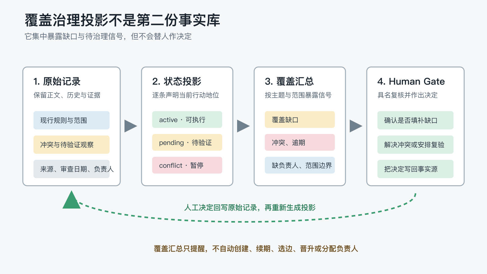

# 长期记忆越来越多，怎样发现覆盖缺口和待治理事项？

上一篇建立了一张“当前记忆地图”：旧规则继续保留，但只有当前有效、范围匹配的记录才能指导行动。

这解决了“这一条现在能不能用”，却没有回答另一个更像维护工作的问题：**整个记忆集合，还有哪些地方没有着落？**

假设你半年后回头盘点项目：

- Win11 的故障处理被列为重要主题，却从来没有形成过记录。
- 一条全局发布检查规则仍然是 `active`，计划复核日却已经过去 40 天。
- 两条缓存策略互相冲突，负责人都是空的。
- 一次审计观察提出了自动采样建议，但没有重复证据，也没有人批准它成为策略。

这些资料并没有丢。真正的问题是：缺口、逾期和未决事项散落在全部记录中，如果没有人逐条检查，它们不会主动出现。


> 在保留全部历史的前提下，怎样让人和 AI 定期看清哪些范围已经覆盖、哪些事项需要治理，同时不再维护一套新的 Dashboard？

这就是第七个 POC 要验证的对象：**覆盖治理投影**。

## 1. 当前状态和集合盘点，是两个不同问题

当前记忆地图以“记录”为单位，回答：

- 这条记录是 `active`、`superseded`、`conflict`，还是 `pending-validation`？
- 它适用于全局、当前项目，还是某个平台？
- 它替代了谁，又能回到哪一份原始依据？

覆盖治理以“主题域 × 范围”为单位，回答：

- 声明的主题域里，哪些已有可执行依据？
- 哪些虽然有记录，却因为冲突或待验证而不能执行？
- 哪些完全没有记录？
- 哪些 `active` 记录已经到期复核？
- 哪些治理事项没有负责人？

前者帮助一次行动选对依据，后者帮助维护者安排下一轮治理。普通索引只能告诉我们资料在哪里，逐条状态投影也仍然需要再次人工聚合；覆盖治理投影做的，是把分散信号集中到一张可以回链来源的清单中。

## 2. 一张覆盖表，最少要区分三种情况

“没有可执行规则”并不等于“什么记录都没有”。至少要区分：

| 情况 | 示例 | 当前含义 |
| --- | --- | --- |
| 已覆盖 | `data-retention` 有一条 `active` 记录 | 可以在声明范围内执行 |
| 有记录但不可执行 | `cache-policy` 有两条冲突记录 | 需要治理，不能静默选边 |
| 零记录 | `incident-handling` 被声明，但没有对应记录 | 存在覆盖缺口，是否补齐仍由人判断 |

如果把后两种情况都写成“未覆盖”，维护者会看不出“需要解决冲突”和“需要判断是否建立规则”的差别；如果只统计文件数量，又会把历史记录和待验证观察误算成当前覆盖。

本次 POC 的覆盖汇总因此只保留少量字段：

| 主题域 | 范围 | 当前覆盖 | 治理信号 | 来源 |
| --- | --- | --- | --- | --- |
| data-retention | project | active-record | none | DR-202 |
| cache-policy | project | no-active-record | conflict, owner-missing | CP-301, CP-302 |
| incident-handling | win11 | no-record | coverage-gap | none |

它不复制正文，也不生成新的决策。记录 ID 和相对路径让每个结论都能回到原始资料；`none` 则明确表示“这是由声明清单与实际记录做差得到的缺席型结论”。

W3C 的 PROV-O 使用实体、活动、责任主体和 `wasDerivedFrom` 等关系表达来源链，并允许派生产物回到直接来源[3]。本文没有实现完整的 PROV 模型，但采用了相同的可追溯原则：汇总结论必须说明从哪里派生、由谁负责，读者也必须能够回到原始依据。

## 3. 投影只负责提醒，不能顺手替人治理

覆盖汇总最危险的误用，是把“发现问题”直接变成“自动修复问题”。

- 发现覆盖缺口，不等于系统可以创建一条空规则来消除红点。
- 发现审查逾期，不等于可以自动更新 `last_review`，假装复核已经发生。
- 发现两条记录冲突，不等于可以选择日期更新或措辞更强的一条。
- 发现待验证观察，不等于可以把它晋升为 `active`。
- 发现负责人为空，不等于系统有权替团队指派一个人。

投影可以自动完成的是机械工作：检查来源、计算到期日、汇总状态、发现缺失负责人、生成 Markdown 或 JSON。真正改变状态、范围和责任归属的动作，必须经过具名的 Human Gate，并写回事实源，再重新生成投影。

NIST AI RMF 的 `GOVERN 1.5` 要求规划持续监控和周期复核，并明确复核频率与组织责任；`GOVERN 2.1` 和 `GOVERN 3.2` 进一步要求记录责任分工，以及区分人机配置中的监督角色[4]。它讨论的是 AI 风险治理，不是长期记忆实现，但支持同一个边界：系统可以生成治理信号，高后果决定仍应有清晰的人类责任归属。



这条回写路径很重要。只在汇总表上点一个“已解决”，却没有修改原始记录，会让投影变成第二份真相。

## 4. 我怎样比较三种信息呈现方式

实验使用同一份冻结 manifest 和同一组合成记录，生成三种事实等价的工作区：

| 条件 | Agent 能看到什么 | 盘点时还要自己完成什么 |
| --- | --- | --- |
| Source Only | 原始记录 | 定位、判断状态并跨主题汇总 |
| State Projection | 原始记录 + 逐条状态投影 | 按主题和范围再次汇总 |
| Coverage Governance | 原始记录 + 状态投影 + 覆盖汇总 | 先看信号，再回链核实 |

五类任务分别检查：覆盖缺口、审查到期、治理队列、范围切片和来源回链。每个答案不仅要给出事实，还要说明适用范围、当前禁止动作、最小人工下一步和实际来源。

这样评分的原因是：一份答案即使找对了记录，只要把项目级结论扩成全局规则，或把冲突信号写成自动执行建议，仍然不算正确。

## 5. 90 次正式运行，三种条件都答对了

本篇在 macOS 上使用两组执行配置，各完成 `5 个任务 × 3 个条件 × 3 次重复 = 45 次`正式运行[1]、[2]。

| 条件 | deepseek-v4-flash / max | glm-5.2 / max |
| --- | ---: | ---: |
| Source Only | 15/15；96/96 分 | 15/15；96/96 分 |
| State Projection | 15/15；96/96 分 | 15/15；96/96 分 |
| Coverage Governance | 15/15；96/96 分 | 15/15；96/96 分 |

90 次运行都通过冻结 rubric；人工复核也没有发现不受来源支持的结论或无关事实。

这组结果先排除了一个好写、但证据并不支持的故事：

> 在这批规模很小、来源清晰的合成资料中，覆盖治理投影没有表现出比原始记录更高的盘点正确率。

原始记录已经明确写出状态、范围和关系，两组配置都能自行恢复正确结论。投影在这里更像一条更短、更稳定的维护入口，而不是把错误答案变成正确答案的补丁。

本 POC 能支持的判断更小：

1. 覆盖缺口、审查到期、冲突、待验证和负责人缺失可以从冻结事实源确定性派生。
1. 派生结果不必复制正文，仍能通过记录 ID 和路径回到原始来源。
1. 汇总信号可以与“不得自动创建、续期、选边或晋升”的治理门禁同时成立。

至于它是否能减少真实大项目中的漏报、缩短 Review 时间，还需要更大规模和更长周期的使用证据。

## 6. 两组结果一致，但不是严格的模型对照实验

这里还有一个不能藏在脚注里的限制。

`deepseek-v4-flash` 的正式矩阵通过 Codex CLI `0.146.1` 在隔离只读工作区执行，Agent 可以自行读取夹具，聚合数据记录了工作区调用、输出字节、耗时和 token。

`glm-5.2` 则由当时的会话代理直接执行：夹具材料被放进会话上下文，不允许使用外部工具，也没有采集同口径的工作区调用、耗时和输入 token。公开聚合文件中的相应字段为 `0`，表示该路径没有采集这些指标，**不表示运行真的零耗时、零输入或零工具成本**[2]。

因此，两组配置可以作为“相同任务语义在两条执行路径上都得到一致答案”的独立证据，不能作为严格控制变量的模型性能比较。本文不比较它们的速度、token 或工具调用，也不把一致结果推广到其他模型、执行器或操作系统。

这项限制反而说明了实验记录为什么要保留运行方式：如果只留下两列满分，读者很容易误以为除了模型名称，其他条件完全相同。

## 7. Pilot 连续两次没过，缺的都是 Human Gate

正式矩阵开始前，这套协议并不是第一次就通过。

Pilot-01 的 15 个任务/条件组合只通过了 12 个。三个 `scope-slice` 答案都能识别范围边界，却没有明确给出需要谁完成什么人工复核。原因不在 Agent“忘了谨慎”，而在冻结 Prompt 只要求范围和来源，没有把人工下一步写成任务契约。

补上要求后，Pilot-02 通过了 14/15。剩下的一格已经建议人工审阅，却没有明确声明“不自动创建、替代、删除或晋升任何规则”。直到 Pilot-03 把这条禁止动作也写进 Prompt 和 rubric，15 格才全部通过[2]。

这两次失败留下了一个比满分更能复用的结论：

> Human Gate 不能只存在于设计者心里。什么必须由人决定、Agent 当前禁止做什么，都要进入任务契约和验收标准。

否则，同一个系统可能在这次回答里表现得谨慎，下次却把“需要治理”理解成“请自动修复”。治理边界只有可观察、可评分，才真正属于系统行为。

## 8. 一套 Markdown 就能落地的最小结构

小项目不需要先建设知识图谱或持续运行的治理服务。可以从四类文件开始：

```text
project/
├── memory/
│   ├── domains.yaml           # 声明要管理的主题域与范围
│   └── records/               # 决定、观察、冲突与历史依据
├── generated/
│   ├── current-state.json     # 逐条当前状态投影
│   └── coverage-review.md     # 覆盖与待治理汇总
└── scripts/
    └── build-memory-views.*   # 从事实源确定性生成投影
```

`coverage-review.md` 不必很复杂：

```markdown
## 本期需要人工处理

- incident-handling / win11
  - 信号：coverage-gap
  - 来源：domains.yaml 中已声明；records/ 中无对应记录
  - 下一步：由负责人判断是否需要建立规则
  - 禁止动作：不自动创建空规则

- cache-policy / project
  - 信号：conflict, owner-missing
  - 来源：CP-301, CP-302
  - 下一步：指定复核人并安排受控对照
  - 禁止动作：不自动选边或扩大范围
```

生成器至少要检查五件事：

1. 每个汇总项能否回链到来源，或明确标识为清单差异产生的缺席结论。
1. 同一主题和范围是否出现多个 `active` 记录。
1. `last_review + review_interval_days` 是否已经到期。
1. `conflict` 和 `pending-validation` 是否缺少负责人。
1. 项目级或平台级依据是否被错误汇总成全局覆盖。

人工复核后，不直接改 `generated/`；先更新原始记录或主题声明，再重新生成两份投影。

## 9. 它和 Dashboard 的真正区别

覆盖治理投影不反对 Dashboard。它反对的是把展示层变成新的事实维护面。

| 轻量投影应当做到 | 不应承担 |
| --- | --- |
| 从同一事实源重复生成 | 手工维护另一套状态 |
| 暴露缺口、逾期和未决事项 | 自动填补、续期或选边 |
| 每项结论可以回到来源 | 用颜色代替证据链 |
| 只保留高后果治理信号 | 试图可视化全部知识 |

未来当然可以把同一份投影渲染成网页、图表或提醒消息。判断它有没有变成第二份真相，只需要问一句：**关闭这个界面后，所有状态和决定还能不能从原始事实重新生成？**

Martin Fowler 对 Event Sourcing 的说明区分了事件日志和应用状态，并指出派生状态可以从事件日志重新构建[5]。本文不是 Event Sourcing 实现，只借用其中的工程直觉：展示与查询视图可以替换，事实源和变更依据不能随展示层一起消失。

如果不能，问题不在界面形式，而在 source of truth 已经分叉。

在生产监控领域，Google SRE 也强调聚合高层信号、降低维护负担，同时保留检查单个组件的粒度[6]。这只能作为工程类比，不能证明覆盖治理投影在长期记忆中同样有效；它提醒我们，汇总层的价值来自“更容易看到信号且仍能下钻”，而不是拥有更多图表。

## 10. 什么时候值得增加覆盖治理投影

满足以下任意两三项时，它通常开始有价值：

- 主题域已经多到无法靠记忆判断“还缺什么”。
- 项目存在定期复核、过期或撤销要求。
- 冲突和待验证观察经常被长期搁置。
- 同一规则在全局、项目和平台之间有不同范围。
- 维护者需要一份周期性治理队列，但不想逐条重读全部记录。

如果项目只有少量稳定规则，没有范围差异，也没有复核周期，一张手写清单可能已经足够。不要为了拥有“治理系统”而制造治理负担。

是否保留这层投影，应该观察两个真实指标：它是否持续发现了原本会漏掉的事项，以及它是否降低了人工盘点成本。一次 POC 的满分不能替代这两项长期证据。

## 11. 实验与复现

本篇依赖的公开 POC 目录：

<https://github.com/ExDevilLee/ai-work-system/tree/main/experiments/practical-ai-memory/07-memory-coverage-governance>

公开目录包含：

- 冻结 manifest、合成原始记录和三种 Agent 条件。
- 覆盖治理投影生成器、状态投影生成器和夹具验证器。
- 隔离运行器、评分与聚合脚本。
- 两组执行配置的脱敏聚合数据和协议说明。

完整 `raw.jsonl`、最终答案、标准错误、逐次评分、本机路径和会话标识只保留在私有证据区，不进入公开仓库。

## 12. 当前结论

长期记忆的下一个问题，不是继续保存更多文件，而是能否看见集合中仍未解决的空白。

当前记忆地图声明每条记录现在能不能用；覆盖治理投影再向上一步，按主题和范围暴露：哪里没有依据、哪里虽然有记录却不能执行、哪里已经逾期、哪里缺少负责人。

它的价值不在于替人完成治理，而在于把需要人决定的地方集中呈现，并让每个判断都能回到来源：

- 原始记录保留历史和证据。
- 状态投影声明单条记录的当前行动地位。
- 覆盖汇总暴露跨主题的缺口和治理信号。
- Human Gate 作出决定，并把结果写回事实源。

对很多小项目，一份确定性生成的 Markdown 表格已经足够。真正值得追求的不是“把治理做成 Dashboard”，而是让维护者随时回答三个问题：**哪些地方已经有可执行依据，哪些地方还没有着落，下一步必须由谁来判断。**

下一篇继续讨论：

> 当原始记录、状态和来源关系已经建立，怎样做备份、恢复与跨设备迁移，才不会把一份可治理的记忆重新变成互相冲突的副本？

## 参考文献

[1] ExDevilLee. (2026). *第二系列 POC 验证策略：macOS 双模型对比*. 项目一手验证策略。<https://github.com/ExDevilLee/ai-work-system/blob/main/experiments/practical-ai-memory/CROSS-PLATFORM-VALIDATION-STRATEGY.md>

[2] ExDevilLee. (2026). *覆盖治理投影 POC：冻结协议与脱敏正式聚合数据*. 项目一手实验记录。<https://github.com/ExDevilLee/ai-work-system/tree/main/experiments/practical-ai-memory/07-memory-coverage-governance>

[3] W3C. (2013). *PROV-O: The PROV Ontology*. W3C Recommendation. <https://www.w3.org/TR/prov-o/>

[4] National Institute of Standards and Technology. (2023). *Artificial Intelligence Risk Management Framework (AI RMF 1.0): GOVERN*. <https://airc.nist.gov/airmf-resources/airmf/5-sec-core/>

[5] Fowler, M. (2005). *Event Sourcing*. <https://martinfowler.com/eaaDev/EventSourcing.html>

[6] Wilkinson, J. (2016). *Practical Alerting from Time-Series Data*. Site Reliability Engineering. <https://sre.google/sre-book/practical-alerting/>
