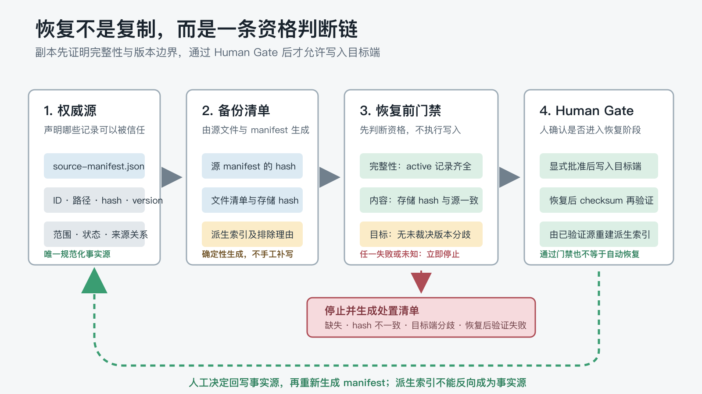
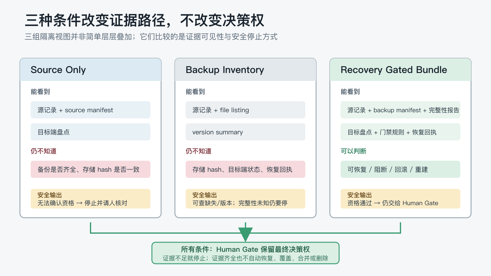

# AI 记忆恢复：复制文件为什么不够？

上一篇建立了覆盖治理投影：原始记录继续保存事实，状态与覆盖视图负责暴露缺口、逾期和待治理事项。

但这些记录终究要落在设备上。换电脑、重装系统或迁移到另一套 AI 工具时，我们通常会先想到一个简单动作：把记忆目录复制过去。

假设备份包已经成功解压，复制命令也返回成功。此时仍可能同时存在四个问题：一条 `active` 记录没有进入备份；另一条记录路径没变，内容 hash 却不同；目标端已经有更新的有效版本；包里还混入了一份早已过期的派生索引。

复制工具可以搬运文件，却不会替你判断这些文件是否足以重建当前状态。

> **备份回答“有没有副本”；恢复门禁回答“这份副本能不能在此时、此处重建可信状态”。**

这就是第八个 POC 要验证的窄问题：在不接触真实记忆、真实设备目录和远端存储的前提下，能否把完整性、版本分歧、回滚和人工决策边界编码成一条可重复检查的恢复资格链。

## 1. 复制成功、备份完整和恢复合格，是三件事

这三个判断经常被混在一起：

| 判断 | 它真正回答什么 | 它不能回答什么 |
| --- | --- | --- |
| 复制成功 | 字节是否从一个位置写到另一个位置 | 文件是否齐全、可信、适用于目标端 |
| 备份完整 | 应保护的源记录是否都在包中，内容 hash 是否一致 | 现在是否应该恢复、目标端分歧怎样裁决 |
| 恢复合格 | 包、目标状态、适用范围和人工批准是否共同满足门禁 | 恢复后的内容是否已验证成功 |

因此，一次复制命令返回零退出，只能证明搬运动作完成，不能证明恢复资格成立。恢复后还要重新核对写入结果；如果 checksum 不匹配，本次恢复就应被视为失败，而不是“基本成功”。

NIST SP 800-209 把数据保护、隔离和 restoration assurance（恢复保证）并列为存储基础设施的安全问题；NIST SP 800-34 Rev. 1 也把测试视为验证恢复能力的步骤，并在 reconstitution（恢复后的重建阶段）要求验证系统能力与功能[3]、[4]。这些指南不能替本 POC 证明当前文件方案有效，但它们说明：**“保存了副本”和“验证了恢复能力”本来就是两种不同证据。**

## 2. 最小设计不是“多存一份”，而是建立资格链

本次 POC 采用的设计是：**单一权威源 + 确定性备份 manifest + 恢复门禁 + Human Gate**。



这条链路包含四层职责：

1. `source-manifest.json` 声明稳定 ID、相对路径、内容 hash、逻辑版本、适用范围、状态和来源关系，是本 POC 唯一规范化事实源。
1. `backup-manifest.json` 由源 manifest 与合成 Markdown 确定性生成，记录源 manifest 的 hash、备份文件、存储 hash、逻辑版本，以及被排除的派生物和原因。
1. 恢复前门禁检查完整性、内容 hash 和目标端分歧；任何失败或证据不足都先停止，不进入写入阶段。
1. 全部门禁通过后仍需明确的人工批准；写入完成还要核对 post-restore checksum，再从已验证源重建派生索引。

这里的“单一权威源”不是说所有项目都必须引入 JSON manifest。真实项目也可以让规范化 Markdown、数据库状态表或版本库承担事实源。关键是必须能回答：**谁声明当前版本，谁生成备份清单，谁有权改变恢复决定。**

派生索引不随包迁移，是这条链路里容易被忽略的一步。Martin Fowler 对 Event Sourcing 的说明提到，派生应用状态可以从事件日志重建[5]。本 POC 不是 Event Sourcing 实现，只借用同一个工程直觉：如果一个视图能从权威源确定性生成，就应优先恢复源，再重建视图，而不是让旧视图在新设备上成为第二份事实。

## 3. 六个场景分别拦住什么错误

实验没有只放一个“完整包恢复成功”的顺风题，而是冻结了六种结果不同的场景[1]：

| 任务 | 夹具中的关键事实 | 恢复资格判断 | 必须避免的动作 |
| --- | --- | --- | --- |
| `clean-restore` | RR-801 的源、备份和目标端均为 v2，hash 一致 | 具备恢复资格，但仍等待人工批准 | 把“校验通过”写成“已经自动恢复” |
| `partial-backup` | active 的 BK-802 未进入备份包 | 完整性门禁失败，停止该批次 | 用残缺包继续，或补造缺失内容 |
| `integrity-mismatch` | IG-803 的存储 hash 与源 hash 不同 | 该文件不可信，阻断恢复 | 只因路径和版本相同就接受文件 |
| `target-divergence` | 备份 TD-804 为 v2，目标端已有 active v3 | 停止并请人裁决 | 静默覆盖、自动选边或自动合并 |
| `derived-index` | DI-805-index 被明确标记为派生物 | 恢复源 DI-805 后重新生成 | 跨设备复制索引并当成权威源 |
| `rollback-receipt` | RB-806 的恢复后 hash 与备份 hash 不同 | 标记失败、回滚并通知人工 | 把写入完成报告成恢复成功 |

每个任务不只要求给出“能不能恢复”。答案还必须列出事实、适用范围、允许与禁止的下一步、需要的人类决定，以及实际使用的来源 ID。否则，即使找到了正确记录，只要把项目级结论扩大成全局规则，或把“可恢复”写成“请立即执行恢复”，仍然不算通过。

这六个场景不是现实故障的穷举，也没有验证增量同步。它们只是把本轮最想观察的六条边界固定下来：完整、缺失、篡改、分歧、派生物和恢复后失败。

## 4. 三种条件改变的是证据路径，不是决策权

三个条件共享同一套源记录、任务和评分表，但可见的恢复证据不同。它们不是简单从少到多层层叠加：`source-only` 能看到目标端盘点，`backup-inventory` 则主要看到备份文件与版本摘要；只有 `recovery-gated-bundle` 同时提供完整 manifest、目标状态、门禁和回执。



| 条件 | 可见材料 | 能直接判断什么 | 仍必须停止在哪里 |
| --- | --- | --- | --- |
| `source-only` | 源记录、source manifest、目标端盘点 | 当前源状态和目标端是否已分歧 | 看不到备份清单与存储 hash，不能确认包的完整性 |
| `backup-inventory` | 源记录、文件清单、版本摘要 | 哪些文件在包里、逻辑版本是否相符 | 看不到存储 hash、目标端状态和恢复回执 |
| `recovery-gated-bundle` | 源与备份 manifest、完整性报告、目标盘点、门禁、回执 | 可恢复、阻断、回滚或重建 | 资格通过后仍不能越过 Human Gate |

这个设计带来一个很容易误读的结果：三个条件都允许满分。

`source-only` 的满分答案不必假装自己验证过备份。它可以准确地说：“当前材料不足以确认完整性，因此停止并请人补充核验。”`backup-inventory` 可以发现缺失和版本问题，却必须承认看不到 hash。完整门禁组可以给出更具体的失败原因，但依然不能自动恢复。

因此，本轮不能用通过率证明“门禁包让答案更准确”。更可靠的判断是：**结构化门禁缩短并稳定了证据路径；信息不足时，安全答案不是猜测，而是明确停机。**

## 5. 36 格 Pilot 通过的是最终机械门禁，不是首次作答神话

两个请求配置各执行 `6 个任务 × 3 个条件 × 1 次 = 18 格`，共 36 格。两组都通过 session 路径完成，不是独立 CLI 子进程[1]。

| 运行标签 | 请求配置记录 | 最终机械门禁 | 只读 Review | 接受前修正 |
| --- | --- | ---: | --- | --- |
| Pilot-01 | `requested_model=glm-5.2`；effort 与 observed 字段均为 `unknown` | 18/18 | 抽查 9/18，覆盖三个条件 | 记录中无修正轮次 |
| Pilot-02 | `requested_model=deepseek-v4-flash`；effort 与 observed 字段均为 `unknown` | 18/18 | 全量 18/18 | 5 格评分词法改写；其中 2 格再做条件可见性修正 |

按条件看，最终接受状态的机械结果完全一致：

| 条件 | Pilot-01 | Pilot-02 | 合计 |
| --- | ---: | ---: | ---: |
| `source-only` | 6/6 | 6/6 | 12/12 |
| `backup-inventory` | 6/6 | 6/6 | 12/12 |
| `recovery-gated-bundle` | 6/6 | 6/6 | 12/12 |

这里必须保留三条限制：

1. `glm-5.2` 与 `deepseek-v4-flash` 是用户请求配置，不是运行时独立观察到的模型身份；两个配置的 `observed_model`、`requested_effort` 和 `observed_effort` 都是 `unknown`。
1. 36/36 描述的是修正后的最终产物通过机械 rubric，不表示两个配置都在第一次回答时零问题。
1. Pilot-01 只做了 9 格人工抽查，不能写成“36 格全部逐份人工 Review”。

因此，这组数据只能说明冻结协议在两条 session 请求配置下完成了 Pilot，并形成了可评分的接受状态。它不构成模型性能比较，也没有正式矩阵的重复次数和方差证据。系列验证策略同样要求把模型、推理强度、执行路径和平台分开记录，不能把同时变化的因素包装成单变量模型对照[2]。

## 6. 满分前的两次停机，比满分更值得保留

Pilot-02 的两轮修正暴露了两类不同问题。

### 机械评分可能误伤正确的禁止语句

5 格答案原样引用了 Prompt 中的禁止动作，例如不得替换目标副本、不得合并分歧副本。冻结评分器已经有否定语境检查，但否定词落在固定窗口外或进入正则匹配范围时，仍会把“不要做 X”误判成“建议做 X”。

本轮没有借机改 rubric，而是在不改变事实和结论的前提下改写措辞，使最终答案满足冻结检查。这证明的不是模型更安全，而是另一件事：**纯关键词式安全评分会与回答措辞耦合，机械满分必须结合人工语义 Review 解释。**

如果以后要降低这种耦合，更稳的方向是让答案显式输出 `decision=stop`、`human_gate=required`、`forbidden_actions=[...]` 等结构化字段，再把自然语言说明作为补充，而不是继续扩大关键词窗口。本轮尚未实现这项改造，因此它只是下一轮评分器设计候选。

### Session 上下文可能穿透条件边界

随后，隔离审计又发现 2 格 `backup-inventory` 答案引用了该条件不可见的 `backup-manifest.json`。它们最终被重新落到实际可见的 `version-summary.json` 与 `file-listing.json` 上，其他结论不变。

这是真正的条件可见性违规。它说明 session 路径即使不允许外部工具，也不等于每格都拥有独立、遗忘此前内容的临时工作区。只看最终答案是否正确，反而会漏掉这类“用错证据得出正确结论”的问题。

因此，本轮最可复用的实验教训不是 36/36，而是：

> **恢复结论不仅要正确，还必须由当前条件中实际可见的证据推出。来源审计是隔离门禁的一部分，不是答案末尾的装饰。**

## 7. 一套 Markdown 和 JSON 就能起步的最小结构

真实项目不需要照搬本 POC 的文件名，但可以先把职责拆开：

```text
memory/
├── records/                         # 权威 Markdown 记录
├── source-manifest.json             # 当前源清单与 hash/version/scope
├── backups/
│   └── batch-<id>/
│       ├── backup-manifest.json     # 本批次清单与源 manifest hash
│       └── records/                 # 只保存需要保护的权威源
├── recovery/
│   ├── integrity-report.json        # 完整性与分歧检查结果
│   ├── recovery-gates.md            # 停止条件与 Human Gate
│   └── receipts/                    # 恢复后 checksum 与结果
└── derived/                         # 恢复后由已验证源重建
```

最小 manifest 不需要保存全部正文，但至少要让每个判断能回到：

- 稳定记录 ID 与相对路径。
- 内容 hash 与逻辑版本。
- 当前状态和适用范围。
- 备份批次引用的源 manifest hash。
- 本批次实际包含、缺失和排除的文件。
- 派生物为什么不随源文件一起恢复。

然后把恢复拆成五道问题：

1. 所有应保护的 active 源记录都在包里吗？
1. 每个存储 hash 都与权威源一致吗？
1. 目标端是否已有不同 active 版本？
1. 是否取得了明确的人工批准？
1. 写入后的 checksum 是否与备份清单一致？

任何问题为“否”或“未知”，都不要自动进入下一步。

## 8. 自动化机械检查，Human Gate 只接管真正的决定

Human Gate 不等于让人逐个重算 hash。机械事实适合自动化，语义和授权决定才交给人：

| 可以自动完成 | 必须由人决定 |
| --- | --- |
| 从事实源生成备份 manifest | 当前是否是合适的恢复时机 |
| 计算并比较内容 hash | 目标端分歧中哪一份应成为权威版本 |
| 检查 active 记录是否缺失 | 是否接受不完整包，还是重新备份 |
| 检测目标端版本或 hash 分歧 | 是否批准写入、覆盖既有目标状态 |
| 校验 post-restore checksum | 验证失败后的处置与责任确认 |
| 在批准恢复后重建派生索引 | 是否扩大适用范围或删除仍有审计价值的历史 |

这个边界也解释了为什么 `clean-restore` 仍要求人工批准：门禁证明的是“具备资格”，不是“已经获得授权”。

## 9. 什么时候值得增加这层门禁

满足以下任意两三项时，恢复资格链开始有价值：

- 同一套记忆需要跨设备、跨工具或跨工作区迁移。
- 记录存在明确的 active、superseded、conflict 等状态。
- 目标端可能独立演化，不允许用“最新文件时间”静默选边。
- 项目有派生索引、摘要或投影，必须区分源与可重建视图。
- 恢复动作会覆盖当前工作区，失败后需要回滚与审计。

如果项目只有几份稳定 Markdown，全部放在一个经过 Review 的版本库里，手工核对一次就足够，就不必为了“备份系统”引入完整工作流。可以先从源清单、hash 校验和一张人工检查表开始。

本 POC 也没有比较 Git、归档包、对象存储或第三方备份产品。它验证的是恢复判断的语义边界，不是某种存储技术栈。

## 10. 当前数据能说明什么，不能说明什么

本轮 36 格 macOS session Pilot 支持以下阶段性判断：

1. 六种合成恢复场景可以被编码为确定性夹具、停止条件和可机械评分的来源门禁。
1. 在最终接受状态中，两组请求配置都能给出与冻结事实一致的恢复资格、人工下一步和来源 ID。
1. 证据不足的条件仍可以安全回答，前提是“未知”会触发停止，而不是默认许可。
1. 来源可见性审计能捕获“结论正确、证据越界”的隔离问题。

它还不能证明：

- 当前方案能提高真实备份成功率或恢复速度。
- `recovery-gated-bundle` 比其他条件更准确、更省 token 或更省人工时间。
- 自动合并、双向同步或增量同步已经得到验证。
- 结果能推广到其他模型、CLI 执行器、Windows 或真实跨设备环境。
- 请求模型名称等于运行时已独立观察到的模型身份。

这也是为什么本文使用“Pilot 实测”和“协议可执行”作为结论口径，而不写成“备份恢复方案已经验证可靠”。

## 11. 实验与复现

本篇依赖的公开 POC 目录：

[打开 GitHub 实验目录](https://github.com/ExDevilLee/ai-work-system/tree/main/experiments/practical-ai-memory/08-backup-recovery-migration)

公开目录包含：

- 冻结的 source/backup manifest、六条合成 Markdown 记录和目标端盘点。
- 三种隔离条件、完整性报告、恢复门禁与合成验证回执。
- 确定性生成器、夹具验证器、静态测试、六个 Prompt 和冻结 rubric。
- 两组请求配置的脱敏聚合数据、机械评分摘要和只读 Review 记录。

静态复核可以在 POC 目录运行：

```bash
python3 generate_backup_bundle.py
python3 validate_fixtures.py
python3 -m unittest test_fixture_model.py test_validate_fixtures.py
```

这些命令只处理合成夹具，不会执行真实恢复或重新调用模型。完整 `final.md`、私有 metadata 和逐格运行目录继续留在私有证据区，不进入公开仓库。

## 12. 当前结论

AI 长期记忆的备份不是“再保存一份文件”这么简单。副本只有在来源、完整性、版本和目标状态都可核验时，才具备恢复资格；具备资格以后，仍要由人决定是否写入。

这次 POC 真正建立的是一条很薄的恢复治理接口：

- 权威源声明哪些记录当前有效。
- 备份 manifest 证明这批副本来自哪个源状态。
- 门禁把缺失、hash 不一致和目标端分歧变成硬停止。
- Human Gate 保留版本裁决与恢复授权。
- 恢复回执验证结果，派生索引再由已验证源重建。

它没有证明哪种存储工具最好，也没有证明 Agent 可以无人值守地完成恢复。它只是把一句模糊的“请恢复记忆”，改写成五个可检查的问题，并让任何未知答案都先停下来。

下一篇计划是本系列的最后一篇：

> 当一个临时提示词被反复使用、每次都有效时，它应该在什么时候晋升为规则、Guide、Skill 或工作流，成为系统长期复用的程序性记忆？

## 参考文献

[1] ExDevilLee. (2026). *备份、恢复与迁移 POC：冻结协议、合成夹具与脱敏 Pilot 证据*. [项目一手实验记录](https://github.com/ExDevilLee/ai-work-system/tree/main/experiments/practical-ai-memory/08-backup-recovery-migration)。

[2] ExDevilLee. (2026). *第二系列 POC 验证策略：macOS 双配置敏感性复核*. [项目一手验证策略](https://github.com/ExDevilLee/ai-work-system/blob/main/experiments/practical-ai-memory/CROSS-PLATFORM-VALIDATION-STRATEGY.md)。

[3] Chandramouli, R., & Pinhas, D. (2020). *Security Guidelines for Storage Infrastructure (NIST SP 800-209)*. National Institute of Standards and Technology. [DOI](https://doi.org/10.6028/NIST.SP.800-209)。

[4] Swanson, M., Bowen, P., Phillips, A. W., Gallup, D., & Lynes, D. (2010). *Contingency Planning Guide for Federal Information Systems (NIST SP 800-34 Rev. 1)*. National Institute of Standards and Technology. [DOI](https://doi.org/10.6028/NIST.SP.800-34r1)。

[5] Fowler, M. (2005). [*Event Sourcing*](https://martinfowler.com/eaaDev/EventSourcing.html)。
