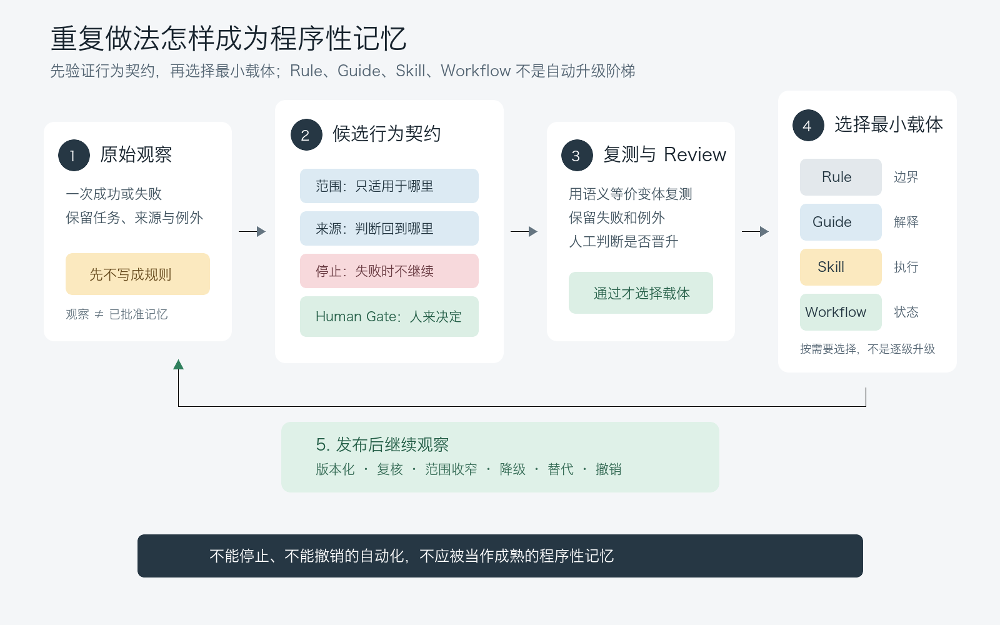

# AI 不只要记住事实：规则、Skill 和工作流怎样成为长期记忆？

上一篇讨论备份与恢复时，我留下了本系列最后一个问题：当一个临时提示词被反复使用、每次都有效，它应该在什么时候晋升为规则、Guide、Skill 或工作流？

这听起来像文件整理。把一段提示词放进 `AGENTS.md`，改写成一份 Guide，或者包进可调用的 Skill，似乎就完成了沉淀。

但文件位置只改变了它下次怎样被加载，没有证明这套做法已经稳定。一次成功也可能来自任务简单、上下文碰巧充分、模型主动补全了遗漏，甚至只是 Review 没有发现问题。

> **程序性记忆不是“把做法保存下来”，而是保存一份经过重复验证、范围明确、失败时会停止、仍可被人撤销的行为契约。**

这是第九个 POC 真正想验证的问题。它没有把 Skill 数量、调用次数或外部采用率当作效果证据，而是让三种载体面对同一批合成重复任务，观察它们能否稳定守住范围、来源、人工 Review 和禁止自动晋升这四条边界。

## 1. 事实记忆回答“知道什么”，程序性记忆回答“怎样行动”

长期记忆里最容易理解的是事实：当前目标是什么，哪条规则仍有效，某个结论来自哪次实验。

在认知科学里，程序性记忆通常被放在“记忆由多个系统构成”的框架中讨论，相关综述会区分可明确陈述的记忆与通过行为表现出来的记忆系统[5]。本文并不把 AI 的 Rule、Guide、Skill 等同于人脑记忆系统，只借用“可执行行为如何被保留”这一问题来设计工程实验。

在这个工程语境里，程序性记忆保存的不是另一个事实清单，而是遇到某类情境时怎样行动。例如：

- 变更只属于一个项目时，先读取该项目的规则，不扩散到其他仓库。
- 验证失败且证据不完整时，停止继续执行，保留失败来源并交给人决定。
- 同类问题连续出现三次时，只形成候选规则，不自动写进长期记忆。
- 一个操作会修改权限、发布内容或扩大范围时，保留显式 Human Gate。

这些做法可以写成一句规则、一份解释性 Guide、一个可调用 Skill，也可以组织成多阶段工作流。载体不同，执行力度也不同，但它们都必须回答同样的问题：适用于哪里，依据是什么，失败时停在哪里，谁拥有最终决定权。

如果这些边界没有写清，系统记住的就不是“怎样可靠地做事”，而只是“上一次是这样做的”。

## 2. Rule、Guide、Skill 和工作流不是一条自动升级路线

以下四种载体是本文为 P9 设定的工程分类，不是一个已经统一的行业标准 taxonomy。它们解决的问题并不相同：

| 载体 | 最适合保存什么 | 什么时候已经足够 | 主要风险 |
| --- | --- | --- | --- |
| Rule | 禁止项、适用范围、必须保留的人工决定 | 行为边界短而稳定，不需要解释多步操作 | 规则入口持续膨胀，例外条件被压扁 |
| Guide | 背景、判断依据、操作建议和常见失败 | 人或 Agent 需要理解原因，但执行仍按任务选择 | 被当成默认命令，适用范围悄悄扩大 |
| Skill | 明确触发条件、输入输出、步骤和验证 | 同类任务重复出现，入口和验收可以冻结 | 触发过宽，把候选经验包装成自动能力 |
| Workflow | 多阶段状态、交接、停止、恢复和 Human Gate | 单个步骤不足以表达依赖与失败恢复 | 流程为了完整而变重，协调成本超过收益 |

因此，Guide 不必因为被使用三次就升级为 Skill，Skill 也不必继续升级为工作流。选择载体时应该问：**哪一种最小结构已经能表达这份行为契约？**

只有一句稳定禁止项，就保留为 Rule。需要解释为什么和何时例外，使用 Guide。输入、输出、验证都已重复稳定，才值得做成 Skill。只有出现多阶段交接、状态推进和恢复路径时，工作流才开始产生额外价值。



## 3. 这次怎样对比三种程序载体

POC 使用五类合成任务：

1. `classify-change`：根据变更类型选择已有路径，不新增规则。
1. `prepare-review`：生成最小 Review 清单，保留未知项和人工门。
1. `apply-scope`：只在声明的项目或平台范围内应用规则。
1. `recover-failure`：失败时按停止、保留来源、人工确认的顺序处理。
1. `distill-candidate`：从三次重复结果提出候选规则，但不自动晋升。

每类任务有三个语义等价变体。三个条件共享同一批任务，但只能看到自己的材料：

| 条件 | 可见材料 | 要观察的差异 |
| --- | --- | --- |
| `prompt-only` | 任务说明与合成项目文件 | 临时提示是否足以守住边界 |
| `guide-assisted` | 上述材料加只读 Guide | 解释性指导是否让行为更稳定 |
| `skill-workflow` | 上述材料加版本化执行契约 | 更强的程序入口是否仍保持最小范围 |

每个回答都必须给出 `scope`、`source`、`human_review` 和 `refuse_automatic` 四个字段。逐份 Review 不只检查字段存在，还检查范围是否真正收窄、失败时是否停止，以及有没有把候选做法写成已批准规则。

这不是生产环境性能测试。任务没有修改真实仓库，也没有访问账号、密钥、真实用户资料或 Windows 环境。

正式矩阵在 macOS 上运行。配置 A 请求为 `gpt-5.6-terra` / `medium`，使用隔离的 Codex CLI；配置 B 请求为 `deepseek-v4-flash` / `max`，使用关闭 session、skills、rules 和 tools 的 OMP CLI。两条路径都保存 raw final 与 metadata，但响应侧无法独立确认实际模型和推理强度，因此 `observed_model` 与 `observed_effort` 继续记为 `unknown`。这里把它们当作两组独立敏感性配置，不把模型、推理强度和执行路径拆成单一因果变量。

## 4. 正式矩阵最大的风险来自结构化合批

正式矩阵换用一套没有进入旧 Pilot 的任务表。每个配置执行 `5 个任务 × 3 个条件 × 3 个变体 × 3 轮 = 135 格`，两组共 270 格。三轮轮换条件顺序；所有失败保留，不通过修 JSON、改字或重跑覆盖变成通过。

| 请求配置 | `prompt-only` | `guide-assisted` | `skill-workflow` | 合计 |
| --- | ---: | ---: | ---: | ---: |
| `gpt-5.6-terra / medium` | 30/45 | 45/45 | 45/45 | 120/135 |
| `deepseek-v4-flash / max` | 30/45 | 30/45 | 44/45 | 104/135 |
| 合计 | 60/90 | 75/90 | 89/90 | 224/270 |

表面看，`skill-workflow` 最高，`prompt-only` 最低。但 45 个失败格来自三个 15 格批次的 JSON 结构错误：一个对象多出逗号；一个字符串含未转义控制字符；一个回答带 code fence，并在字符串中使用未转义引号。一个批次坏掉，就同时让 15 格失去可解析性。

唯一的单格契约失败发生在 `skill-workflow`：回答把“不自动晋升”写成“不自动晋缘”。虽然看起来像错别字，但它破坏了关键禁止字段，不能自动纠正后计为通过。

因此，当前结果不能支持“Skill/工作流稳定优于 Guide”，更不能支持“Guide 优于提示词”。更准确的说法是：

> **在 225 个可独立解析格中，224 格守住了程序性边界；但 15 格合批让一次格式错误放大成整批失败。**

这揭示了程序性记忆实验中容易被忽略的一层：行为契约不仅要在语义上正确，还要通过机器接口可靠交付。若真实工作流需要结构化输出，应考虑任务级小批次、schema 校验、失败隔离和可审计重试，而不是把“模型大致答对”当成执行成功。

## 5. 真正可以复用的是契约，不是包装形式

三种条件在不同批次里变化，但每次 Review 使用的边界没有变：

- **范围**：只处理当前任务声明的项目、平台或实验目录。
- **来源**：说明判断回到哪些任务材料、规则或失败证据。
- **Human Gate**：涉及晋升、扩大范围、冲突裁决或继续执行时，由人确认。
- **禁止自动动作**：不自动修改、不自动晋升、不静默扩大范围。

这四项才是 POC 中稳定的程序性记忆接口。它们可以存在于 Rule、Guide、Skill 或 Workflow 中，也可以先留在一次性提示词里接受观察。

更完整的候选契约还应该包含：

- 触发条件：什么信号出现时才加载或调用。
- 输入边界：允许读取什么，明确不读取什么。
- 输出契约：必须留下哪些字段、证据和状态。
- 停止条件：证据不足、范围冲突或权限受阻时怎样停下。
- 版本与撤销：做法失效后怎样降级、替代或移除。

一份 Skill 如果只有步骤，没有停止和撤销，仍然不是本文定义下成熟的程序性记忆。一句临时提示如果已经明确这些边界，也可能比一个触发范围过宽的工作流更可靠。类似地，Reflexion 研究把语言化反馈写入 episodic memory buffer，用来影响后续决策[8]；这说明“保留反馈以改变后续行为”是一个可研究的 Agent 方向，但它不等于本 POC 的仓库级 Rule、Guide 或 Workflow，也不能替代本文的边界 Review。

## 6. 一条做法怎样进入程序性记忆

可以把晋升过程压缩成六道门：

1. 先保存真实观察，不急着写规则。
1. 找到重复模式，同时保留失败和例外。
1. 写成候选契约，明确范围、来源、Human Gate 和禁止动作。
1. 用语义等价变体复测，检查它是否只记住了某个模板。
1. 由人决定最小载体：Rule、Guide、Skill 或 Workflow。
1. 版本化发布并继续观察，允许降级、替代和撤销。

这里最容易被跳过的是第五步。系统常把“重复出现”直接翻译成“应该自动化”，但重复只证明问题值得关注，没有证明边界已经稳定，更没有证明复杂载体值得维护。Anthropic 对 Agent 系统的公开工程总结也建议从简单、可组合的模式开始，只在任务确实需要时增加工作流或更动态的 Agent 结构[6]；这与本文的“最小载体”判断方向一致，但不是本 POC 的实验依据。

在这个 POC 中，三次同类遗漏只能产生候选项。任何条件都不能自动写回全局规则、长期记忆或默认 Skill。这不是保守装饰，而是防止一次实验把自身假设变成下一轮输入。

## 7. 什么时候值得做成 Skill 或工作流

满足以下多数信号时，Skill 开始比 Guide 更合适：

- 同类任务已经在不同表述下重复出现。
- 输入、输出和验收字段可以冻结。
- 失败路径可以明确停止，不需要 Agent 临场猜测。
- 适用范围足够窄，触发条件可以审查。
- 执行结果能回链到来源，且不会自动扩大权限。

工作流还需要更多条件：任务有多个阶段，阶段之间存在状态或证据交接；中断后需要恢复；某些节点必须等待人工决定；单个 Skill 无法表达这些依赖。对于跨多个上下文窗口的长任务，Anthropic 公开的 harness 文章把增量推进、结构化进度记录、干净交接和独立测试作为一种可行设计[7]。这可以作为工作流设计的外部参考，但不证明那套 harness 或本 POC 的方式在所有项目中有效。

反过来，如果任务仍在探索、例外比稳定路径更多，或者每次都需要人重新解释目标，那么先保留提示词和 Guide 更合适。过早工作流化只会把尚未理解的问题变成更难修改的流程。

## 8. 这轮程序性记忆实验的证据边界

当前证据支持以下阶段性判断：

1. 五类合成重复任务可以被编码为冻结任务、隔离条件和可逐份 Review 的边界契约。
1. Rule、Guide、Skill 与 Workflow 的区别不在“记得更多”，而在行为约束和执行结构的强弱。
1. 正式矩阵没有证明更重的程序载体更优；三条件差异主要受批次级 JSON 结构失败影响。
1. 范围、来源、Human Gate、失败停止和禁止自动晋升，可以作为不同载体共享的最小程序性接口。

它不能证明：

- Skill 或工作流能提高真实项目的正确率、速度或生产率。
- 回答字符更少就代表人工 Review 成本更低。
- 任一模型配置普遍更擅长遵守边界。
- 结果可以推广到 Windows、真实团队或其他执行器。
- 三次重复是所有程序性记忆都适用的固定晋升阈值。

旧 Pilot 仍有一项公开证据限制：配置 B 的 45 格脱敏 final 已进入公开 manifest；配置 A 的旧原始 final 当时只写入临时目录，因此旧 Pilot 不能逐格对称复算。正式矩阵已经为两组配置统一保存 raw final 与 metadata，并生成脱敏聚合；私有事件流和运行标识不进入公开仓库。

## 9. 怎样复查三种程序载体

本篇依赖的公开 POC 目录：

[打开 GitHub 实验目录](https://github.com/ExDevilLee/ai-work-system/tree/main/experiments/practical-ai-memory/09-procedural-memory)

公开目录包含：

- 冻结任务、三种条件材料、预期协议和静态校验器。
- 旧 Pilot 的 45 条配置 B 逐格 manifest、9 个代表样本和 5 条配置 A 聚合 Review 记录。
- 正式矩阵的新任务表、两组脱敏 135 格聚合，以及分配置全量只读 Review。
- 公开主张矩阵，列出每条结论允许怎样陈述、不能怎样外推。

本地静态复核可以在 POC 目录运行：

```bash
python3 validate_design.py
python3 validate_protocol.py
python3 validate_public_evidence.py
python3 -m unittest test_formal_matrix.py
```

这些命令不会重新调用模型，也不会修改真实仓库或读取私有记忆。正式矩阵的完整 raw final、JSONL 事件和运行 metadata 继续留在 Git 忽略目录；公开目录只保留脱敏聚合和必要 Review。

## 10. 系列收束：记住行为契约，而不是包装形式

AI 工作系统不只需要记住事实，也需要记住怎样行动。但“怎样行动”一旦进入长期系统，风险通常比一条普通事实更高：它可能被自动触发、重复执行、扩大范围，并在后续任务中继续影响决策。

所以，程序性记忆不应该以“这次做对了”为起点，而应该以“这套行为契约经过重复变体仍守住边界”为起点。然后再选择最小载体：一句 Rule、一份 Guide、一个 Skill，或者一条带状态与 Human Gate 的 Workflow。

这个 POC 没有选出赢家。恰恰相反，它说明包装形式不能替代验证。结合外部工程文章和 Agent 研究来看，程序性记忆更适合作为一个需要持续验证的工程设计问题，而不是一套已经统一的产品分类。真正值得长期保存的是可追溯、可停止、可审查、可撤销的行动边界。

到这里，“AI 长期记忆实战”系列的九个问题形成了一条完整链路：从信息分层、加载、晋升、冲突治理和检索行动，走到当前地图、覆盖治理、恢复门禁，最后落到行为本身怎样被系统复用。

如果继续下一条实践主线，我更倾向于转向 Loop Engineering，而不是把本系列机械延长为第十篇。暂定的桥接问题是：

> 当 AI 生成越来越快，为什么真正可验收的交付没有同样变快？

它会把本篇的程序性契约放回完整任务中，继续讨论计划、执行、独立验证、Human Gate、失败恢复和经验回写怎样形成闭环。这个方向仍是候选，只有对应 POC 获得脱敏证据后才进入公开写作。

## 参考文献

[1] ExDevilLee. (2026). *程序性记忆 POC：冻结协议、合成任务、逐份 Review 与公开证据包*. [项目一手实验记录](https://github.com/ExDevilLee/ai-work-system/tree/main/experiments/practical-ai-memory/09-procedural-memory)。

[2] ExDevilLee. (2026). *P9 公开主张矩阵*. [证据边界](https://github.com/ExDevilLee/ai-work-system/blob/main/experiments/practical-ai-memory/09-procedural-memory/evidence/claim-matrix.md)。

[3] ExDevilLee. (2026). *第二系列 POC 验证策略：macOS 双配置敏感性复核*. [项目一手验证策略](https://github.com/ExDevilLee/ai-work-system/blob/main/experiments/practical-ai-memory/CROSS-PLATFORM-VALIDATION-STRATEGY.md)。

[4] ExDevilLee. (2026). *POC 公开依据规范*. [公开证据结构与提交门禁](https://github.com/ExDevilLee/ai-work-system/blob/main/docs/poc-evidence-publication.md)。

[5] Squire, L. R. (2004). *Memory systems of the brain: A brief history and current perspective*. Neurobiology of Learning and Memory, 82(3), 171–177. [DOI](https://doi.org/10.1016/j.nlm.2004.06.005)。本文只用它说明认知科学中的记忆系统区分，不把人脑机制等同于 AI 工程载体。

[6] Anthropic. (2024). *Building effective agents*. [Engineering article](https://www.anthropic.com/engineering/building-effective-agents)。本文引用其“从简单、可组合模式开始，并按任务需要增加复杂度”的工程建议，不把厂商经验当作 P9 结果。

[7] Anthropic. (2025). *Effective harnesses for long-running agents*. [Engineering article](https://www.anthropic.com/engineering/effective-harnesses-for-long-running-agents)。本文引用其关于增量进展、结构化交接和独立测试的设计案例，不把案例效果推广为通用结论。

[8] Shinn, N., Cassano, F., Gopinath, A., Narasimhan, K., & Yao, S. (2023). *Reflexion: Language agents with verbal reinforcement learning*. arXiv:2303.11366. [论文](https://arxiv.org/abs/2303.11366)。本文只用它作为“语言化反馈影响后续 Agent 决策”的研究背景，不把其 benchmark 结果用于 P9 对照。
