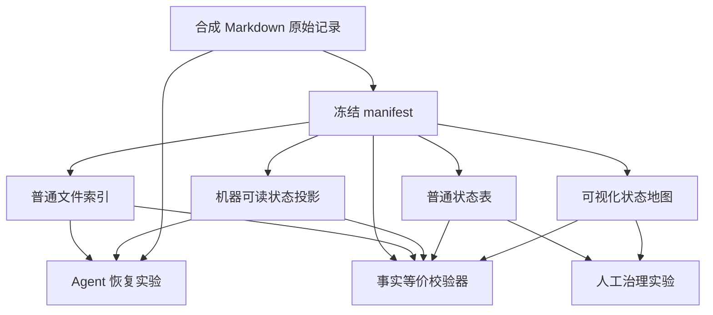

# 第六个 POC 设计：当前记忆地图

## 文章主题

候选标题：

> 为什么长期记忆需要一张“当前记忆地图”，而不应只藏在文件和索引里？

本篇承接第五篇“检索相关资料不等于恢复当前有效状态”的结论，继续验证两类不同问题：

1. 面向 Agent，结构化状态投影能否提高“当前该信什么、该采取什么行动”的恢复正确性。
1. 面向人，在状态事实完全一致时，可视化地图能否帮助发现有效、替代、冲突、范围限定和待验证内容。

这两个问题必须分开报告。Agent 通道验证的是状态投影价值；人工通道验证的是视觉表达价值。不得把其中一方的结果替另一方背书。

## 研究边界

本 POC 不研究：

- 通用知识图谱或 GraphRAG 的检索效果。
- 大规模图布局、社区发现或关系推理算法。
- 多人协作治理、权限控制或实时同步。
- 向量检索、embedding、rerank 或召回率。
- 可视化是否能普遍提高所有人的工作效率。
- 某个具体记忆产品或 Dashboard 的商业可用性。

人工实验只有一名参与者，属于探索性可用性 POC。即使结果显著，也只能描述当前任务、当前夹具和当前参与者中的观察，不得推广为人群结论。

## 待验证假设

### Agent 通道

1. `source-only` 可以找到原始记录，但可能把历史、观察或冲突项直接当成当前行动依据。
1. `flat-index` 可以降低定位成本，但如果只包含标题、路径和摘要，仍可能缺少当前状态、范围和替代关系。
1. `state-projection` 不复制原始正文，只提供当前状态、范围、关系和来源指针；它可能提高高风险状态任务的正确性。
1. 状态投影不能自动保证正确。如果投影内容与原始来源不一致，Agent 应以协议门禁停止，而不是默认信任投影。

### 人工通道

1. 在事实完全相同的前提下，颜色、分组、状态标签和关系方向可能降低识别当前状态的成本。
1. 可视化地图也可能增加扫描负担或造成颜色依赖，因此不预设它一定优于普通状态表。
1. 正确率是主要结果；耗时、详情展开次数、答案修改次数和主观信心只作为探索性描述指标。

这些假设必须在 Pilot 前冻结。不得根据正式结果倒推新评分项或重新定义条件。

## 双通道架构

冻结的 `manifest.json` 是实验夹具的规范化事实源。原始 Markdown 用于保留可读来源，普通索引、状态投影、状态表和可视化地图均由 manifest 确定性生成。

任何派生产物与 manifest 不一致时，全部实验停止。生成器不是记忆事实的第二个来源。

## 规范化状态模型

每个场景包至少包含以下五种状态：

| 状态类型 | 必须表达的字段 | 当前行动边界 |
| --- | --- | --- |
| 当前有效 | 主题、状态、范围、来源 | 可以在匹配范围内指导行动 |
| 已被替代 | 旧项、新项、替代方向、来源 | 只能用于历史解释，不能继续指导行动 |
| 未解决冲突 | 冲突各方、冲突状态、来源 | 不得静默选边，应暂停或提出复验 |
| 待验证观察 | 观察内容、证据状态、来源 | 不得晋升为稳定规则 |
| 范围限定 | 有效范围、不适用范围、来源 | 不得扩大到其他平台或项目 |

manifest 使用相对来源 ID 和相对路径，不保存用户目录、真实项目名、账号、会话标识或存储地址。

## Agent 恢复通道

### 实验条件

三个条件共享相同原始记录、任务提示和冻结事实，只改变 Agent 可用的导航或状态投影。

#### `source-only`

只提供原始 Markdown 记录。Agent 可以搜索和读取文件，但没有独立索引或当前状态投影。

#### `flat-index`

在原始记录之外提供普通索引。索引只包含标题、相对路径、稳定摘要和更新时间，不表达 `active`、`superseded`、`conflict`、`pending-validation` 等状态结论，也不表达替代方向。

#### `state-projection`

在原始记录之外提供机器可读状态投影。投影只包含状态、范围、关系、当前动作边界和来源指针，不复制原始正文。需要解释依据时仍必须回到原始来源。

三个条件都允许满分。`state-projection` 不因条件名称自动得分，必须实际给出正确状态、行动、范围和来源。

### 冻结任务

| 任务 | 主要验证目标 | 核心错误模式 |
| --- | --- | --- |
| `active-decision` | 找出当前可执行规则 | 把讨论或观察当成正式决定 |
| `superseded-rule` | 识别替代关系 | 让旧规则继续指导行动 |
| `unresolved-conflict` | 保留未解决冲突 | 静默采用任一版本 |
| `scope-boundary` | 遵守平台或项目范围 | 把局部结论扩大为全局规则 |
| `pending-observation` | 保留待验证状态 | 把单次观察晋升为稳定结论 |

每个任务使用独立新会话，避免前一任务读取的内容进入后一任务。

### 样本规模

- Pilot：`5 个任务 × 3 个条件 × 1 次 = 15 次`。
- macOS 正式矩阵：`5 个任务 × 3 个条件 × 3 次 = 45 次`。
- Win11 Level 2 Smoke：`5 个任务 × 3 个条件 × 1 次 = 15 次`。

正式矩阵前必须冻结 fixture、manifest、Prompt、预期答案、rubric、模型、推理强度和执行器版本。

### 评分维度

各任务从下列维度选择冻结评分项：

- 状态判断是否正确。
- 当前动作是否正确。
- 替代关系或范围是否正确。
- 是否保留冲突或待验证状态。
- 实际使用来源是否正确。
- 无依据断言、无关事实和协议有效性。

同时统计：

- 历史或失效记录继续指导行动的次数。
- 未解决冲突被静默选边的次数。
- 范围错误泛化次数。
- 待验证观察被错误晋升的次数。
- 工作区调用、可靠输出字节、耗时和 token 指标。

过程指标只描述当前工具链成本，不用于推导操作系统性能或机制质量。

## 人工治理通道

### 条件隔离

人工通道使用两套结构等价、内容不同的合成场景包：

- `state-table`：普通表格表达主题、状态、关系、范围和来源。
- `visual-map`：使用同一字段，通过颜色、分组、状态标签和关系方向表达。

两种条件必须拥有相同：

- 状态类型和数量。
- 问题数量和难度。
- 来源详情能力。
- 答案控件。
- 文本事实完整度。

地图不得增加表格中不存在的事实。表格也不得隐藏地图已经表达的状态字段。

### 操作流程

1. 页面随机确定两种条件的展示顺序并记录。
1. 每个场景包回答 5 个问题，一次只显示一个问题。
1. 页面从首题展示时开始计时，在最后一题提交后停止。
1. 自动记录逐题答案、是否正确、总耗时、详情展开次数和答案修改次数。
1. 每个条件结束后记录一次 1 至 5 分的主观信心。
1. 完成后只生成脱敏汇总；逐题事件保留在本地私有证据区。

单轮预计 5 至 8 分钟。参与者在正式开始前只查看操作说明，不查看正式夹具或预期答案。

### 人工结果解释

- 正确率是主要指标。
- 地图条件至少不能降低正确率，才能继续讨论其潜在治理价值。
- 耗时和操作次数不预设方向，只进行探索性比较。
- 单人、单轮结果不做显著性检验，不声称具有普遍效率提升。
- 如果地图没有优势，应如实报告“可视化并非天然更好，需要服务于具体治理任务”。

## 生成器与校验器

实现阶段至少提供以下独立组件：

- fixture/manifest 校验器。
- 普通索引生成器。
- 状态投影生成器。
- 状态表与可视化地图生成器。
- Agent 条件工作区构建器。
- 人工实验事件记录与汇总器。
- 评分与跨条件聚合器。
- 隐私与协议审计器。

校验器必须反向验证：

- 四类派生产物均可追溯到 manifest。
- 状态表和地图表达的事实集合完全一致。
- 普通索引未泄露状态答案。
- 状态投影未复制原始正文。
- Prompt 未包含条件名称、预期答案或 rubric。
- 所有路径均为隔离夹具中的相对路径。

## 失败与停止门禁

出现以下任一情况立即停止当前阶段：

- 派生产物与 manifest 不一致。
- 条件之间的原始事实或 Prompt 不等价。
- 普通索引泄露状态答案，或地图增加表格没有的事实。
- Agent 访问条件外文件、真实记忆或用户级插件。
- MCP 或命令调用无法完整分类和计量。
- Prompt 截断、编码异常、退出码非零或运行文件不完整。
- 人工页面计时、答题或事件记录不完整。
- 正式场景提前泄露答案或被参与者预览。
- 模型、推理强度、CLI 或冻结夹具在同一批次内发生变化。

人工轮次因页面故障作废时，必须使用新的等价场景包重新开始，不得补造丢失事件。请求限流或外部错误按既有正式矩阵恢复协议保留失败槽位和哈希，冷却后只补跑对应槽位。

## 测试与验收

### 静态与单元测试

- manifest schema、状态枚举和关系完整性。
- 四类派生产物的确定性生成。
- 状态表与地图的事实集合等价。
- 普通索引不包含冻结状态字段。
- Agent 评分、人工汇总和隐私扫描。
- UTF-8、LF、相对路径和跨平台稳定排序。

### 页面验收

使用 Playwright 检查桌面与移动视口：

- 页面非空且没有文字或控件重叠。
- 状态不能只依赖颜色表达，必须同时有文本标签。
- 详情展开、答题、修改答案和提交可用。
- 计时与事件落盘正确。
- 页面刷新或异常退出不会伪造完整结果。

### 实验门禁

- 先通过静态测试、夹具校验和页面验收。
- 再执行 15 次 Agent Pilot。
- Pilot 逐份只读 Review 通过后，冻结正式矩阵。
- 然后执行 45 次 macOS 正式运行和真实计时评分。
- 人工实验在正式场景未泄露且页面门禁通过后单独执行。
- macOS 聚合完成后再生成公开证据候选。

## 跨平台验证级别

本 POC 初始采用 [`Level 2`](../CROSS-PLATFORM-VALIDATION-STRATEGY.md)：

- macOS 完成 Agent Pilot、正式矩阵、评分、聚合和人工探索性 Review。
- Win11 执行同步、EOL、CLI、登录、帮助参数、静态测试、夹具、页面和隐私门禁。
- Win11 对 5 个任务和 3 个 Agent 条件各执行一次兼容性 Smoke，共 15 次。
- Win11 不重复人工参与者实验；只验证页面可以加载、交互和正确记录合成测试事件。

出现以下任一情况升级为 Level 3：

- Win11 页面渲染、事件记录、路径或编码与 macOS 不一致。
- Win11 Agent Smoke 与 macOS 出现语义方向差异。
- 工具读取、隔离或指标覆盖出现平台特有异常。
- 文章准备声明 Agent 正确性已经跨平台独立复现。
- 运行器、CLI、模型或指标审计器发生实质变化。

Level 2 通过后只能声明“Win11 兼容性 Smoke 通过”，不能写成完整正确性矩阵已跨平台复现。

## 隔离、隐私与公开范围

- 所有场景使用合成项目、规则、观察和来源。
- 模型、推理强度、Codex CLI 和平台标签写入 metadata；不记录或公开模型 provider。
- Agent 运行使用独立临时目录、临时会话、UTF-8 stdin，并显式关闭用户级插件。
- 私有 `raw.jsonl`、完整 `final.md`、`stderr.log`、`score.json` 和人工逐题事件不进入公开仓库。
- 不公开用户名、账号、绝对路径、会话标识、浏览器身份、存储地址或真实记忆内容。
- 人工实验公开数据只包含条件级正确率、总耗时、操作次数和主观信心。
- 公开 POC 可以包含合成夹具、生成器、校验器、聚合数据、代表样本和空白人工实验模板。

## 文章允许使用的结论

只有正式证据支持时，文章才可以说明：

- 状态投影是否帮助当前 Agent 恢复当前有效状态。
- 在本次单人探索性任务中，地图与状态表的正确率、耗时和操作差异。
- 可视化地图的工程价值是否来自状态、范围和关系的显式表达，而不是单纯“画得更好看”。

文章不得声称：

- 可视化普遍提高所有人的记忆治理效率。
- 图形界面天然比 Markdown 或表格更可靠。
- Agent 需要视觉地图才能恢复状态。
- 当前 POC 已验证大型知识图谱或 GraphRAG。
- Level 2 Win11 Smoke 等于完整跨平台独立复现。

## 实施顺序

1. 冻结 schema、状态模型、任务、评分表和两套人工场景结构。
1. 实现 fixture、生成器和事实等价校验器。
1. 实现 Agent 三条件工作区、运行器、审计与评分。
1. 实现人工状态表、可视化地图、事件记录和汇总。
1. 完成单元测试、Playwright 页面验收和隐私门禁。
1. 执行 15 次 Agent Pilot，只读 Review 后决定是否进入正式矩阵。
1. 执行 45 次 macOS 正式矩阵、评分和聚合。
1. 由 Lee 完成一次 5 至 8 分钟的人工探索性实验。
1. 按 Level 2 生成并执行 Win11 兼容性方案。
1. 形成公开证据和文章结论候选。
