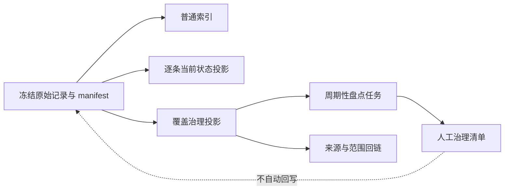

# 记忆覆盖与治理投影 POC 设计

## 研究问题

第六个 POC 处理的是一次具体行动：面对原始记录、索引与状态投影，Agent 能否分辨当前可执行内容、范围边界和不能静默处理的事项。

第七个 POC 转向周期性治理：当维护者不在处理某一条规则，而是在盘点一个记忆集合时，怎样快速看出哪些范围已覆盖、哪些内容仍然活跃、哪些事项需要人工治理，同时不另建一套难维护的 Dashboard 或事实库？

本 POC 的核心问题是：

> 在相同的合成原始记录下，可追溯的轻量覆盖治理投影，能否比原始记录或逐条状态投影更完整地发现待治理事项，并保持每个判断都能回到来源？

## 目标与非目标

目标：

- 验证覆盖、活跃度、审查状态、冲突与待验证事项能否从冻结事实源确定性派生。
- 验证 Agent 在周期性盘点任务中能否识别覆盖缺口、逾期审查和不能自动处置的治理项。
- 验证投影是否保留范围、来源与状态边界，避免聚合后失去可审计性。
- 为第七篇文章提供可公开、可复跑的合成夹具与脱敏聚合证据候选。

非目标：

- 不验证 Dashboard、知识图谱、GraphRAG 或向量检索的产品价值。
- 不自动创建、修改、删除或晋升任何记忆。
- 不以单次盘点耗时、token 或工具调用量单独证明效率或质量。
- 不使用真实记忆、账号、设备路径、会话标识或私有运行内容。

## 设计判断

采用“轻量覆盖治理投影”，而不是再做一套视觉仪表盘。它是从规范化 manifest 生成的 Markdown 与 JSON 派生物，只呈现可回链的汇总事实和待人工判断信号。

投影的责任是显示“需要被看见的治理信号”，不是替人做批准、替代、删除或跨范围推广的决定。

## 冻结事实模型

正式运行前冻结一份合成 `manifest.json`。每条记录至少包含：

- 稳定 ID、主题域、适用范围和相对来源路径。
- 生命周期状态：`active`、`superseded`、`conflict`、`pending-validation`。
- 来源关系，例如替代、冲突或依赖。
- 负责人是否明确、上次审查日期、审查间隔与可选到期日期。
- 覆盖声明：该主题域在当前范围内是否已有可执行记录、是否仅有观察，或是否没有记录。

所有日期、主题域、负责人代号和来源文件都使用合成值。投影不得复制原始正文、答案、评分项或任何私有标记。

## 对照条件

| 条件 | 可见材料 | 用途 | 不应包含 |
| --- | --- | --- | --- |
| `source-only` | 合成原始记录 | 基线：自行定位与汇总 | 预先计算的状态或覆盖结论 |
| `state-projection` | 原始记录与逐条状态投影 | P6 风格的记录级治理视图 | 按主题域汇总的覆盖或待办结论 |
| `coverage-governance-projection` | 原始记录、状态投影与轻量汇总 | 观察跨主题覆盖、活跃度与治理信号 | 无来源的建议、自动处置结果或正文复制 |

第三个条件只允许根据 manifest 做确定性汇总。每个汇总格必须列出记录 ID 和相对来源，以便回答可复核。

## 任务与错误模式

| 任务 | 主要验证目标 | 核心错误模式 |
| --- | --- | --- |
| `coverage-gap` | 找出当前范围内没有可执行依据的主题域 | 把仅有观察或历史记录误认为已覆盖 |
| `review-due` | 找出仍有效但需要人工复查的项目 | 因记录仍是 `active` 而忽略逾期审查 |
| `governance-queue` | 列出冲突、待验证和缺失负责人的最小治理清单 | 把信号当成自动处置指令 |
| `scope-slice` | 区分全局、项目与平台范围的覆盖结论 | 把局部覆盖扩大为全局覆盖 |
| `source-trace` | 说明每个盘点判断的来源与边界 | 使用汇总结论但无法回链原始依据 |

每个任务都要求回答：事实、适用范围、当前能做或不能做的动作、需要的人类判断，以及实际使用的来源。

## 假设与可判定结果

H1：覆盖治理投影可减少盘点任务中漏报的覆盖缺口、逾期审查和未决治理项。

H2：覆盖治理投影不会让 Agent 把汇总信号误当作批准、替代或自动处置命令。

H3：任何正确盘点结论均能通过 ID 与相对来源回链至原始记录。

如果三个条件在正确性与遗漏率上无差异，文章仍可说明投影能够被确定性生成并保留回链，但不能声称它必然提升盘点质量。如果第三个条件出现更多越权或无来源结论，则该机制不进入文章的正面实践建议。

## 评分与门禁

每个任务的 rubric 必须独立评分：

- 覆盖或治理信号是否正确。
- 是否保留状态与范围边界。
- 是否明确禁止自动处置冲突和待验证观察。
- 是否提出最小、可审查的人工下一步。
- 是否引用正确的原始来源。

正式矩阵开始前，必须冻结 manifest、任务 Prompt、期望答案、rubric、生成器输出、模型配置与执行器版本。夹具验证器至少检查：

- 三种条件的事实集合一致。
- 覆盖投影不复制原文，不泄露答案或生命周期词给不应可见的条件。
- 所有汇总字段可回链到 manifest 记录。
- 不存在绝对路径、账号、密钥、会话 ID 或模型 provider。
- 每个任务均有明确的失败模式与来源要求。

## 验证矩阵与跨平台边界

遵循 `CROSS-PLATFORM-VALIDATION-STRATEGY.md` 的默认方案：

- macOS 上两个模型配置分别执行 Pilot、正式矩阵、真实计时 Review、评分和独立聚合。
- 初始正式矩阵建议为 `5 个任务 × 3 个条件 × 3 次 = 45 次`，每个模型配置独立统计。
- 默认不安排 Win11。若实现包含文件系统、路径、编码、Shell、同步或其他操作系统变量，或 macOS 结果出现无法解释的工具链差异，再设计 Win11 兼容性 Smoke。
- 文章只可声明“在 macOS 两个模型配置下实测”；过程指标只作量级参考。

## 隔离、隐私与公开边界

- 每次 Agent 运行使用独立临时目录、临时会话和只读工作区。
- 私有原始输出、逐次评分、标准错误和真实计时明细仅保留在本地私有目录。
- 公开仓库仅保存合成夹具、生成器、校验器、脱敏聚合、代表样本和分析报告。
- 公开 Markdown 不记录模型 provider；模型名、推理强度、执行器版本和平台标签按系列既有约定分组呈现。

## 实施前停止条件

以下任一情况出现时，不进入实现：

- 无法把“覆盖缺口”定义为可从冻结事实判断的信号。
- 任务要求 Agent 自动决定记忆是否创建、替代、删除或晋升。
- 覆盖投影只能靠复制正文、手工注释或无来源标签才能成立。
- 设计目标变成比较 Dashboard 美观度、通用生产率或大规模知识图谱能力。

## 后续实施顺序

1. 冻结事实 schema、主题域、范围、审查字段与三种条件的可见性边界。
1. 编写合成记录、Prompt、期望答案与 rubric，并先写会失败的夹具校验测试。
1. 实现确定性索引、状态投影和覆盖治理投影生成器。
1. 完成单元测试、隐私扫描、回链校验与公共聚合门禁。
1. 执行两个模型配置各自的 Pilot；逐份只读 Review 通过后才冻结正式矩阵。
1. 执行 macOS 正式矩阵、真实计时评分和独立聚合。
1. 根据证据决定是否撰写文章正文、是否需要补充 Win11 Smoke，以及哪些结论可以公开。
