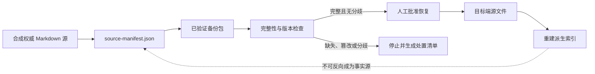

# 第八个 POC 设计：备份、恢复与跨设备迁移

## 决策

本 POC 采用“**单一权威源 + 已验证备份包 + 人工恢复门禁**”的最小设计，而不是把不同设备
上的副本当成可自动合并的对等事实源。公开实验只操作合成 Markdown 和记载相对路径、版本、
哈希与关系的 manifest。

正式矩阵冻结两个请求配置：`glm-5.2 / max` 与 `deepseek-v4-flash / max`。它们只是
**请求的运行配置**，不是已经独立观察到的实际执行身份；运行证据继续分别记录请求字段、
不可观察字段、执行器版本、平台与运行结果。

## 承接与目标

第七篇回答的是：怎样从长期记忆中发现覆盖缺口、逾期审查和待治理事项。下一步问题是：当
这些原始记录、状态和来源关系需要备份、恢复或迁移时，怎样避免把残缺包、旧副本或冲突副本
重新变成当前行动依据？

本 POC 的核心问题是：

> 在相同的合成原始记录下，显式的完整性校验、恢复门禁和冲突停机规则，能否让 Agent 正确
> 判断何时可以恢复、何时必须停止，并把每个结论回链到权威源和备份清单？

目标：

- 验证备份 manifest 能否以确定性方式列出受保护的源记录、版本、内容哈希与排除项。
- 验证恢复前能否识别完整包、缺失文件、内容篡改、目标端分歧和不应迁移的派生索引。
- 验证恢复决定保持“验证通过才可继续；其他情况人工处置”的边界。
- 为第八篇提供可公开复跑的合成夹具、协议、聚合数据和失败样本候选。

非目标：

- 不访问或复制 Lee 的真实记忆、Git 仓库、对象存储或跨设备同步目录。
- 不执行真实恢复、删除、覆盖、提交、推送、自动合并或远端同步。
- 不比较 Git、归档包、对象存储或某个第三方产品的性能、成本和可靠性。
- 不把兼容性 Smoke 描述成双设备双向同步已经验证。

## 方案选择与替代路径

| 方案 | 结论 | 原因 |
| --- | --- | --- |
| 权威源 + 校验 manifest + 恢复门禁 | 采用 | 能把完整性、来源和停止条件编码为可重复检查的合成任务。 |
| 两个设备副本自动合并 | 不采用 | 冲突语义、授权和真实数据边界尚未冻结，自动合并会越过人工决策权。 |
| 只测试“备份能否解压” | 不采用 | 只能验证文件存在，无法验证来源、分歧、恢复资格和回滚边界。 |

## 事实模型与恢复链路

冻结 `source-manifest.json` 是唯一规范化事实源。`backup-manifest.json` 只能从它和合成源文件
确定性生成；恢复报告、目标端盘点和索引重建计划都是派生产物，不能反向改写事实。

每条合成记录至少包含：稳定 ID、相对路径、内容哈希、逻辑版本、适用范围、状态、来源关系和
是否为派生物。备份包另记录备份批次 ID、源清单哈希、文件清单、创建时间和明确排除的派生索引。

## 对照条件

三个条件共享同一套合成源记录、故障场景和任务提示，只改变可用的恢复信息。

| 条件 | 可见材料 | 用途 | 不应包含 |
| --- | --- | --- | --- |
| `source-only` | 源记录与目标端盘点 | 基线：自行核对来源与状态 | 预先计算的完整性或恢复资格结论 |
| `backup-inventory` | 源记录、文件清单与版本摘要 | 观察仅有盘点信息是否足够 | 哈希核验结果、自动恢复建议或冲突裁决 |
| `recovery-gated-bundle` | 源记录、备份 manifest、完整性报告与门禁规则 | 观察可回链的恢复资格判断 | 自动覆盖、自动合并或脱离来源的结论 |

三个条件都允许获得满分。第三个条件不能因为名称得分，必须给出正确的资格、停止或人工下一步，
并列出来源 ID。

## 冻结任务与错误模式

| 任务 | 验证目标 | 必须避免的错误 |
| --- | --- | --- |
| `clean-restore` | 识别哈希、版本和范围均匹配的可恢复包 | 绕过人工批准，或遗漏来源回链 |
| `partial-backup` | 识别必需源文件缺失 | 用残缺包继续恢复或补造内容 |
| `integrity-mismatch` | 识别内容哈希不匹配 | 把篡改/损坏文件当成可信源 |
| `target-divergence` | 识别目标端已出现不同有效版本 | 静默覆盖、选边或自动合并 |
| `derived-index` | 区分权威 Markdown 与派生索引 | 跨设备复制索引，或把索引当事实源 |
| `rollback-receipt` | 识别恢复后校验失败时的停止与回滚要求 | 把未完成恢复标记为成功 |

每个任务都要求写出：事实、适用范围、允许或禁止的下一步、需要的人类决定和实际使用的来源 ID。

## 结果解释与设计风险

允许的结论仅限于：在冻结合成场景、指定配置和指定任务中，Agent 是否遵守完整性、来源、范围
和人工门禁。过程指标只能描述当前执行环境，不能推导机制效率或模型优劣。

主要风险与控制：

| 风险 | 影响 | 控制 |
| --- | --- | --- |
| 备份 manifest 泄漏标准答案 | 条件不公平 | 校验器检查 Prompt 与条件视图不包含预期答案或 rubric。 |
| 把工具复制等同于恢复 | 结论越界 | 任务要求恢复资格与人工批准，不允许执行写操作。 |
| Pilot 会话与正式 CLI 隔离能力不同 | 证据不可混用 | 每次运行记录执行路径；Pilot 与正式矩阵分开聚合与解释。 |
| Windows 与 macOS 的路径/编码差异 | 跨设备结论失真 | 本 POC 不运行 Win11 矩阵，也不生成跨平台结论。 |

## 正式矩阵冻结事项

- Pilot-01 的请求模型记录为 `glm-5.2`，Pilot-02 为 `deepseek-v4-flash`；两个请求推理强度均保持
  `unknown`，没有从历史配置反推。
- 两个 Pilot 均采用 session 执行路径；`observed_model` 与 `observed_effort` 无法独立观察，继续
  保持 `unknown`。
- 正式矩阵采用 OMP 非交互 CLI；夹具内容确定性嵌入 Prompt，并关闭 session、skills、rules 与
  tools。完整快照保留为运行身份，模型只接收该任务所需的确定性投影；每格只产生 350 词以内
  的文本判断，不允许访问或修改文件。
- 两个配置分别执行 `6 × 3 × 3 = 54` 格，独立聚合；先完成 GLM-5.2，再执行
  DeepSeek-V4-Flash。
- 每格必须同时通过运行完整性契约和冻结机械 rubric；每个配置还须完成 54 格全量只读 Review。
- 正式机械门禁增加 condition-aware 检查：缺少 backup、target 或 receipt 证据时，必须明确标注
  不可观察边界，不能用 source 或 target 信息冒充备份证据。
- 根据当前系列策略和 Lee 的决定，P8 不安排 Win11 验证，也不生成跨平台语义结论。

正式矩阵和全量 Review 已完成：两组请求配置合计 99/108 通过，包含 2 个语义失败、6 个 deadline
和 1 个主线程中断。文章必须保留这些失败，禁止把请求配置写成独立观察到的模型身份，或把合成
场景结果扩大为跨平台、真实恢复可靠性结论。
